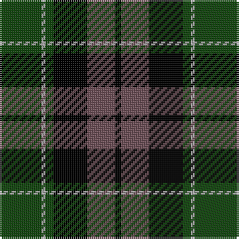

**Bands:** [GYGKBK](/stripes/gygkbk/) · **Stripes:** [DG LR DG K N K](/stripes/stripes6/) DG LR DG K N K

This was sourced from weddslist.  It is a [6 band tartan](/bands/bands6/).

Original link http://www.weddslist.com/cgi-bin/tartans/pg.pl?source=x

## Register references

External register numbers recorded for this tartan.

- Scottish Register of Tartans: [2540](https://www.tartanregister.gov.uk/tartanDetails.aspx?ref=2540)
- Scottish Register of Tartans: [2625](https://www.tartanregister.gov.uk/tartanDetails.aspx?ref=2625)
- Scottish Register of Tartans: [3555](https://www.tartanregister.gov.uk/tartanDetails.aspx?ref=3555)
- Scottish Tartans Authority (ITI): 1429
- Scottish Tartans Authority (ITI): 218
- Scottish Tartans World Register: 1429
- Scottish Tartans World Register: 218
- Scottish Tartans World Register: 864

## Variants

Other setts woven to the same stripe pattern.

- [Graham W](/setts/s6/dg21lr2dg4k17n14k3~x2/)

## Thread count
DG/21 Na2 DG4 K17 N14 K/3

## Palette
Each colour and its ΔE from the base-6 reference it is a variant of.

| Colour | Shade | Base | ΔE (OKLab) |
|---|---|---|---|
| DG | <code style="background-color:#11450D;">#11450D</code> `#11450D` | G <code style="background-color:#006100;">#006100</code> | 0.09 |
| K | <code style="background-color:#000000;">#000000</code> `#000000` | K <code style="background-color:#000000;">#000000</code> | 0.00 |
| N | <code style="background-color:#6E5058;">#6E5058</code> `#6E5058` | B <code style="background-color:#2A418A;">#2A418A</code> | 0.15 |
| Na | <code style="background-color:#AAAAAA;">#AAAAAA</code> `#AAAAAA` | Y <code style="background-color:#F2BF00;">#F2BF00</code> | 0.19 |

# Sample pattern

## Nearest tartans

The nearest existing variants by ΔTartan distance.

1. [Graham W](/setts/s6/dg21lr2dg4k17n14k3~x2/) — ΔT 0.00
1. [Melville](/setts/s6/k5lr2dg18k17n16k3~x2/) — ΔT 0.52
1. [Melville](/setts/s6/k5lr2dg18k17n16k3/) — ΔT 0.52
1. [Graham W](/setts/s6/dg21lb2dg4k17dp14k3/) — ΔT 0.66
1. [MacCallum](/setts/s7/dg8k2lb1dg4k6db6k1~x2/) — ΔT 1.00
1. [Wilson's, No 150 "Coburg"](/setts/s6/g18t2g4k14p12k3~x2/) — ΔT 1.03
1. [Mowat](/setts/s7/db48k6db10k46ly4k22g43/) — ΔT 1.05
1. [Gunn](/setts/s6/dg2db12dg1k12dg12r2~x2/) — ΔT 1.05
1. [Ferguson of Balquhidder](/setts/s6/g2db12r1k12g12k2~x2/) — ΔT 1.06
1. [Gunn](/setts/s6/r2g12k12g1db12g1~x2/) — ΔT 1.07

## Neighbour map

Every grey dot is one of 14313 variants placed by the first two principal components of the ΔTartan feature space (44% of its variance). Red is this tartan; blue dots are its nearest — click one to open its page.

<svg viewBox="0 0 640 380" role="img" style="max-width:100%;height:auto;border:1px solid #e0e0e0;border-radius:4px;display:block" xmlns="http://www.w3.org/2000/svg"><image href="/nn/cloud.v1.png" width="640" height="380"/><a href="/setts/s6/dg21lr2dg4k17n14k3~x2/"><circle cx="211.8" cy="227.0" r="4" fill="#3465a4"><title>Graham W</title></circle></a><a href="/setts/s6/k5lr2dg18k17n16k3~x2/"><circle cx="195.1" cy="234.7" r="4" fill="#3465a4"><title>Melville</title></circle></a><a href="/setts/s6/k5lr2dg18k17n16k3/"><circle cx="195.1" cy="234.7" r="4" fill="#3465a4"><title>Melville</title></circle></a><a href="/setts/s6/dg21lb2dg4k17dp14k3/"><circle cx="200.6" cy="222.3" r="4" fill="#3465a4"><title>Graham W</title></circle></a><a href="/setts/s7/dg8k2lb1dg4k6db6k1~x2/"><circle cx="194.1" cy="245.1" r="4" fill="#3465a4"><title>MacCallum</title></circle></a><a href="/setts/s6/g18t2g4k14p12k3~x2/"><circle cx="176.9" cy="220.2" r="4" fill="#3465a4"><title>Wilson's, No 150 &quot;Coburg&quot;</title></circle></a><a href="/setts/s7/db48k6db10k46ly4k22g43/"><circle cx="192.5" cy="210.4" r="4" fill="#3465a4"><title>Mowat</title></circle></a><a href="/setts/s6/dg2db12dg1k12dg12r2~x2/"><circle cx="203.5" cy="228.4" r="4" fill="#3465a4"><title>Gunn</title></circle></a><a href="/setts/s6/g2db12r1k12g12k2~x2/"><circle cx="171.4" cy="211.9" r="4" fill="#3465a4"><title>Ferguson of Balquhidder</title></circle></a><a href="/setts/s6/r2g12k12g1db12g1~x2/"><circle cx="173.0" cy="206.1" r="4" fill="#3465a4"><title>Gunn</title></circle></a><circle cx="211.8" cy="227.0" r="5" fill="#c00000"/></svg>

ID: /setts/s6/dg21lr2dg4k17n14k3/
