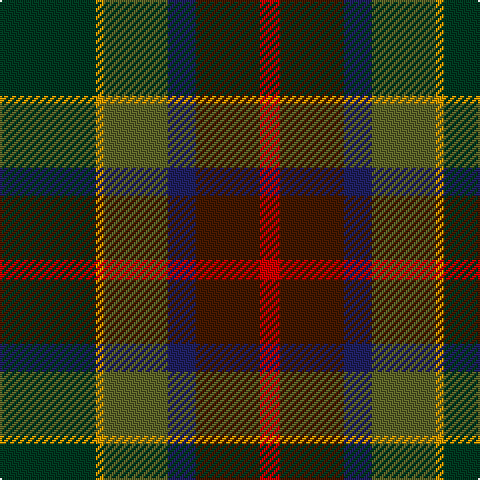

**Bands:** [RBBGYG](/stripes/rbbgyg/) · **Stripes:** [R DO DB Y LO DG](/stripes/stripes6/) R DO DB Y LO DG

This was sourced from tartans-authority.  It is a [6 band tartan](/bands/bands6/).

Original link http://www.tartansauthority.com/tartan-ferret/display/2255/

## Variants

Other setts woven to the same stripe pattern.

- [Waterford, County](/setts/s6/dg42lo2y16db7do16r5~x2/)

## Thread count
DG/48 DY4 G32 DB14 DR32 R/10

## Palette
Each colour and its ΔE from the base-6 reference it is a variant of.

| Colour | Shade | Base | ΔE (OKLab) |
|---|---|---|---|
| DB | <code style="background-color:#202060;">#202060</code> `#202060` | B <code style="background-color:#2A418A;">#2A418A</code> | 0.11 |
| DG | <code style="background-color:#003820;">#003820</code> `#003820` | G <code style="background-color:#006100;">#006100</code> | 0.15 |
| DR | <code style="background-color:#441800;">#441800</code> `#441800` | B <code style="background-color:#2A418A;">#2A418A</code> | 0.23 |
| DY | <code style="background-color:#D09800;">#D09800</code> `#D09800` | Y <code style="background-color:#F2BF00;">#F2BF00</code> | 0.12 |
| G | <code style="background-color:#5C6428;">#5C6428</code> `#5C6428` | G <code style="background-color:#006100;">#006100</code> | 0.10 |
| R | <code style="background-color:#C80000;">#C80000</code> `#C80000` | R <code style="background-color:#CC0000;">#CC0000</code> | 0.01 |

# Sample pattern

## Nearest tartans

The nearest existing variants by ΔTartan distance.

1. [McHale, Barry Name Tartan Tartan Number: 10708. Earliest known date: 27 September 2012 Barry McHale commissioned the production of this tartan to be worn at his wedding. It may be worn by any of his McHale relatives. See products available Copyright © Blair Urquhart, Comrie, 2015](/setts/s6/n15k10dt30dy11w3lg5~x2/) — ΔT 1.17
1. [Meeson Hunting](/setts/s6/k26n10dt19r6ly2db9~x2/) — ΔT 1.26
1. [McCarter (2016)](/setts/s8/o4k2dy15k2dg15db15k2r1~x2/) — ΔT 1.31
1. [Staley (2014)](/setts/s6/db9w2dg25do10k15dp4~x2/) — ΔT 1.40
1. [Christmas Hill Game Farm (Corporate)](/setts/s7/dy5lo20r3dg13dy13db3g3~x2/) — ΔT 1.41
1. [Dunanas Rising (Corporate)](/setts/s5/dg35y25r15b2db21~x2/) — ΔT 1.42
1. [Haughfoot (Commemorative)](/setts/s6/r4k15t4dt15dg24y4~x2/) — ΔT 1.45
1. [Swankie](/setts/s7/dg3dt22dr10o5dg21r6dt3~x2/) — ΔT 1.46
1. [Linden](/setts/s8/dt4k9g20dp2dg20k5dt6lb2~x2/) — ΔT 1.50
1. [Tennant Family Tartan Tartan Number: 1653. Earliest known date: 1930 MacGregor-Hastie made few notes about his sample collection. In December 1967, Captain Tennant wrote to the Scottish Tartans Society, saying, ".. and I have no objection to other Tennants wearing it (Tennant tartan) but their problem will be to get hold of it ... I don't know of any other Tennant tartan and that is why I think my father designed this one." The head of the Tennant family is Lord Glenconner, descended from John Tennant of Blairston, Ayr. (1635). See products available Copyright © Blair Urquhart, Comrie, 2015](/setts/s7/r1dy7db7k7g7dy7r1~x4/) — ΔT 1.51

## Neighbour map

Every grey dot is one of 14299 variants placed by the first two principal components of the ΔTartan feature space (44% of its variance). Red is this tartan; blue dots are its nearest — click one to open its page.

<svg viewBox="0 0 640 380" role="img" style="max-width:100%;height:auto;border:1px solid #e0e0e0;border-radius:4px;display:block" xmlns="http://www.w3.org/2000/svg"><image href="/nn/cloud.v1.png" width="640" height="380"/><a href="/setts/s6/n15k10dt30dy11w3lg5~x2/"><circle cx="192.5" cy="219.8" r="4" fill="#3465a4"><title>McHale, Barry Name Tartan Tartan Number: 10708. Earliest known date: 27 September 2012 Barry McHale commissioned the production of this tartan to be worn at his wedding. It may be worn by any of his McHale relatives. See products available Copyright © Blair Urquhart, Comrie, 2015</title></circle></a><a href="/setts/s6/k26n10dt19r6ly2db9~x2/"><circle cx="181.2" cy="214.4" r="4" fill="#3465a4"><title>Meeson Hunting</title></circle></a><a href="/setts/s8/o4k2dy15k2dg15db15k2r1~x2/"><circle cx="172.9" cy="179.6" r="4" fill="#3465a4"><title>McCarter (2016)</title></circle></a><a href="/setts/s6/db9w2dg25do10k15dp4~x2/"><circle cx="209.2" cy="228.9" r="4" fill="#3465a4"><title>Staley (2014)</title></circle></a><a href="/setts/s7/dy5lo20r3dg13dy13db3g3~x2/"><circle cx="149.1" cy="215.5" r="4" fill="#3465a4"><title>Christmas Hill Game Farm (Corporate)</title></circle></a><a href="/setts/s5/dg35y25r15b2db21~x2/"><circle cx="208.7" cy="235.7" r="4" fill="#3465a4"><title>Dunanas Rising (Corporate)</title></circle></a><a href="/setts/s6/r4k15t4dt15dg24y4~x2/"><circle cx="157.6" cy="244.8" r="4" fill="#3465a4"><title>Haughfoot (Commemorative)</title></circle></a><a href="/setts/s7/dg3dt22dr10o5dg21r6dt3~x2/"><circle cx="217.3" cy="248.4" r="4" fill="#3465a4"><title>Swankie</title></circle></a><a href="/setts/s8/dt4k9g20dp2dg20k5dt6lb2~x2/"><circle cx="159.2" cy="208.7" r="4" fill="#3465a4"><title>Linden</title></circle></a><a href="/setts/s7/r1dy7db7k7g7dy7r1~x4/"><circle cx="167.6" cy="261.1" r="4" fill="#3465a4"><title>Tennant Family Tartan Tartan Number: 1653. Earliest known date: 1930 MacGregor-Hastie made few notes about his sample collection. In December 1967, Captain Tennant wrote to the Scottish Tartans Society, saying, &quot;.. and I have no objection to other Tennants wearing it (Tennant tartan) but their problem will be to get hold of it ... I don't know of any other Tennant tartan and that is why I think my father designed this one.&quot; The head of the Tennant family is Lord Glenconner, descended from John Tennant of Blairston, Ayr. (1635). See products available Copyright © Blair Urquhart, Comrie, 2015</title></circle></a><circle cx="181.6" cy="222.8" r="5" fill="#c00000"/></svg>

ID: /setts/s6/dg24lo2y16db7do16r5~x2/
