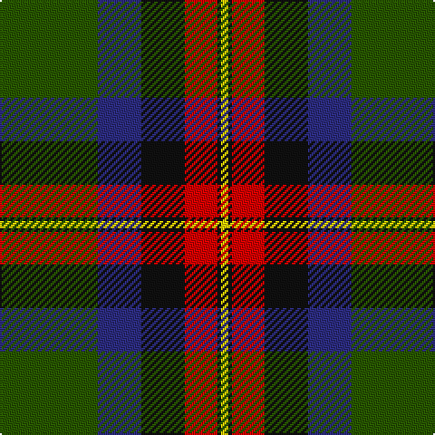

In pattern [GBKRKY](/stripes/gbkrky/).

This was sourced from register-of-tartans.  It is a [6 stripe tartan](/stripes/stripes6/).

Original link https://www.tartanregister.gov.uk/tartanDetails.aspx?ref=11199

## Also known as

This cloth is also recorded under:

- Ferguson, Jerrfey S

## Register references

External register numbers recorded for this tartan.

- Scottish Register of Tartans: [11199](https://www.tartanregister.gov.uk/tartanDetails.aspx?ref=11199)

## Thread count
G/54 DB24 K24 R18 K2 Y/4

## Palette
Each colour and its ΔE from the base-6 reference it is a variant of.

| Colour | Shade | Base | ΔE (OKLab) |
|---|---|---|---|
| DB | <code style="background-color:#2C2C80;">#2C2C80</code> `#2C2C80` | B <code style="background-color:#2A418A;">#2A418A</code> | 0.06 |
| G | <code style="background-color:#285800;">#285800</code> `#285800` | G <code style="background-color:#006100;">#006100</code> | 0.03 |
| K | <code style="background-color:#101010;">#101010</code> `#101010` | K <code style="background-color:#000000;">#000000</code> | 0.17 |
| R | <code style="background-color:#DC0000;">#DC0000</code> `#DC0000` | R <code style="background-color:#CC0000;">#CC0000</code> | 0.03 |
| Y | <code style="background-color:#FFD700;">#FFD700</code> `#FFD700` | Y <code style="background-color:#F2BF00;">#F2BF00</code> | 0.06 |

# Sample pattern

## Nearest tartans

The nearest existing variants by ΔTartan distance.

1. [Ferguson, Jerrfey S (Personal)](/setts/s6/g27db12k12r9k1ly2~x2/) — ΔT 0.32
1. [Chiti, Cristiano (Personal)](/setts/s6/dg20dg11lb6r2dp3lb1~x2/) — ΔT 1.07
1. [Charles-Carberry (Personal)](/setts/s5/dg21db10k26ly10r1~x2/) — ΔT 1.15
1. [Regent](/setts/s7/dp18k7g5r4g7k1ly2~x2/) — ΔT 1.17
1. [Charles-Carberry (Personal)](/setts/s5/dg21t10k26w10r1~x2/) — ΔT 1.20
1. [McGeachie (Personal)](/setts/s8/w1k6b9r12k12g32k6ly1~x2/) — ΔT 1.21
1. [Ferguson - 1830 of Atholl (Clan)](/setts/s7/db18k10g6r4g6k1w2~x2/) — ΔT 1.25
1. [Bryant (Dalgleish) (Personal)](/setts/s6/lb3r30k18db6g30k2~x2/) — ΔT 1.27
1. [Bergen Scottish](/setts/s7/db5w3r12g37k12db21w2~x2/) — ΔT 1.28
1. [Naysmith (Name)](/setts/s6/r6db32k18g28k1lb2~x2/) — ΔT 1.29

## Neighbour map

Every grey dot is one of 14299 variants placed by the first two principal components of the ΔTartan feature space (44% of its variance). Red is this tartan; blue dots are its nearest — click one to open its page.

<svg viewBox="0 0 640 380" role="img" style="max-width:100%;height:auto;border:1px solid #e0e0e0;border-radius:4px;display:block" xmlns="http://www.w3.org/2000/svg"><image href="/nn/cloud.v1.png" width="640" height="380"/><a href="/setts/s6/g27db12k12r9k1ly2~x2/"><circle cx="229.0" cy="165.4" r="4" fill="#3465a4"><title>Ferguson, Jerrfey S (Personal)</title></circle></a><a href="/setts/s6/dg20dg11lb6r2dp3lb1~x2/"><circle cx="245.1" cy="169.8" r="4" fill="#3465a4"><title>Chiti, Cristiano (Personal)</title></circle></a><a href="/setts/s5/dg21db10k26ly10r1~x2/"><circle cx="198.6" cy="192.8" r="4" fill="#3465a4"><title>Charles-Carberry (Personal)</title></circle></a><a href="/setts/s7/dp18k7g5r4g7k1ly2~x2/"><circle cx="215.4" cy="169.8" r="4" fill="#3465a4"><title>Regent</title></circle></a><a href="/setts/s5/dg21t10k26w10r1~x2/"><circle cx="180.4" cy="179.7" r="4" fill="#3465a4"><title>Charles-Carberry (Personal)</title></circle></a><a href="/setts/s8/w1k6b9r12k12g32k6ly1~x2/"><circle cx="212.2" cy="119.8" r="4" fill="#3465a4"><title>McGeachie (Personal)</title></circle></a><a href="/setts/s7/db18k10g6r4g6k1w2~x2/"><circle cx="189.6" cy="175.7" r="4" fill="#3465a4"><title>Ferguson - 1830 of Atholl (Clan)</title></circle></a><a href="/setts/s6/lb3r30k18db6g30k2~x2/"><circle cx="193.4" cy="190.4" r="4" fill="#3465a4"><title>Bryant (Dalgleish) (Personal)</title></circle></a><a href="/setts/s7/db5w3r12g37k12db21w2~x2/"><circle cx="170.0" cy="146.2" r="4" fill="#3465a4"><title>Bergen Scottish</title></circle></a><a href="/setts/s6/r6db32k18g28k1lb2~x2/"><circle cx="234.3" cy="167.2" r="4" fill="#3465a4"><title>Naysmith (Name)</title></circle></a><circle cx="231.8" cy="164.6" r="5" fill="#c00000"/></svg>

ID: /setts/s6/dg27db12k12r9k1ly2~x2/
