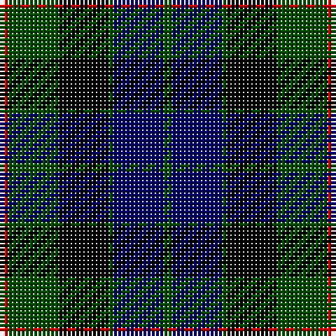

In pattern [GBGKGR](/stripes/gbgkgr/).

This was sourced from weddslist.  It is a [6 stripe tartan](/stripes/stripes6/).

Original link http://www.weddslist.com/cgi-bin/tartans/pg.pl?source=rb

## Attestations

This cloth appears in 2 source records; the oldest owns this page.

- undated — Gunn (weddslist, [record](http://www.weddslist.com/cgi-bin/tartans/pg.pl?source=rb))
- undated — Gunn (weddslist, [record](http://www.weddslist.com/cgi-bin/tartans/pg.pl?source=x))

## Thread count
R/2 G12 K12 G1 DB12 G/2

## Palette
Each colour and the base-6 reference it is a variant of.

| Colour | Shade | Base |
|---|---|---|
| DB | <code style="background-color:#000064;">#000064</code> `oklch(22.7% 0.158 264.1)` <small>#000064</small> | B <code style="background-color:#2A418A;">#2A418A</code> |
| G | <code style="background-color:#004C00;">#004C00</code> `oklch(36.1% 0.123 142.5)` <small>#004C00</small> | G <code style="background-color:#006100;">#006100</code> |
| K | <code style="background-color:#000000;">#000000</code> `oklch(0.0% 0.000 0.0)` <small>#000000</small> | K <code style="background-color:#000000;">#000000</code> |
| R | <code style="background-color:#C80000;">#C80000</code> `oklch(52.3% 0.215 29.2)` <small>#C80000</small> | R <code style="background-color:#CC0000;">#CC0000</code> |

# Sample pattern

## Nearest tartans

The nearest existing variants by ΔTartan distance.

1. [Gunn](/setts/s6/dg2db12dg1k12dg12r2~x2/) — ΔT 0.49
1. [Graham of Menteith](/setts/s6/dg8lb2dg1k12db12k1~x2/) — ΔT 0.73
1. [Graham of Menteith](/setts/s6/dg16b2dg1k12db12k1~x2/) — ΔT 0.74
1. [Morrison](/setts/s6/k3dg14k14dg2db14r3/) — ΔT 0.91
1. [Graham W](/setts/s6/dg21lb2dg4k17dp14k3/) — ΔT 0.92
1. [Mitchell](/setts/s6/k2dg12k12r1db12lr2~x2/) — ΔT 0.93
1. [Mitchell](/setts/s6/k2dg12k12r1db12lr2/) — ΔT 0.93
1. [Gunn](/setts/s6/r2g12k12g1db12g2~x2/) — ΔT 0.95
1. [National Galleries of Scotland](/setts/s7/k7g22k22db6r2db15r2~x2/) — ΔT 1.00
1. [Fletcher C](/setts/s7/db6k1db6k8r1dg8r2/) — ΔT 1.01

## Neighbour map

Every grey dot is one of 14299 variants placed by the first two principal components of the ΔTartan feature space (44% of its variance). Red is this tartan; blue dots are its nearest — click one to open its page.

<svg viewBox="0 0 640 380" role="img" style="max-width:100%;height:auto;border:1px solid #e0e0e0;border-radius:4px;display:block" xmlns="http://www.w3.org/2000/svg"><image href="/nn/cloud.v1.png" width="640" height="380"/><a href="/setts/s6/dg2db12dg1k12dg12r2~x2/"><circle cx="218.1" cy="235.5" r="4" fill="#3465a4"><title>Gunn</title></circle></a><a href="/setts/s6/dg8lb2dg1k12db12k1~x2/"><circle cx="190.6" cy="216.9" r="4" fill="#3465a4"><title>Graham of Menteith</title></circle></a><a href="/setts/s6/dg16b2dg1k12db12k1~x2/"><circle cx="243.0" cy="220.0" r="4" fill="#3465a4"><title>Graham of Menteith</title></circle></a><a href="/setts/s6/k3dg14k14dg2db14r3/"><circle cx="164.2" cy="252.7" r="4" fill="#3465a4"><title>Morrison</title></circle></a><a href="/setts/s6/dg21lb2dg4k17dp14k3/"><circle cx="200.8" cy="222.2" r="4" fill="#3465a4"><title>Graham W</title></circle></a><a href="/setts/s6/k2dg12k12r1db12lr2~x2/"><circle cx="170.4" cy="211.3" r="4" fill="#3465a4"><title>Mitchell</title></circle></a><a href="/setts/s6/k2dg12k12r1db12lr2/"><circle cx="170.4" cy="211.3" r="4" fill="#3465a4"><title>Mitchell</title></circle></a><a href="/setts/s6/r2g12k12g1db12g2~x2/"><circle cx="216.6" cy="230.6" r="4" fill="#3465a4"><title>Gunn</title></circle></a><a href="/setts/s7/k7g22k22db6r2db15r2~x2/"><circle cx="218.5" cy="229.4" r="4" fill="#3465a4"><title>National Galleries of Scotland</title></circle></a><a href="/setts/s7/db6k1db6k8r1dg8r2/"><circle cx="168.2" cy="243.1" r="4" fill="#3465a4"><title>Fletcher C</title></circle></a><circle cx="203.8" cy="228.4" r="5" fill="#c00000"/></svg>

ID: /setts/s6/dg2db12dg1k12dg12r2/
