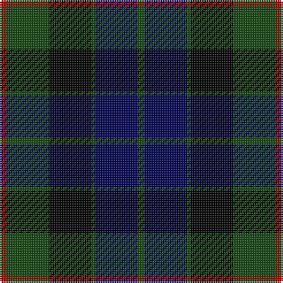

This page is one **sett** — a single exact thread-count. It belongs to the [tartan](/tartans/dr2dg12k12dg1db12dg2/)
(the same proportion at any scale), whose colour order is pattern [GBGKGR](/stripes/gbgkgr/).

Sourced from weddslist.  It is a [6 stripe tartan](/stripes/stripes6/).

Original link http://www.weddslist.com/cgi-bin/tartans/pg.pl?source=tinsel

## Thread count
DR/4 DG24 K24 DG2 DB24 DG/4

## Palette
Each colour and the base-6 reference it is a variant of.

| Colour | Shade | Base |
|---|---|---|
| DB | <code style="background-color:#000052;">#000052</code> `oklch(19.8% 0.137 264.1)` <small>#000052</small> | B <code style="background-color:#2A418A;">#2A418A</code> |
| DG | <code style="background-color:#11450D;">#11450D</code> `oklch(34.4% 0.101 142.1)` <small>#11450D</small> | G <code style="background-color:#006100;">#006100</code> |
| DR | <code style="background-color:#AA0000;">#AA0000</code> `oklch(46.3% 0.190 29.2)` <small>#AA0000</small> | R <code style="background-color:#CC0000;">#CC0000</code> |
| K | <code style="background-color:#000000;">#000000</code> `oklch(0.0% 0.000 0.0)` <small>#000000</small> | K <code style="background-color:#000000;">#000000</code> |

# Sample pattern

## Nearest tartans

The nearest existing variants by ΔTartan distance, with this tartan at the top so the swatches line up against it.

ΔTartan

Tartan

Sett

—

<a href="/ttd/edit/#slug=dg2db12dg1k12dg12r2~x2">Gunn</a> <a class="nn-out" href="/setts/s6/dg2db12dg1k12dg12r2~x2/" title="open its dictionary page">↗</a>

0.49

<a href="/ttd/edit/#slug=dg2db12dg1k12dg12r2">Gunn</a> <a class="nn-out" href="/setts/s6/dg2db12dg1k12dg12r2/" title="open its dictionary page">↗</a>

0.60

<a href="/ttd/edit/#slug=dg16b2dg1k12db12k1~x2">Graham of Menteith</a> <a class="nn-out" href="/setts/s6/dg16b2dg1k12db12k1~x2/" title="open its dictionary page">↗</a>

0.83

<a href="/ttd/edit/#slug=r3k2dg25k28db25k2r3~x2">Coarse Kilt</a> <a class="nn-out" href="/setts/s7/r3k2dg25k28db25k2r3~x2/" title="open its dictionary page">↗</a>

0.88

<a href="/ttd/edit/#slug=k7g22k22db6r2db15r2~x2">National Galleries of Scotland</a> <a class="nn-out" href="/setts/s7/k7g22k22db6r2db15r2~x2/" title="open its dictionary page">↗</a>

0.91

<a href="/ttd/edit/#slug=k3dg14k14dg2db14r3~x2">Morrison</a> <a class="nn-out" href="/setts/s6/k3dg14k14dg2db14r3~x2/" title="open its dictionary page">↗</a>

0.91

<a href="/ttd/edit/#slug=r2g12k12g1db12g2~x2">Gunn</a> <a class="nn-out" href="/setts/s6/r2g12k12g1db12g2~x2/" title="open its dictionary page">↗</a>

0.93

<a href="/ttd/edit/#slug=db6k1db6k8r1dg8k2">Fletcher</a> <a class="nn-out" href="/setts/s7/db6k1db6k8r1dg8k2/" title="open its dictionary page">↗</a>

0.97

<a href="/ttd/edit/#slug=db6k1db6k8r1dg8r2~x2">Fletcher C</a> <a class="nn-out" href="/setts/s7/db6k1db6k8r1dg8r2~x2/" title="open its dictionary page">↗</a>

0.99

<a href="/ttd/edit/#slug=dg3dr2dg21k11db21dr2db3~x2">MacThomas</a> <a class="nn-out" href="/setts/s7/dg3dr2dg21k11db21dr2db3~x2/" title="open its dictionary page">↗</a>

0.99

<a href="/ttd/edit/#slug=dg3dr2dg21k11db21dr2db3">MacThomas</a> <a class="nn-out" href="/setts/s7/dg3dr2dg21k11db21dr2db3/" title="open its dictionary page">↗</a>

## Neighbour map

Every grey dot is one of 14299 variants placed by the first two principal components of the ΔTartan feature space (44% of its variance). Red is this tartan; blue dots are its nearest — click one to open its page.

<svg viewBox="0 0 640 380" role="img" style="max-width:100%;height:auto;border:1px solid #e0e0e0;border-radius:4px;display:block" xmlns="http://www.w3.org/2000/svg"><image href="/nn/cloud.v1.png" width="640" height="380"/><a href="/setts/s6/dg2db12dg1k12dg12r2/"><circle cx="203.8" cy="228.4" r="4" fill="#3465a4"><title>Gunn</title></circle></a><a href="/setts/s6/dg16b2dg1k12db12k1~x2/"><circle cx="243.0" cy="220.0" r="4" fill="#3465a4"><title>Graham of Menteith</title></circle></a><a href="/setts/s7/r3k2dg25k28db25k2r3~x2/"><circle cx="231.1" cy="208.5" r="4" fill="#3465a4"><title>Coarse Kilt</title></circle></a><a href="/setts/s7/k7g22k22db6r2db15r2~x2/"><circle cx="218.5" cy="229.4" r="4" fill="#3465a4"><title>National Galleries of Scotland</title></circle></a><a href="/setts/s6/k3dg14k14dg2db14r3~x2/"><circle cx="178.3" cy="259.9" r="4" fill="#3465a4"><title>Morrison</title></circle></a><a href="/setts/s6/r2g12k12g1db12g2~x2/"><circle cx="216.6" cy="230.6" r="4" fill="#3465a4"><title>Gunn</title></circle></a><a href="/setts/s7/db6k1db6k8r1dg8k2/"><circle cx="197.2" cy="257.1" r="4" fill="#3465a4"><title>Fletcher</title></circle></a><a href="/setts/s7/db6k1db6k8r1dg8r2~x2/"><circle cx="183.2" cy="251.1" r="4" fill="#3465a4"><title>Fletcher C</title></circle></a><a href="/setts/s7/dg3dr2dg21k11db21dr2db3~x2/"><circle cx="250.5" cy="232.0" r="4" fill="#3465a4"><title>MacThomas</title></circle></a><a href="/setts/s7/dg3dr2dg21k11db21dr2db3/"><circle cx="250.5" cy="232.0" r="4" fill="#3465a4"><title>MacThomas</title></circle></a><circle cx="218.1" cy="235.5" r="5" fill="#c00000"/></svg>

ID: /setts/s6/dg2db12dg1k12dg12r2~x2/
