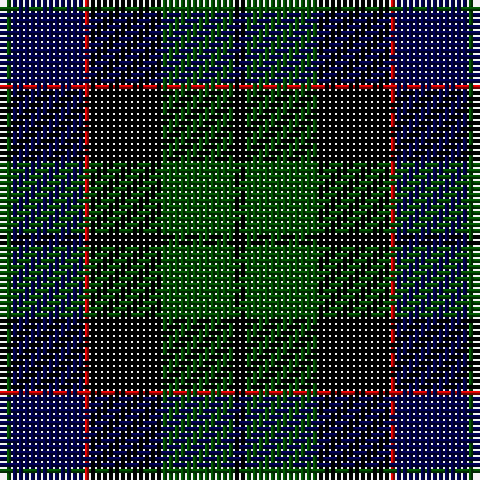

**Bands:** [GBRKGK](/stripes/gbrkgk/) · **Stripes:** [DG DB R K DG K](/stripes/stripes6/) DG DB R K DG K

This was sourced from weddslist.  It is a [6 band tartan](/bands/bands6/).

Original link http://www.weddslist.com/cgi-bin/tartans/pg.pl?source=rb

## Attestations

This cloth appears in 2 source records; the oldest owns this page.

- undated — Ferguson of Balquhidder (weddslist, [record](http://www.weddslist.com/cgi-bin/tartans/pg.pl?source=rb))
- undated — Ferguson of Balquhidder (weddslist, [record](http://www.weddslist.com/cgi-bin/tartans/pg.pl?source=x))

## Register references

External register numbers recorded for this tartan.

- Scottish Register of Tartans: [2540](https://www.tartanregister.gov.uk/tartanDetails.aspx?ref=2540)
- Scottish Register of Tartans: [2625](https://www.tartanregister.gov.uk/tartanDetails.aspx?ref=2625)
- Scottish Register of Tartans: [2666](https://www.tartanregister.gov.uk/tartanDetails.aspx?ref=2666)
- Scottish Register of Tartans: [3555](https://www.tartanregister.gov.uk/tartanDetails.aspx?ref=3555)
- Scottish Register of Tartans: [3808](https://www.tartanregister.gov.uk/tartanDetails.aspx?ref=3808)
- Scottish Tartans Authority (ITI): 1429
- Scottish Tartans Authority (ITI): 218
- Scottish Tartans World Register: 1010
- Scottish Tartans World Register: 1429
- Scottish Tartans World Register: 1585
- Scottish Tartans World Register: 218
- Scottish Tartans World Register: 864

## Variants

Other setts woven to the same stripe pattern.

- [Ferguson of Balquhidder](/setts/s6/dg2db12r1k12dg12k2~x2/)

## Thread count
G/2 DB12 R1 K12 G12 K/2

## Palette
Each colour and its ΔE from the base-6 reference it is a variant of.

| Colour | Shade | Base | ΔE (OKLab) |
|---|---|---|---|
| DB | <code style="background-color:#00004C;">#00004C</code> `#00004C` | B <code style="background-color:#2A418A;">#2A418A</code> | 0.21 |
| G | <code style="background-color:#004C00;">#004C00</code> `#004C00` | G <code style="background-color:#006100;">#006100</code> | 0.07 |
| K | <code style="background-color:#000000;">#000000</code> `#000000` | K <code style="background-color:#000000;">#000000</code> | 0.00 |
| R | <code style="background-color:#C80000;">#C80000</code> `#C80000` | R <code style="background-color:#CC0000;">#CC0000</code> | 0.01 |

# Sample pattern

## Nearest tartans

The nearest existing variants by ΔTartan distance.

1. [Gunn](/setts/s6/dg2db12dg1k12dg12r2~x2/) — ΔT 0.46
1. [Graham of Menteith](/setts/s6/dg16b2dg1k12db12k1~x2/) — ΔT 0.70
1. [Morrison](/setts/s6/k3dg14k14dg2db14r3~x2/) — ΔT 0.93
1. [Coarse Kilt](/setts/s7/r3k2db25k28dg25k2r3~x2/) — ΔT 0.94
1. [Fletcher](/setts/s7/db6k1db6k8r1dg8k2/) — ΔT 0.97
1. [Morrison](/setts/s6/k3dg14k14dg2db14r3/) — ΔT 0.99
1. [Graham of Menteith](/setts/s6/dg8lb2dg1k12db12k1~x2/) — ΔT 1.02
1. [Mitchell](/setts/s6/k2dg12k12r1db12lr2~x2/) — ΔT 1.02
1. [Mitchell](/setts/s6/k2dg12k12r1db12lr2/) — ΔT 1.02
1. [Gunn](/setts/s6/g2db12g1k12g12r2~x2/) — ΔT 1.09

## Neighbour map

Every grey dot is one of 14313 variants placed by the first two principal components of the ΔTartan feature space (44% of its variance). Red is this tartan; blue dots are its nearest — click one to open its page.

<svg viewBox="0 0 640 380" role="img" style="max-width:100%;height:auto;border:1px solid #e0e0e0;border-radius:4px;display:block" xmlns="http://www.w3.org/2000/svg"><image href="/nn/cloud.v1.png" width="640" height="380"/><a href="/setts/s6/dg2db12dg1k12dg12r2~x2/"><circle cx="203.5" cy="228.4" r="4" fill="#3465a4"><title>Gunn</title></circle></a><a href="/setts/s6/dg16b2dg1k12db12k1~x2/"><circle cx="242.7" cy="220.0" r="4" fill="#3465a4"><title>Graham of Menteith</title></circle></a><a href="/setts/s6/k3dg14k14dg2db14r3~x2/"><circle cx="177.9" cy="259.9" r="4" fill="#3465a4"><title>Morrison</title></circle></a><a href="/setts/s7/r3k2db25k28dg25k2r3~x2/"><circle cx="230.8" cy="208.5" r="4" fill="#3465a4"><title>Coarse Kilt</title></circle></a><a href="/setts/s7/db6k1db6k8r1dg8k2/"><circle cx="196.8" cy="257.0" r="4" fill="#3465a4"><title>Fletcher</title></circle></a><a href="/setts/s6/k3dg14k14dg2db14r3/"><circle cx="163.9" cy="252.7" r="4" fill="#3465a4"><title>Morrison</title></circle></a><a href="/setts/s6/dg8lb2dg1k12db12k1~x2/"><circle cx="190.3" cy="216.9" r="4" fill="#3465a4"><title>Graham of Menteith</title></circle></a><a href="/setts/s6/k2dg12k12r1db12lr2~x2/"><circle cx="170.1" cy="211.3" r="4" fill="#3465a4"><title>Mitchell</title></circle></a><a href="/setts/s6/k2dg12k12r1db12lr2/"><circle cx="170.1" cy="211.3" r="4" fill="#3465a4"><title>Mitchell</title></circle></a><a href="/setts/s6/g2db12g1k12g12r2~x2/"><circle cx="216.4" cy="230.6" r="4" fill="#3465a4"><title>Gunn</title></circle></a><circle cx="209.6" cy="235.3" r="5" fill="#c00000"/></svg>

ID: /setts/s6/dg2db12r1k12dg12k2/
