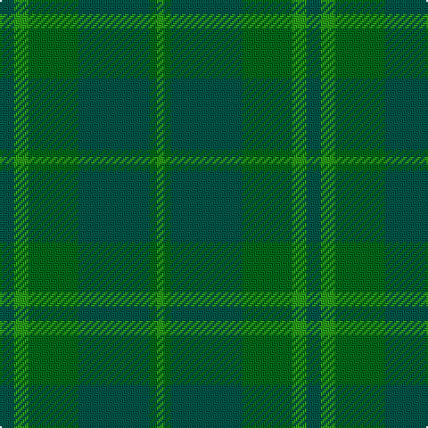

In pattern [GGGGGG](/stripes/gggggg/).

This was sourced from register-of-tartans.  It is a [6 stripe tartan](/stripes/stripes6/).

Original link https://www.tartanregister.gov.uk/tartanDetails.aspx?ref=1109

## Also known as

This cloth is also recorded under:

- Emerald, The

## Attestations

This cloth appears in 2 source records; the oldest owns this page.

- 01/01/1972 — Emerald, The (register-of-tartans, [record](https://www.tartanregister.gov.uk/tartanDetails.aspx?ref=1109))
- pre 1972 — Emerald (Fashion) (tartans-authority, [record](http://www.tartansauthority.com/tartan-ferret/display/4813/))

## Register references

External register numbers recorded for this tartan.

- Scottish Register of Tartans: [1109](https://www.tartanregister.gov.uk/tartanDetails.aspx?ref=1109)
- Scottish Tartans Authority (ITI): 4813

## Thread count
G/8 Gb8 Ga28 G40 Ga4 Gb/4

## Palette
Each colour and the base-6 reference it is a variant of.

| Colour | Shade | Base |
|---|---|---|
| G | <code style="background-color:#005448;">#005448</code> `oklch(39.9% 0.073 178.8)` <small>#005448</small> | G <code style="background-color:#006100;">#006100</code> |
| Ga | <code style="background-color:#006818;">#006818</code> `oklch(45.0% 0.142 145.0)` <small>#006818</small> | G <code style="background-color:#006100;">#006100</code> |
| Gb | <code style="background-color:#289C18;">#289C18</code> `oklch(60.6% 0.191 141.6)` <small>#289C18</small> | G <code style="background-color:#006100;">#006100</code> |

# Sample pattern

## Nearest tartans

The nearest existing variants by ΔTartan distance, with this tartan at the top so the swatches line up against it.

ΔTartan

Tartan

Sett

—

<a href="/ttd/edit/#slug=dg2g2g7dg10g1g1~x4">Emerald, The</a> <a class="nn-out" href="/setts/s6/dg2g2g7dg10g1g1~x4/" title="open its dictionary page">↗</a>

1.30

<a href="/ttd/edit/#slug=g40dg15g4dg4g4~x2">Celtic 2009 (Sports)</a> <a class="nn-out" href="/setts/s5/g40dg15g4dg4g4~x2/" title="open its dictionary page">↗</a>

1.71

<a href="/ttd/edit/#slug=y4dg18dg6dg6dg24ly3~x2">Park (Estate Check)</a> <a class="nn-out" href="/setts/s6/y4dg18dg6dg6dg24ly3~x2/" title="open its dictionary page">↗</a>

1.71

<a href="/ttd/edit/#slug=dg5g3dg24g24dg3g5~x2">Erskine Hunting</a> <a class="nn-out" href="/setts/s6/dg5g3dg24g24dg3g5~x2/" title="open its dictionary page">↗</a>

1.76

<a href="/ttd/edit/#slug=t4g26g8t8g8g3t2~x2">Valley of the Green</a> <a class="nn-out" href="/setts/s7/t4g26g8t8g8g3t2~x2/" title="open its dictionary page">↗</a>

1.89

<a href="/ttd/edit/#slug=g13dy3g1do3dy1~x6">Glen Boig</a> <a class="nn-out" href="/setts/s5/g13dy3g1do3dy1~x6/" title="open its dictionary page">↗</a>

1.91

<a href="/ttd/edit/#slug=dg4db2dg17dg2r4dg2dg3dg11dg2~x2">Conlon</a> <a class="nn-out" href="/setts/s9/dg4db2dg17dg2r4dg2dg3dg11dg2~x2/" title="open its dictionary page">↗</a>

1.96

<a href="/ttd/edit/#slug=dg24r2dg2dg40dg25dg2dg2r2dg2dg20~x2">Donachie of Brockloch Hunting Clan Tartan Tartan Number: 3002. Earliest known date: 2004 Based on the Robertson sett No. 893 with red changed to green. The Donachie's are part of the Robertson clan, also known as Clan Donnachaidh. See products available Copyright © Blair Urquhart, Comrie, 2015</a> <a class="nn-out" href="/setts/s10/dg24r2dg2dg40dg25dg2dg2r2dg2dg20~x2/" title="open its dictionary page">↗</a>

2.00

<a href="/ttd/edit/#slug=y4dg18dg6dg6dg24k3~x2">Park Estate</a> <a class="nn-out" href="/setts/s6/y4dg18dg6dg6dg24k3~x2/" title="open its dictionary page">↗</a>

2.11

<a href="/ttd/edit/#slug=dg5k2dg28k10dy26db4dg4~x2">John Telfar Dunbar Hunting</a> <a class="nn-out" href="/setts/s7/dg5k2dg28k10dy26db4dg4~x2/" title="open its dictionary page">↗</a>

2.17

<a href="/ttd/edit/#slug=g24g3g4g12g8g3g8g30b3~x2">Gates, Hunting</a> <a class="nn-out" href="/setts/s9/g24g3g4g12g8g3g8g30b3~x2/" title="open its dictionary page">↗</a>

## Neighbour map

Every grey dot is one of 14299 variants placed by the first two principal components of the ΔTartan feature space (44% of its variance). Red is this tartan; blue dots are its nearest — click one to open its page.

<svg viewBox="0 0 640 380" role="img" style="max-width:100%;height:auto;border:1px solid #e0e0e0;border-radius:4px;display:block" xmlns="http://www.w3.org/2000/svg"><image href="/nn/cloud.v1.png" width="640" height="380"/><a href="/setts/s5/g40dg15g4dg4g4~x2/"><circle cx="487.9" cy="307.2" r="4" fill="#3465a4"><title>Celtic 2009 (Sports)</title></circle></a><a href="/setts/s6/y4dg18dg6dg6dg24ly3~x2/"><circle cx="377.3" cy="303.3" r="4" fill="#3465a4"><title>Park (Estate Check)</title></circle></a><a href="/setts/s6/dg5g3dg24g24dg3g5~x2/"><circle cx="477.3" cy="339.7" r="4" fill="#3465a4"><title>Erskine Hunting</title></circle></a><a href="/setts/s7/t4g26g8t8g8g3t2~x2/"><circle cx="355.2" cy="265.9" r="4" fill="#3465a4"><title>Valley of the Green</title></circle></a><a href="/setts/s5/g13dy3g1do3dy1~x6/"><circle cx="568.5" cy="307.0" r="4" fill="#3465a4"><title>Glen Boig</title></circle></a><a href="/setts/s9/dg4db2dg17dg2r4dg2dg3dg11dg2~x2/"><circle cx="444.1" cy="288.8" r="4" fill="#3465a4"><title>Conlon</title></circle></a><a href="/setts/s10/dg24r2dg2dg40dg25dg2dg2r2dg2dg20~x2/"><circle cx="515.9" cy="268.7" r="4" fill="#3465a4"><title>Donachie of Brockloch Hunting Clan Tartan Tartan Number: 3002. Earliest known date: 2004 Based on the Robertson sett No. 893 with red changed to green. The Donachie's are part of the Robertson clan, also known as Clan Donnachaidh. See products available Copyright © Blair Urquhart, Comrie, 2015</title></circle></a><a href="/setts/s6/y4dg18dg6dg6dg24k3~x2/"><circle cx="369.9" cy="301.1" r="4" fill="#3465a4"><title>Park Estate</title></circle></a><a href="/setts/s7/dg5k2dg28k10dy26db4dg4~x2/"><circle cx="392.1" cy="269.1" r="4" fill="#3465a4"><title>John Telfar Dunbar Hunting</title></circle></a><a href="/setts/s9/g24g3g4g12g8g3g8g30b3~x2/"><circle cx="427.1" cy="285.6" r="4" fill="#3465a4"><title>Gates, Hunting</title></circle></a><circle cx="447.0" cy="317.6" r="5" fill="#c00000"/></svg>

ID: /setts/s6/dg2g2g7dg10g1g1~x4/
