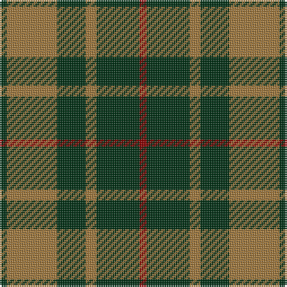

This page is one **sett** — a single exact thread-count. It belongs to the [tartan](/tartans/dr2dg12lt3dg8lt14dg2/)
(the same proportion at any scale), whose colour order is pattern [GRGRGR](/stripes/grgrgr/).

Sourced from register-of-tartans.  It is a [6 stripe tartan](/stripes/stripes6/).

Original link https://www.tartanregister.gov.uk/tartanDetails.aspx?ref=729

## Register references

External register numbers recorded for this tartan.

- Scottish Register of Tartans: [729](https://www.tartanregister.gov.uk/tartanDetails.aspx?ref=729)
- Scottish Tartans Authority (ITI): 4566

## Thread count
DR/4 DG24 LT6 DG16 LT28 DG/4

## Palette
Each colour and the base-6 reference it is a variant of.

| Colour | Shade | Base |
|---|---|---|
| B | <code style="background-color:#788CB4;">#788CB4</code> `oklch(63.9% 0.065 264.0)` <small>#788CB4</small> | B <code style="background-color:#2A418A;">#2A418A</code> |
| DB | <code style="background-color:#00008C;">#00008C</code> `oklch(28.9% 0.200 264.1)` <small>#00008C</small> | B <code style="background-color:#2A418A;">#2A418A</code> |
| DG | <code style="background-color:#003014;">#003014</code> `oklch(27.1% 0.071 152.1)` <small>#003014</small> | G <code style="background-color:#006100;">#006100</code> |
| DR | <code style="background-color:#8C0000;">#8C0000</code> `oklch(40.2% 0.165 29.2)` <small>#8C0000</small> | R <code style="background-color:#CC0000;">#CC0000</code> |
| DY | <code style="background-color:#C88C00;">#C88C00</code> `oklch(68.2% 0.142 78.2)` <small>#C88C00</small> | Y <code style="background-color:#F2BF00;">#F2BF00</code> |
| K | <code style="background-color:#000000;">#000000</code> `oklch(0.0% 0.000 0.0)` <small>#000000</small> | K <code style="background-color:#000000;">#000000</code> |
| LT | <code style="background-color:#A0783C;">#A0783C</code> `oklch(60.0% 0.092 75.5)` <small>#A0783C</small> | R <code style="background-color:#CC0000;">#CC0000</code> |
| N | <code style="background-color:#C8C8C8;">#C8C8C8</code> `oklch(83.3% 0.000 89.9)` <small>#C8C8C8</small> | W <code style="background-color:#F7F7F7;">#F7F7F7</code> |
| P | <code style="background-color:#64008C;">#64008C</code> `oklch(38.5% 0.193 311.3)` <small>#64008C</small> | B <code style="background-color:#2A418A;">#2A418A</code> |

# Sample pattern

## Nearest tartans

The nearest existing variants by ΔTartan distance, with this tartan at the top so the swatches line up against it.

ΔTartan

Tartan

Sett

—

<a href="/ttd/edit/#slug=dg2o14dg8o3dg12r2~x2">Confederate Artillery</a> <a class="nn-out" href="/setts/s6/dg2o14dg8o3dg12r2~x2/" title="open its dictionary page">↗</a>

0.38

<a href="/ttd/edit/#slug=dg2o14dg8o3dg12db2~x2">Confederate Infantry</a> <a class="nn-out" href="/setts/s6/dg2o14dg8o3dg12db2~x2/" title="open its dictionary page">↗</a>

0.75

<a href="/ttd/edit/#slug=dg2y14dg8y3dg12lo2~x2">Confederate Cavalry (Military)</a> <a class="nn-out" href="/setts/s6/dg2y14dg8y3dg12lo2~x2/" title="open its dictionary page">↗</a>

1.00

<a href="/ttd/edit/#slug=db6r3g2r3g12r3g2~x2">Skene Clan Tartan Tartan Number: 516. Earliest known date: 1886 Smith No 53 has ROSE in place of RED. Grant's version is similar to the sample named Skene in the 1830 pattern book of Wilson's of Bannockburn. See products available Copyright © Blair Urquhart, Comrie, 2015</a> <a class="nn-out" href="/setts/s7/db6r3g2r3g12r3g2~x2/" title="open its dictionary page">↗</a>

1.07

<a href="/ttd/edit/#slug=g22dt5r4dt5r3~x2">Romsdal</a> <a class="nn-out" href="/setts/s5/g22dt5r4dt5r3~x2/" title="open its dictionary page">↗</a>

1.22

<a href="/ttd/edit/#slug=g9m2g2m2g2m8g11w2~x4">Leeds University Corporate Tartan Tartan Number: 980. Earliest known date: pre 2003 Leeds University Scottish Country Dance Club. See products available Copyright © Blair Urquhart, Comrie, 2015</a> <a class="nn-out" href="/setts/s8/g9m2g2m2g2m8g11w2~x4/" title="open its dictionary page">↗</a>

1.25

<a href="/ttd/edit/#slug=k8g3k4g20r4~x2">MacArthur-Fox (Personal)</a> <a class="nn-out" href="/setts/s5/k8g3k4g20r4~x2/" title="open its dictionary page">↗</a>

1.30

<a href="/ttd/edit/#slug=k9g3k3g12ly2~x4">MacArthur</a> <a class="nn-out" href="/setts/s5/k9g3k3g12ly2~x4/" title="open its dictionary page">↗</a>

1.32

<a href="/ttd/edit/#slug=ly1r3dg7r3dg7r3ly1~x4">Unidentified #42</a> <a class="nn-out" href="/setts/s7/ly1r3dg7r3dg7r3ly1~x4/" title="open its dictionary page">↗</a>

1.40

<a href="/ttd/edit/#slug=g10db2r8lo2g5~x4">Cub Scouts of America</a> <a class="nn-out" href="/setts/s5/g10db2r8lo2g5~x4/" title="open its dictionary page">↗</a>

1.40

<a href="/ttd/edit/#slug=g25r4db24r21g25r3db4~x2">Glasgow</a> <a class="nn-out" href="/setts/s7/g25r4db24r21g25r3db4~x2/" title="open its dictionary page">↗</a>

## Neighbour map

Every grey dot is one of 14299 variants placed by the first two principal components of the ΔTartan feature space (44% of its variance). Red is this tartan; blue dots are its nearest — click one to open its page.

<svg viewBox="0 0 640 380" role="img" style="max-width:100%;height:auto;border:1px solid #e0e0e0;border-radius:4px;display:block" xmlns="http://www.w3.org/2000/svg"><image href="/nn/cloud.v1.png" width="640" height="380"/><a href="/setts/s6/dg2o14dg8o3dg12db2~x2/"><circle cx="313.8" cy="262.0" r="4" fill="#3465a4"><title>Confederate Infantry</title></circle></a><a href="/setts/s6/dg2y14dg8y3dg12lo2~x2/"><circle cx="337.0" cy="273.8" r="4" fill="#3465a4"><title>Confederate Cavalry (Military)</title></circle></a><a href="/setts/s7/db6r3g2r3g12r3g2~x2/"><circle cx="284.0" cy="253.3" r="4" fill="#3465a4"><title>Skene Clan Tartan Tartan Number: 516. Earliest known date: 1886 Smith No 53 has ROSE in place of RED. Grant's version is similar to the sample named Skene in the 1830 pattern book of Wilson's of Bannockburn. See products available Copyright © Blair Urquhart, Comrie, 2015</title></circle></a><a href="/setts/s5/g22dt5r4dt5r3~x2/"><circle cx="342.0" cy="256.5" r="4" fill="#3465a4"><title>Romsdal</title></circle></a><a href="/setts/s8/g9m2g2m2g2m8g11w2~x4/"><circle cx="350.3" cy="249.9" r="4" fill="#3465a4"><title>Leeds University Corporate Tartan Tartan Number: 980. Earliest known date: pre 2003 Leeds University Scottish Country Dance Club. See products available Copyright © Blair Urquhart, Comrie, 2015</title></circle></a><a href="/setts/s5/k8g3k4g20r4~x2/"><circle cx="355.9" cy="277.8" r="4" fill="#3465a4"><title>MacArthur-Fox (Personal)</title></circle></a><a href="/setts/s5/k9g3k3g12ly2~x4/"><circle cx="282.5" cy="278.4" r="4" fill="#3465a4"><title>MacArthur</title></circle></a><a href="/setts/s7/ly1r3dg7r3dg7r3ly1~x4/"><circle cx="301.1" cy="244.0" r="4" fill="#3465a4"><title>Unidentified #42</title></circle></a><a href="/setts/s5/g10db2r8lo2g5~x4/"><circle cx="279.6" cy="282.4" r="4" fill="#3465a4"><title>Cub Scouts of America</title></circle></a><a href="/setts/s7/g25r4db24r21g25r3db4~x2/"><circle cx="257.0" cy="247.8" r="4" fill="#3465a4"><title>Glasgow</title></circle></a><circle cx="320.3" cy="262.9" r="5" fill="#c00000"/></svg>

ID: /setts/s6/dg2o14dg8o3dg12r2~x2/
