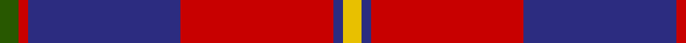
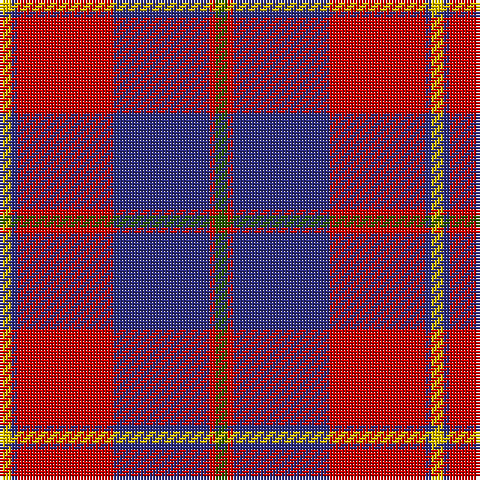

**Bands:** [YBRBRG](/stripes/ybrbrg/) · **Stripes:** [LY DB R DB R DG](/stripes/stripes6/) LY DB R DB R DG

This was sourced from register-of-tartans.  It is a [6 band tartan](/bands/bands6/).

Original link https://www.tartanregister.gov.uk/tartanDetails.aspx?ref=1303

## Attestations

This cloth appears in 2 source records; the oldest owns this page.

- 01/01/1950 — Galloway Dress (Yellow Line) (register-of-tartans, [record](https://www.tartanregister.gov.uk/tartanDetails.aspx?ref=1303))
- 1950 — Galloway Dress (Yellow Line) (Dist) (tartans-authority, [record](http://www.tartansauthority.com/tartan-ferret/display/850/))

## Register references

External register numbers recorded for this tartan.

- Scottish Register of Tartans: [1303](https://www.tartanregister.gov.uk/tartanDetails.aspx?ref=1303)
- Scottish Tartans Authority (ITI): 850
- Scottish Tartans World Register: 850

## Thread count
Y/4 DB2 R32 DB32 R2 G/4

## Palette
Each colour and its ΔE from the base-6 reference it is a variant of.

| Colour | Shade | Base | ΔE (OKLab) |
|---|---|---|---|
| DB | <code style="background-color:#2C2C80;">#2C2C80</code> `#2C2C80` | B <code style="background-color:#2A418A;">#2A418A</code> | 0.06 |
| G | <code style="background-color:#285800;">#285800</code> `#285800` | G <code style="background-color:#006100;">#006100</code> | 0.03 |
| R | <code style="background-color:#C80000;">#C80000</code> `#C80000` | R <code style="background-color:#CC0000;">#CC0000</code> | 0.01 |
| Y | <code style="background-color:#E8C000;">#E8C000</code> `#E8C000` | Y <code style="background-color:#F2BF00;">#F2BF00</code> | 0.02 |

# Sample pattern

## Nearest tartans

The nearest existing variants by ΔTartan distance.

1. [Galloway dress](/setts/s6/g2r1db16r16db1ly2~x2/) — ΔT 0.53
1. [Robinson, dress](/setts/s6/k1r7k1r7db16g1~x2/) — ΔT 0.63
1. [Galloway Red](/setts/s6/g3r2db22r22db2w3~x2/) — ΔT 0.71
1. [Robinson Dress (Pendleton) #1](/setts/s6/k1r7k1r7db16g1~x4/) — ΔT 0.73
1. [Galloway, dress](/setts/s6/g1r1db16r16db1w1~x2/) — ΔT 0.76
1. [Americana - 1978 #2 (Fashion)](/setts/s7/db2r2db28k11r27w2r2~x2/) — ΔT 0.94
1. [Superfast Ferries (Corporate)](/setts/s6/db1r16db6ly4db6w1~x4/) — ΔT 0.95
1. [Mercer Personal Tartan Tartan Number: 3019. Earliest known date: 2004 Sent to House of Tartan by the owner. See products available Copyright © Blair Urquhart, Comrie, 2015](/setts/s9/db16w2db3ly4db3w2db10r35db4~x2/) — ΔT 0.97
1. [Masai Shuka 17 (Artefact)](/setts/s6/k4b32r30b2w5k2~x2/) — ΔT 0.98
1. [Mercer, James (Personal)](/setts/s9/db24w3db4ly6db4w3db15r52db6/) — ΔT 1.03

## Neighbour map

Every grey dot is one of 14299 variants placed by the first two principal components of the ΔTartan feature space (44% of its variance). Red is this tartan; blue dots are its nearest — click one to open its page.

<svg viewBox="0 0 640 380" role="img" style="max-width:100%;height:auto;border:1px solid #e0e0e0;border-radius:4px;display:block" xmlns="http://www.w3.org/2000/svg"><image href="/nn/cloud.v1.png" width="640" height="380"/><a href="/setts/s6/g2r1db16r16db1ly2~x2/"><circle cx="316.6" cy="172.0" r="4" fill="#3465a4"><title>Galloway dress</title></circle></a><a href="/setts/s6/k1r7k1r7db16g1~x2/"><circle cx="324.9" cy="181.2" r="4" fill="#3465a4"><title>Robinson, dress</title></circle></a><a href="/setts/s6/g3r2db22r22db2w3~x2/"><circle cx="277.4" cy="178.6" r="4" fill="#3465a4"><title>Galloway Red</title></circle></a><a href="/setts/s6/k1r7k1r7db16g1~x4/"><circle cx="329.1" cy="182.1" r="4" fill="#3465a4"><title>Robinson Dress (Pendleton) #1</title></circle></a><a href="/setts/s6/g1r1db16r16db1w1~x2/"><circle cx="353.6" cy="170.4" r="4" fill="#3465a4"><title>Galloway, dress</title></circle></a><a href="/setts/s7/db2r2db28k11r27w2r2~x2/"><circle cx="270.5" cy="168.0" r="4" fill="#3465a4"><title>Americana - 1978 #2 (Fashion)</title></circle></a><a href="/setts/s6/db1r16db6ly4db6w1~x4/"><circle cx="279.6" cy="168.2" r="4" fill="#3465a4"><title>Superfast Ferries (Corporate)</title></circle></a><a href="/setts/s9/db16w2db3ly4db3w2db10r35db4~x2/"><circle cx="301.5" cy="134.6" r="4" fill="#3465a4"><title>Mercer Personal Tartan Tartan Number: 3019. Earliest known date: 2004 Sent to House of Tartan by the owner. See products available Copyright © Blair Urquhart, Comrie, 2015</title></circle></a><a href="/setts/s6/k4b32r30b2w5k2~x2/"><circle cx="284.9" cy="162.3" r="4" fill="#3465a4"><title>Masai Shuka 17 (Artefact)</title></circle></a><a href="/setts/s9/db24w3db4ly6db4w3db15r52db6/"><circle cx="296.7" cy="132.2" r="4" fill="#3465a4"><title>Mercer, James (Personal)</title></circle></a><circle cx="308.4" cy="166.9" r="5" fill="#c00000"/></svg>

ID: /setts/s6/dg2r1db16r16db1ly2~x2/
