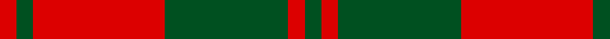

This page is one **sett** — a single exact thread-count. It belongs to the [tartan](/tartans/r2g2r16g15r2g2/)
(the same proportion at any scale), whose colour order is pattern [GRGRGR](/stripes/grgrgr/).

Sourced from register-of-tartans.  It is a [6 stripe tartan](/stripes/stripes6/).

Original link https://www.tartanregister.gov.uk/tartanDetails.aspx?ref=4335

## Also known as

This cloth is also recorded under:

- Unidentified, NW Highlands

## Register references

External register numbers recorded for this tartan.

- Scottish Register of Tartans: [4335](https://www.tartanregister.gov.uk/tartanDetails.aspx?ref=4335)
- Scottish Tartans World Register: 900

## Thread count
R/4 G4 R32 G30 R4 G/4

## Palette
Each colour and the base-6 reference it is a variant of.

| Colour | Shade | Base |
|---|---|---|
| G | <code style="background-color:#005020;">#005020</code> `oklch(37.7% 0.105 149.6)` <small>#005020</small> | G <code style="background-color:#006100;">#006100</code> |
| R | <code style="background-color:#DC0000;">#DC0000</code> `oklch(56.2% 0.230 29.2)` <small>#DC0000</small> | R <code style="background-color:#CC0000;">#CC0000</code> |

# Sample pattern

## Nearest tartans

The nearest existing variants by ΔTartan distance, with this tartan at the top so the swatches line up against it.

ΔTartan

Tartan

Sett

—

<a href="/ttd/edit/#slug=dg2r2dg15r16dg2r2~x2">Unidentified NW Highlands</a> <a class="nn-out" href="/setts/s6/dg2r2dg15r16dg2r2~x2/" title="open its dictionary page">↗</a>

1.01

<a href="/ttd/edit/#slug=r2g2r16g15r2g2~x2">Unidentified, NW Highlands</a> <a class="nn-out" href="/setts/s6/r2g2r16g15r2g2~x2/" title="open its dictionary page">↗</a>

1.18

<a href="/ttd/edit/#slug=dg16r5dg2r18k2~x2">MacDonald Lord of the Isles #2</a> <a class="nn-out" href="/setts/s5/dg16r5dg2r18k2~x2/" title="open its dictionary page">↗</a>

1.20

<a href="/ttd/edit/#slug=g16r5g2r18k2~x2">MacDonald, Lord of The Isles (Artef)</a> <a class="nn-out" href="/setts/s5/g16r5g2r18k2~x2/" title="open its dictionary page">↗</a>

1.26

<a href="/ttd/edit/#slug=r1g3r1g3r8ly1~x8">Cameron</a> <a class="nn-out" href="/setts/s6/r1g3r1g3r8ly1~x8/" title="open its dictionary page">↗</a>

1.34

<a href="/ttd/edit/#slug=dg8r2dg9r16dg1~x2">MacGregor of Glenstrae</a> <a class="nn-out" href="/setts/s5/dg8r2dg9r16dg1~x2/" title="open its dictionary page">↗</a>

1.35

<a href="/ttd/edit/#slug=dg7r3dg1r9k1~x2">MacDonald of Sleat</a> <a class="nn-out" href="/setts/s5/dg7r3dg1r9k1~x2/" title="open its dictionary page">↗</a>

1.37

<a href="/ttd/edit/#slug=r16dg1r1dg1r4dg12">MacQuarrie</a> <a class="nn-out" href="/setts/s6/r16dg1r1dg1r4dg12/" title="open its dictionary page">↗</a>

1.38

<a href="/ttd/edit/#slug=r1dg6r1dg6r15ly1~x2">Cameron Clan D</a> <a class="nn-out" href="/setts/s6/r1dg6r1dg6r15ly1~x2/" title="open its dictionary page">↗</a>

1.42

<a href="/ttd/edit/#slug=r16dg1r1dg1r4dg12~x2">MacQuarrie 7</a> <a class="nn-out" href="/setts/s6/r16dg1r1dg1r4dg12~x2/" title="open its dictionary page">↗</a>

1.44

<a href="/ttd/edit/#slug=r16g1r1g1r4g12~x4">MacQuarrie #5</a> <a class="nn-out" href="/setts/s6/r16g1r1g1r4g12~x4/" title="open its dictionary page">↗</a>

## Neighbour map

Every grey dot is one of 14299 variants placed by the first two principal components of the ΔTartan feature space (44% of its variance). Red is this tartan; blue dots are its nearest — click one to open its page.

<svg viewBox="0 0 640 380" role="img" style="max-width:100%;height:auto;border:1px solid #e0e0e0;border-radius:4px;display:block" xmlns="http://www.w3.org/2000/svg"><image href="/nn/cloud.v1.png" width="640" height="380"/><a href="/setts/s6/r2g2r16g15r2g2~x2/"><circle cx="380.4" cy="242.1" r="4" fill="#3465a4"><title>Unidentified, NW Highlands</title></circle></a><a href="/setts/s5/dg16r5dg2r18k2~x2/"><circle cx="343.2" cy="232.8" r="4" fill="#3465a4"><title>MacDonald Lord of the Isles #2</title></circle></a><a href="/setts/s5/g16r5g2r18k2~x2/"><circle cx="352.4" cy="240.2" r="4" fill="#3465a4"><title>MacDonald, Lord of The Isles (Artef)</title></circle></a><a href="/setts/s6/r1g3r1g3r8ly1~x8/"><circle cx="370.7" cy="226.4" r="4" fill="#3465a4"><title>Cameron</title></circle></a><a href="/setts/s5/dg8r2dg9r16dg1~x2/"><circle cx="381.5" cy="238.1" r="4" fill="#3465a4"><title>MacGregor of Glenstrae</title></circle></a><a href="/setts/s5/dg7r3dg1r9k1~x2/"><circle cx="354.7" cy="237.0" r="4" fill="#3465a4"><title>MacDonald of Sleat</title></circle></a><a href="/setts/s6/r16dg1r1dg1r4dg12/"><circle cx="451.9" cy="212.8" r="4" fill="#3465a4"><title>MacQuarrie</title></circle></a><a href="/setts/s6/r1dg6r1dg6r15ly1~x2/"><circle cx="394.4" cy="195.3" r="4" fill="#3465a4"><title>Cameron Clan D</title></circle></a><a href="/setts/s6/r16dg1r1dg1r4dg12~x2/"><circle cx="455.0" cy="215.4" r="4" fill="#3465a4"><title>MacQuarrie 7</title></circle></a><a href="/setts/s6/r16g1r1g1r4g12~x4/"><circle cx="456.7" cy="215.1" r="4" fill="#3465a4"><title>MacQuarrie #5</title></circle></a><circle cx="375.0" cy="235.6" r="5" fill="#c00000"/></svg>

ID: /setts/s6/dg2r2dg15r16dg2r2~x2/
