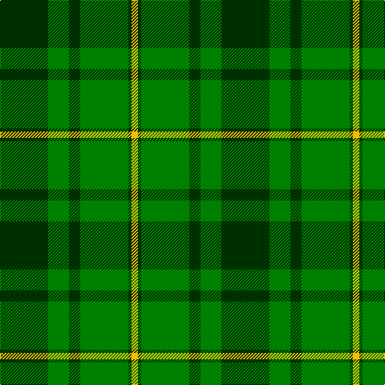

In pattern [GGGGGY](/stripes/gggggy/).

This was sourced from weddslist.  It is a [6 stripe tartan](/stripes/stripes6/).

Original link http://www.weddslist.com/cgi-bin/tartans/pg.pl?source=sts

## Also known as

This cloth is also recorded under:

- MacSporran, Rejected design

## Thread count
DG/60 G26 DG14 G60 DG4 Y/8

## Palette
Each colour and the base-6 reference it is a variant of.

| Colour | Shade | Base |
|---|---|---|
| DG | <code style="background-color:#003000;">#003000</code> `oklch(26.8% 0.091 142.5)` <small>#003000</small> | G <code style="background-color:#006100;">#006100</code> |
| G | <code style="background-color:#008000;">#008000</code> `oklch(52.0% 0.177 142.5)` <small>#008000</small> | G <code style="background-color:#006100;">#006100</code> |
| Y | <code style="background-color:#F0C000;">#F0C000</code> `oklch(82.7% 0.169 90.5)` <small>#F0C000</small> | Y <code style="background-color:#F2BF00;">#F2BF00</code> |

# Sample pattern

## Nearest tartans

The nearest existing variants by ΔTartan distance.

1. [Hunting Kenmore](/setts/s7/r2dg19g2dg2g19dg2ly2~x2/) — ΔT 1.55
1. [Glenbarr](/setts/s8/g3k6r2k6g3k2g16k1~x4/) — ΔT 1.67
1. [Campbell-Simpson (Personal)](/setts/s6/g12k2g2dg9g4k2~x4/) — ΔT 1.68
1. [Armagh](/setts/s9/g4ly2g17dg2r4dg2g3dg11g2~x2/) — ΔT 1.71
1. [Duchess of Fife #2](/setts/s6/g70k26g12k14db3k16~x2/) — ΔT 1.74
1. [Angle, Green (Fashion)](/setts/s7/lo1dg11k6dg3lo1dg1lo1~x4/) — ΔT 1.78
1. [Paton (Personal)](/setts/s7/r3g20k20g20lo2g2lo2~x2/) — ΔT 1.79
1. [MacArthur (Variant)](/setts/s6/r3g30k12g6k16ly2~x2/) — ΔT 1.80
1. [MacArthur (Highland Society)](/setts/s6/g18ly2g18k4g2k15~x2/) — ΔT 1.80
1. [Wcwm 1255](/setts/s5/g3r1k14g14lo1~x4/) — ΔT 1.82

## Neighbour map

Every grey dot is one of 14299 variants placed by the first two principal components of the ΔTartan feature space (44% of its variance). Red is this tartan; blue dots are its nearest — click one to open its page.

<svg viewBox="0 0 640 380" role="img" style="max-width:100%;height:auto;border:1px solid #e0e0e0;border-radius:4px;display:block" xmlns="http://www.w3.org/2000/svg"><image href="/nn/cloud.v1.png" width="640" height="380"/><a href="/setts/s7/r2dg19g2dg2g19dg2ly2~x2/"><circle cx="306.2" cy="208.3" r="4" fill="#3465a4"><title>Hunting Kenmore</title></circle></a><a href="/setts/s8/g3k6r2k6g3k2g16k1~x4/"><circle cx="376.8" cy="215.1" r="4" fill="#3465a4"><title>Glenbarr</title></circle></a><a href="/setts/s6/g12k2g2dg9g4k2~x4/"><circle cx="318.6" cy="273.7" r="4" fill="#3465a4"><title>Campbell-Simpson (Personal)</title></circle></a><a href="/setts/s9/g4ly2g17dg2r4dg2g3dg11g2~x2/"><circle cx="304.1" cy="209.1" r="4" fill="#3465a4"><title>Armagh</title></circle></a><a href="/setts/s6/g70k26g12k14db3k16~x2/"><circle cx="420.0" cy="221.6" r="4" fill="#3465a4"><title>Duchess of Fife #2</title></circle></a><a href="/setts/s7/lo1dg11k6dg3lo1dg1lo1~x4/"><circle cx="396.8" cy="226.0" r="4" fill="#3465a4"><title>Angle, Green (Fashion)</title></circle></a><a href="/setts/s7/r3g20k20g20lo2g2lo2~x2/"><circle cx="347.8" cy="221.4" r="4" fill="#3465a4"><title>Paton (Personal)</title></circle></a><a href="/setts/s6/r3g30k12g6k16ly2~x2/"><circle cx="319.5" cy="213.9" r="4" fill="#3465a4"><title>MacArthur (Variant)</title></circle></a><a href="/setts/s6/g18ly2g18k4g2k15~x2/"><circle cx="386.4" cy="265.0" r="4" fill="#3465a4"><title>MacArthur (Highland Society)</title></circle></a><a href="/setts/s5/g3r1k14g14lo1~x4/"><circle cx="337.7" cy="223.3" r="4" fill="#3465a4"><title>Wcwm 1255</title></circle></a><circle cx="343.2" cy="242.1" r="5" fill="#c00000"/></svg>

ID: /setts/s6/dg30g13dg7g30dg2ly4~x2/
