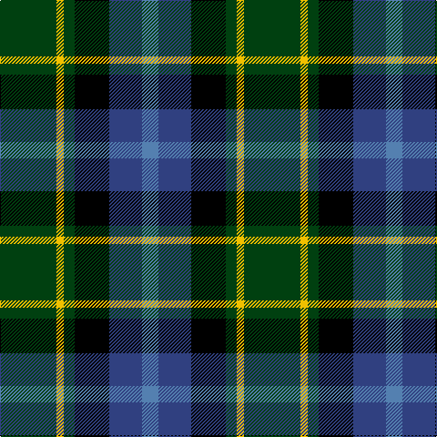

In pattern [BBKGYG](/stripes/bbkgyg/).

This was sourced from weddslist.  It is a [6 stripe tartan](/stripes/stripes6/).

Original link http://www.weddslist.com/cgi-bin/tartans/pg.pl?source=sts

## Thread count
DG/62 Y8 DG12 K38 B36 Ba/18

## Palette
Each colour and the base-6 reference it is a variant of.

| Colour | Shade | Base |
|---|---|---|
| B | <code style="background-color:#304080;">#304080</code> `oklch(39.4% 0.109 270.2)` <small>#304080</small> | B <code style="background-color:#2A418A;">#2A418A</code> |
| Ba | <code style="background-color:#5480B0;">#5480B0</code> `oklch(58.8% 0.089 251.5)` <small>#5480B0</small> | B <code style="background-color:#2A418A;">#2A418A</code> |
| DG | <code style="background-color:#004010;">#004010</code> `oklch(32.3% 0.098 146.3)` <small>#004010</small> | G <code style="background-color:#006100;">#006100</code> |
| K | <code style="background-color:#000000;">#000000</code> `oklch(0.0% 0.000 0.0)` <small>#000000</small> | K <code style="background-color:#000000;">#000000</code> |
| Y | <code style="background-color:#F0C000;">#F0C000</code> `oklch(82.7% 0.169 90.5)` <small>#F0C000</small> | Y <code style="background-color:#F2BF00;">#F2BF00</code> |

# Sample pattern

## Nearest tartans

The nearest existing variants by ΔTartan distance.

1. [Brodie Hunting](/setts/s7/r2dg8ly1k8dg8db8r2/) — ΔT 0.74
1. [Scottish Odyssey Commemorative Tartan Tartan Number: 4071. Earliest known date: 01/01/2002 The Scottish Odyssey tartan from Lochcarron is a 'celebration of the wonderful experiences to be gained' from a visit to Scotland and some of the most spectacularly contrasting landscapes to be seen in Europe. See products available Copyright © Blair Urquhart, Comrie, 2015](/setts/s7/k7db11k3db11dy11g22db3~x2/) — ΔT 0.81
1. [Dyce #3](/setts/s6/k2ly1dg6k6db6w1~x4/) — ΔT 0.84
1. [Midlothian](/setts/s6/db31b4db5k19g20ly4~x2/) — ΔT 0.86
1. [Rose Hunting](/setts/s6/k4w1g10k10db10r2~x4/) — ΔT 0.87
1. [Rose Hunting](/setts/s6/dg4lb1dg10k10db10r2/) — ΔT 0.87
1. [MacLean, Donald (Personal)](/setts/s7/g16lb3g3k10db12r2db3~x2/) — ΔT 0.90
1. [Rose Hunting Clan Tartan Tartan Number: 1226. Earliest known date: 1831 First recorded in James Logan's, 'The Scottish Gael' in 1831. See products available Copyright © Blair Urquhart, Comrie, 2015](/setts/s6/k4w1g10k10db10r2~x2/) — ΔT 0.94
1. [Davidson of Tulloch](/setts/s5/r1db6k3dg6lb1/) — ΔT 0.94
1. [Teylu Coleman (Name)](/setts/s5/ly3dt17n9k25lb3~x2/) — ΔT 0.96

## Neighbour map

Every grey dot is one of 14299 variants placed by the first two principal components of the ΔTartan feature space (44% of its variance). Red is this tartan; blue dots are its nearest — click one to open its page.

<svg viewBox="0 0 640 380" role="img" style="max-width:100%;height:auto;border:1px solid #e0e0e0;border-radius:4px;display:block" xmlns="http://www.w3.org/2000/svg"><image href="/nn/cloud.v1.png" width="640" height="380"/><a href="/setts/s7/r2dg8ly1k8dg8db8r2/"><circle cx="154.1" cy="224.2" r="4" fill="#3465a4"><title>Brodie Hunting</title></circle></a><a href="/setts/s7/k7db11k3db11dy11g22db3~x2/"><circle cx="127.9" cy="223.8" r="4" fill="#3465a4"><title>Scottish Odyssey Commemorative Tartan Tartan Number: 4071. Earliest known date: 01/01/2002 The Scottish Odyssey tartan from Lochcarron is a 'celebration of the wonderful experiences to be gained' from a visit to Scotland and some of the most spectacularly contrasting landscapes to be seen in Europe. See products available Copyright © Blair Urquhart, Comrie, 2015</title></circle></a><a href="/setts/s6/k2ly1dg6k6db6w1~x4/"><circle cx="135.4" cy="239.1" r="4" fill="#3465a4"><title>Dyce #3</title></circle></a><a href="/setts/s6/db31b4db5k19g20ly4~x2/"><circle cx="159.0" cy="208.8" r="4" fill="#3465a4"><title>Midlothian</title></circle></a><a href="/setts/s6/k4w1g10k10db10r2~x4/"><circle cx="166.4" cy="223.2" r="4" fill="#3465a4"><title>Rose Hunting</title></circle></a><a href="/setts/s6/dg4lb1dg10k10db10r2/"><circle cx="157.1" cy="224.4" r="4" fill="#3465a4"><title>Rose Hunting</title></circle></a><a href="/setts/s7/g16lb3g3k10db12r2db3~x2/"><circle cx="164.3" cy="215.2" r="4" fill="#3465a4"><title>MacLean, Donald (Personal)</title></circle></a><a href="/setts/s6/k4w1g10k10db10r2~x2/"><circle cx="170.6" cy="225.3" r="4" fill="#3465a4"><title>Rose Hunting Clan Tartan Tartan Number: 1226. Earliest known date: 1831 First recorded in James Logan's, 'The Scottish Gael' in 1831. See products available Copyright © Blair Urquhart, Comrie, 2015</title></circle></a><a href="/setts/s5/r1db6k3dg6lb1/"><circle cx="126.0" cy="241.9" r="4" fill="#3465a4"><title>Davidson of Tulloch</title></circle></a><a href="/setts/s5/ly3dt17n9k25lb3~x2/"><circle cx="192.2" cy="221.7" r="4" fill="#3465a4"><title>Teylu Coleman (Name)</title></circle></a><circle cx="154.1" cy="228.0" r="5" fill="#c00000"/></svg>

ID: /setts/s6/dg31ly4dg6k19db18t9~x2/
