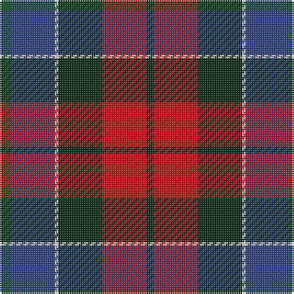

In pattern [GBWGRG](/stripes/gbwgrg/).

This was sourced from register-of-tartans.  It is a [6 stripe tartan](/stripes/stripes6/).

Original link https://www.tartanregister.gov.uk/tartanDetails.aspx?ref=3303

## Register references

External register numbers recorded for this tartan.

- Scottish Register of Tartans: [3303](https://www.tartanregister.gov.uk/tartanDetails.aspx?ref=3303)
- Scottish Tartans World Register: 2191

## Thread count
G/6 B24 LN2 DG24 R24 DG/4

## Palette
Each colour and the base-6 reference it is a variant of.

| Colour | Shade | Base |
|---|---|---|
| B | <code style="background-color:#2C4084;">#2C4084</code> `oklch(39.4% 0.117 268.3)` <small>#2C4084</small> | B <code style="background-color:#2A418A;">#2A418A</code> |
| DG | <code style="background-color:#002814;">#002814</code> `oklch(24.4% 0.059 156.5)` <small>#002814</small> | G <code style="background-color:#006100;">#006100</code> |
| G | <code style="background-color:#005020;">#005020</code> `oklch(37.7% 0.105 149.6)` <small>#005020</small> | G <code style="background-color:#006100;">#006100</code> |
| LN | <code style="background-color:#E0E0E0;">#E0E0E0</code> `oklch(90.7% 0.000 89.9)` <small>#E0E0E0</small> | W <code style="background-color:#F7F7F7;">#F7F7F7</code> |
| R | <code style="background-color:#DC0000;">#DC0000</code> `oklch(56.2% 0.230 29.2)` <small>#DC0000</small> | R <code style="background-color:#CC0000;">#CC0000</code> |

# Sample pattern

## Nearest tartans

The nearest existing variants by ΔTartan distance.

1. [Patterson, John (Personal)](/setts/s6/g3db12w1dg12r12dg2~x2/) — ΔT 0.28
1. [St. Clement of Rome (Corporate)](/setts/s8/db18k5r26k5g25k5db18ly2~x2/) — ΔT 0.70
1. [Canine All Dogs (Fashion)](/setts/s6/r10db6g24db24r6ly3/) — ΔT 0.82
1. [Commonwealth Games Council (Corp.)](/setts/s6/m3k17n11m2o20w2~x2/) — ΔT 0.88
1. [Kilgour (Asymmetrical)](/setts/s8/db6k3r14k3g14k3db6ly1~x4/) — ΔT 0.88
1. [Kilgour (Cant)](/setts/s8/db6ly1db6k3r14k3g14k3~x4/) — ΔT 0.88
1. [Kilgour (Symmetrical)](/setts/s8/db6k3g14k3r14k3db6ly1~x4/) — ΔT 0.88
1. [Gold Brothers](/setts/s6/db6g27db3k19dp27w3~x2/) — ΔT 0.89
1. [Thom(p)son's, Fancy](/setts/s6/r2o8db2t4k4t1~x6/) — ΔT 0.97
1. [Zangenberg (Personal)](/setts/s7/dp2r2dp16k17dg16k2ly2~x2/) — ΔT 0.98

## Neighbour map

Every grey dot is one of 14299 variants placed by the first two principal components of the ΔTartan feature space (44% of its variance). Red is this tartan; blue dots are its nearest — click one to open its page.

<svg viewBox="0 0 640 380" role="img" style="max-width:100%;height:auto;border:1px solid #e0e0e0;border-radius:4px;display:block" xmlns="http://www.w3.org/2000/svg"><image href="/nn/cloud.v1.png" width="640" height="380"/><a href="/setts/s6/g3db12w1dg12r12dg2~x2/"><circle cx="169.2" cy="199.7" r="4" fill="#3465a4"><title>Patterson, John (Personal)</title></circle></a><a href="/setts/s8/db18k5r26k5g25k5db18ly2~x2/"><circle cx="158.9" cy="185.2" r="4" fill="#3465a4"><title>St. Clement of Rome (Corporate)</title></circle></a><a href="/setts/s6/r10db6g24db24r6ly3/"><circle cx="142.2" cy="214.1" r="4" fill="#3465a4"><title>Canine All Dogs (Fashion)</title></circle></a><a href="/setts/s6/m3k17n11m2o20w2~x2/"><circle cx="160.2" cy="191.2" r="4" fill="#3465a4"><title>Commonwealth Games Council (Corp.)</title></circle></a><a href="/setts/s8/db6k3r14k3g14k3db6ly1~x4/"><circle cx="137.0" cy="174.1" r="4" fill="#3465a4"><title>Kilgour (Asymmetrical)</title></circle></a><a href="/setts/s8/db6ly1db6k3r14k3g14k3~x4/"><circle cx="137.0" cy="174.1" r="4" fill="#3465a4"><title>Kilgour (Cant)</title></circle></a><a href="/setts/s8/db6k3g14k3r14k3db6ly1~x4/"><circle cx="137.0" cy="174.1" r="4" fill="#3465a4"><title>Kilgour (Symmetrical)</title></circle></a><a href="/setts/s6/db6g27db3k19dp27w3~x2/"><circle cx="141.0" cy="206.8" r="4" fill="#3465a4"><title>Gold Brothers</title></circle></a><a href="/setts/s6/r2o8db2t4k4t1~x6/"><circle cx="135.4" cy="210.8" r="4" fill="#3465a4"><title>Thom(p)son's, Fancy</title></circle></a><a href="/setts/s7/dp2r2dp16k17dg16k2ly2~x2/"><circle cx="172.5" cy="194.8" r="4" fill="#3465a4"><title>Zangenberg (Personal)</title></circle></a><circle cx="163.3" cy="195.6" r="5" fill="#c00000"/></svg>

ID: /setts/s6/dg3db12w1dg12r12dg2~x2/
