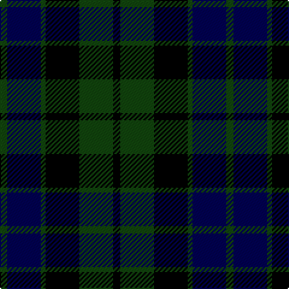

**Bands:** [GBGKGK](/stripes/gbgkgk/) · **Stripes:** [DG DB DG K DG K](/stripes/stripes6/) DG DB DG K DG K

This was sourced from weddslist.  It is a [6 band tartan](/bands/bands6/).

Original link http://www.weddslist.com/cgi-bin/tartans/pg.pl?source=tinsel

## Register references

External register numbers recorded for this tartan.

- Scottish Register of Tartans: [1166](https://www.tartanregister.gov.uk/tartanDetails.aspx?ref=1166)
- Scottish Register of Tartans: [1510](https://www.tartanregister.gov.uk/tartanDetails.aspx?ref=1510)
- Scottish Register of Tartans: [1758](https://www.tartanregister.gov.uk/tartanDetails.aspx?ref=1758)
- Scottish Register of Tartans: [2307](https://www.tartanregister.gov.uk/tartanDetails.aspx?ref=2307)
- Scottish Register of Tartans: [2349](https://www.tartanregister.gov.uk/tartanDetails.aspx?ref=2349)
- Scottish Register of Tartans: [2540](https://www.tartanregister.gov.uk/tartanDetails.aspx?ref=2540)
- Scottish Register of Tartans: [2582](https://www.tartanregister.gov.uk/tartanDetails.aspx?ref=2582)
- Scottish Register of Tartans: [2585](https://www.tartanregister.gov.uk/tartanDetails.aspx?ref=2585)
- Scottish Register of Tartans: [2625](https://www.tartanregister.gov.uk/tartanDetails.aspx?ref=2625)
- Scottish Register of Tartans: [2730](https://www.tartanregister.gov.uk/tartanDetails.aspx?ref=2730)
- Scottish Register of Tartans: [2862](https://www.tartanregister.gov.uk/tartanDetails.aspx?ref=2862)
- Scottish Register of Tartans: [3072](https://www.tartanregister.gov.uk/tartanDetails.aspx?ref=3072)
- Scottish Register of Tartans: [3555](https://www.tartanregister.gov.uk/tartanDetails.aspx?ref=3555)
- Scottish Register of Tartans: [4925](https://www.tartanregister.gov.uk/tartanDetails.aspx?ref=4925)
- Scottish Register of Tartans: [696](https://www.tartanregister.gov.uk/tartanDetails.aspx?ref=696)
- Scottish Register of Tartans: [697](https://www.tartanregister.gov.uk/tartanDetails.aspx?ref=697)
- Scottish Register of Tartans: [982](https://www.tartanregister.gov.uk/tartanDetails.aspx?ref=982)
- Scottish Tartans Authority (ITI): 1277
- Scottish Tartans Authority (ITI): 1429
- Scottish Tartans Authority (ITI): 218
- Scottish Tartans Authority (ITI): 977
- Scottish Tartans World Register: 1042
- Scottish Tartans World Register: 127
- Scottish Tartans World Register: 1277
- Scottish Tartans World Register: 1399
- Scottish Tartans World Register: 1429
- Scottish Tartans World Register: 1593
- Scottish Tartans World Register: 218
- Scottish Tartans World Register: 2218
- Scottish Tartans World Register: 3061
- Scottish Tartans World Register: 441
- Scottish Tartans World Register: 737
- Scottish Tartans World Register: 858
- Scottish Tartans World Register: 864
- Scottish Tartans World Register: 873
- Scottish Tartans World Register: 897
- Scottish Tartans World Register: 977
- Scottish Tartans World Register: 978

## Variants

Other setts woven to the same stripe pattern.

- [MacKay](/setts/s6/dg3db14dg2k14dg14k3/)

## Thread count
DG/6 DB28 DG4 K28 DG28 K/6

## Palette
Each colour and its ΔE from the base-6 reference it is a variant of.

| Colour | Shade | Base | ΔE (OKLab) |
|---|---|---|---|
| DB | <code style="background-color:#000052;">#000052</code> `#000052` | B <code style="background-color:#2A418A;">#2A418A</code> | 0.20 |
| DG | <code style="background-color:#11450D;">#11450D</code> `#11450D` | G <code style="background-color:#006100;">#006100</code> | 0.09 |
| K | <code style="background-color:#000000;">#000000</code> `#000000` | K <code style="background-color:#000000;">#000000</code> | 0.00 |

# Sample pattern

## Nearest tartans

The nearest existing variants by ΔTartan distance.

1. [MacKay](/setts/s6/dg3db14dg2k14dg14k3/) — ΔT 0.48
1. [Black Watch (smallest sett)](/setts/s6/db1k1db6k6dg6k1~x4/) — ΔT 0.67
1. [Fletcher](/setts/s7/db6k1db6k8r1dg8k2/) — ΔT 1.05
1. [Fletcher](/setts/s7/db6k1db6k8r1dg8k2~x2/) — ΔT 1.07
1. [MacCallum](/setts/s7/dg8k2b1dg4k6db6k1~x2/) — ΔT 1.08
1. [Morrison](/setts/s6/k3dg14k14dg2db14r3~x2/) — ΔT 1.08
1. [Austin](/setts/s5/db4k4db4dg9k2/) — ΔT 1.13
1. [Austin](/setts/s5/db4k4db4dg9k2~x2/) — ΔT 1.13
1. [Fletcher C](/setts/s7/db6k1db6k8r1dg8r2~x2/) — ΔT 1.26
1. [Morrison](/setts/s6/k3dg14k14dg2db14r3/) — ΔT 1.29

## Neighbour map

Every grey dot is one of 14313 variants placed by the first two principal components of the ΔTartan feature space (44% of its variance). Red is this tartan; blue dots are its nearest — click one to open its page.

<svg viewBox="0 0 640 380" role="img" style="max-width:100%;height:auto;border:1px solid #e0e0e0;border-radius:4px;display:block" xmlns="http://www.w3.org/2000/svg"><image href="/nn/cloud.v1.png" width="640" height="380"/><a href="/setts/s6/dg3db14dg2k14dg14k3/"><circle cx="217.3" cy="277.7" r="4" fill="#3465a4"><title>MacKay</title></circle></a><a href="/setts/s6/db1k1db6k6dg6k1~x4/"><circle cx="215.8" cy="275.8" r="4" fill="#3465a4"><title>Black Watch (smallest sett)</title></circle></a><a href="/setts/s7/db6k1db6k8r1dg8k2/"><circle cx="196.8" cy="257.0" r="4" fill="#3465a4"><title>Fletcher</title></circle></a><a href="/setts/s7/db6k1db6k8r1dg8k2~x2/"><circle cx="204.9" cy="261.0" r="4" fill="#3465a4"><title>Fletcher</title></circle></a><a href="/setts/s7/dg8k2b1dg4k6db6k1~x2/"><circle cx="216.1" cy="256.2" r="4" fill="#3465a4"><title>MacCallum</title></circle></a><a href="/setts/s6/k3dg14k14dg2db14r3~x2/"><circle cx="177.9" cy="259.9" r="4" fill="#3465a4"><title>Morrison</title></circle></a><a href="/setts/s5/db4k4db4dg9k2/"><circle cx="199.1" cy="324.7" r="4" fill="#3465a4"><title>Austin</title></circle></a><a href="/setts/s5/db4k4db4dg9k2~x2/"><circle cx="207.7" cy="328.5" r="4" fill="#3465a4"><title>Austin</title></circle></a><a href="/setts/s7/db6k1db6k8r1dg8r2~x2/"><circle cx="182.9" cy="251.1" r="4" fill="#3465a4"><title>Fletcher C</title></circle></a><a href="/setts/s6/k3dg14k14dg2db14r3/"><circle cx="163.9" cy="252.7" r="4" fill="#3465a4"><title>Morrison</title></circle></a><circle cx="230.9" cy="284.1" r="5" fill="#c00000"/></svg>

ID: /setts/s6/dg3db14dg2k14dg14k3~x2/
