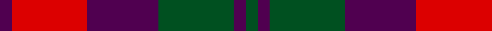

**Bands:** [BRBGBG](/stripes/brbgbg/) · **Stripes:** [DP R DP DG DP DG](/stripes/stripes6/) DP R DP DG DP DG

This was sourced from register-of-tartans.  It is a [6 band tartan](/bands/bands6/).

Original link https://www.tartanregister.gov.uk/tartanDetails.aspx?ref=2670

## Register references

External register numbers recorded for this tartan.

- Scottish Register of Tartans: [2670](https://www.tartanregister.gov.uk/tartanDetails.aspx?ref=2670)
- Scottish Tartans World Register: 410

## Thread count
DP/6 R38 DP36 G38 DP6 G/6

## Palette
Each colour and its ΔE from the base-6 reference it is a variant of.

| Colour | Shade | Base | ΔE (OKLab) |
|---|---|---|---|
| DP | <code style="background-color:#500050;">#500050</code> `#500050` | B <code style="background-color:#2A418A;">#2A418A</code> | 0.17 |
| G | <code style="background-color:#005020;">#005020</code> `#005020` | G <code style="background-color:#006100;">#006100</code> | 0.07 |
| R | <code style="background-color:#DC0000;">#DC0000</code> `#DC0000` | R <code style="background-color:#CC0000;">#CC0000</code> | 0.03 |

# Sample pattern

## Nearest tartans

The nearest existing variants by ΔTartan distance.

1. [MacNab 1](/setts/s6/dp3r19dp18g19dp3g3~x2/) — ΔT 0.73
1. [Scottish Netball Association](/setts/s7/p3g14r2p10g2r14p3~x2/) — ΔT 0.75
1. [Unidentified #21](/setts/s6/dp4r3dp26r26dg26r4~x2/) — ΔT 0.82
1. [Unidentified Artifact Tartan Tartan Number: 463. Earliest known date: 0 Wilson's of Bannockburn 'New Broad Sett' perhaps. See products available Copyright © Blair Urquhart, Comrie, 2015](/setts/s6/dp4r3dp26r26g26r4~x2/) — ΔT 0.84
1. [Unidentified 16](/setts/s6/p4r3p26r26g26r4~x2/) — ΔT 0.88
1. [MacFadyan (MacGregor Hastie)](/setts/s7/db3r25db17r5g22r9db3~x2/) — ΔT 1.08
1. [MacBean of Tomatin (Clan)](/setts/s7/db3r19db13r5g21r8db3~x2/) — ΔT 1.17
1. [Scottish Netball (1986) (Corporate)](/setts/s7/dp3g14m2dp10g2m14dp3~x2/) — ΔT 1.17
1. [Thompson/Thomson/MacTavish (Bonner)](/setts/s6/db4r30k6db13k13db3~x2/) — ΔT 1.22
1. [Thomson, Red (Name)](/setts/s6/t4r28k6t12k12t3~x2/) — ΔT 1.23

## Neighbour map

Every grey dot is one of 14313 variants placed by the first two principal components of the ΔTartan feature space (44% of its variance). Red is this tartan; blue dots are its nearest — click one to open its page.

<svg viewBox="0 0 640 380" role="img" style="max-width:100%;height:auto;border:1px solid #e0e0e0;border-radius:4px;display:block" xmlns="http://www.w3.org/2000/svg"><image href="/nn/cloud.v1.png" width="640" height="380"/><a href="/setts/s6/dp3r19dp18g19dp3g3~x2/"><circle cx="210.6" cy="245.6" r="4" fill="#3465a4"><title>MacNab 1</title></circle></a><a href="/setts/s7/p3g14r2p10g2r14p3~x2/"><circle cx="220.2" cy="240.3" r="4" fill="#3465a4"><title>Scottish Netball Association</title></circle></a><a href="/setts/s6/dp4r3dp26r26dg26r4~x2/"><circle cx="232.7" cy="229.4" r="4" fill="#3465a4"><title>Unidentified #21</title></circle></a><a href="/setts/s6/dp4r3dp26r26g26r4~x2/"><circle cx="249.8" cy="236.0" r="4" fill="#3465a4"><title>Unidentified Artifact Tartan Tartan Number: 463. Earliest known date: 0 Wilson's of Bannockburn 'New Broad Sett' perhaps. See products available Copyright © Blair Urquhart, Comrie, 2015</title></circle></a><a href="/setts/s6/p4r3p26r26g26r4~x2/"><circle cx="240.4" cy="231.3" r="4" fill="#3465a4"><title>Unidentified 16</title></circle></a><a href="/setts/s7/db3r25db17r5g22r9db3~x2/"><circle cx="266.2" cy="233.4" r="4" fill="#3465a4"><title>MacFadyan (MacGregor Hastie)</title></circle></a><a href="/setts/s7/db3r19db13r5g21r8db3~x2/"><circle cx="256.4" cy="257.5" r="4" fill="#3465a4"><title>MacBean of Tomatin (Clan)</title></circle></a><a href="/setts/s7/dp3g14m2dp10g2m14dp3~x2/"><circle cx="239.8" cy="249.9" r="4" fill="#3465a4"><title>Scottish Netball (1986) (Corporate)</title></circle></a><a href="/setts/s6/db4r30k6db13k13db3~x2/"><circle cx="256.0" cy="216.3" r="4" fill="#3465a4"><title>Thompson/Thomson/MacTavish (Bonner)</title></circle></a><a href="/setts/s6/t4r28k6t12k12t3~x2/"><circle cx="243.4" cy="217.3" r="4" fill="#3465a4"><title>Thomson, Red (Name)</title></circle></a><circle cx="226.3" cy="251.0" r="5" fill="#c00000"/></svg>

ID: /setts/s6/dg3dp3dg19dp18r19dp3~x2/
