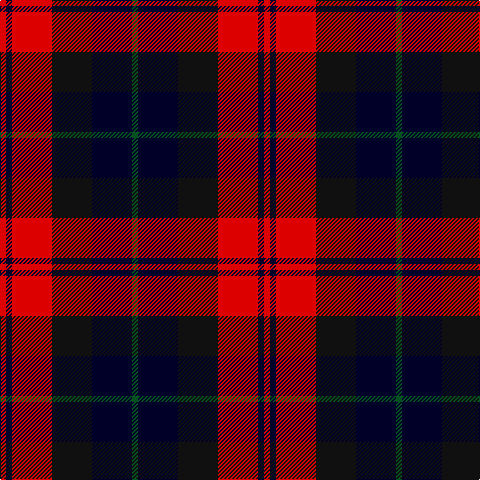

In pattern [GKKRKR](/stripes/gkkrkr/).

This was sourced from register-of-tartans.  It is a [6 stripe tartan](/stripes/stripes6/).

Original link https://www.tartanregister.gov.uk/tartanDetails.aspx?ref=5055

## Register references

External register numbers recorded for this tartan.

- Scottish Register of Tartans: [5055](https://www.tartanregister.gov.uk/tartanDetails.aspx?ref=5055)
- Scottish Tartans World Register: 3056

## Thread count
R/6 DB6 R40 K40 DB40 G/6

## Palette
Each colour and its ΔE from the base-6 reference it is a variant of.

| Colour | Shade | Base | ΔE (OKLab) |
|---|---|---|---|
| DB | <code style="background-color:#000028;">#000028</code> `#000028` | K <code style="background-color:#000000;">#000000</code> | 0.15 |
| G | <code style="background-color:#005020;">#005020</code> `#005020` | G <code style="background-color:#006100;">#006100</code> | 0.07 |
| K | <code style="background-color:#101010;">#101010</code> `#101010` | K <code style="background-color:#000000;">#000000</code> | 0.17 |
| R | <code style="background-color:#DC0000;">#DC0000</code> `#DC0000` | R <code style="background-color:#CC0000;">#CC0000</code> | 0.03 |

# Sample pattern

## Nearest tartans

The nearest existing variants by ΔTartan distance.

1. [Graham of Menteith, (Red)](/setts/s6/r26t3r4k16db16k4~x2/) — ΔT 1.11
1. [Aitken](/setts/s8/lo5db2k2db12k16r20k2r4~x2/) — ΔT 1.11
1. [Edinburgh International Conference Centre](/setts/s6/o4db19o3k20o24db3~x2/) — ΔT 1.13
1. [Clerk](/setts/s6/db5k1g1k1r3k1~x4/) — ΔT 1.14
1. [Dutch](/setts/s6/k4o19k19o2dp22w4~x2/) — ΔT 1.14
1. [Wallace Red Dress Tartan Tartan Number: 8186. Earliest known date: See products available Copyright © Blair Urquhart, Comrie, 2015](/setts/s5/k3r29k11k29t3~x2/) — ΔT 1.16
1. [Edinburgh Military Tattoo 50th](/setts/s5/k1dg8r6db8k1~x4/) — ΔT 1.19
1. [Biffy Clyro](/setts/s7/ly3db22k3db3k11r20ly3~x2/) — ΔT 1.22
1. [Highland Pub Company](/setts/s5/db13k13db13r29ly4~x2/) — ΔT 1.27
1. [Inder (Corporate)](/setts/s5/r2dp8k8w1r2~x2/) — ΔT 1.30

## Neighbour map

Every grey dot is one of 14299 variants placed by the first two principal components of the ΔTartan feature space (44% of its variance). Red is this tartan; blue dots are its nearest — click one to open its page.

<svg viewBox="0 0 640 380" role="img" style="max-width:100%;height:auto;border:1px solid #e0e0e0;border-radius:4px;display:block" xmlns="http://www.w3.org/2000/svg"><image href="/nn/cloud.v1.png" width="640" height="380"/><a href="/setts/s6/r26t3r4k16db16k4~x2/"><circle cx="205.9" cy="207.4" r="4" fill="#3465a4"><title>Graham of Menteith, (Red)</title></circle></a><a href="/setts/s8/lo5db2k2db12k16r20k2r4~x2/"><circle cx="188.4" cy="189.3" r="4" fill="#3465a4"><title>Aitken</title></circle></a><a href="/setts/s6/o4db19o3k20o24db3~x2/"><circle cx="153.4" cy="222.8" r="4" fill="#3465a4"><title>Edinburgh International Conference Centre</title></circle></a><a href="/setts/s6/db5k1g1k1r3k1~x4/"><circle cx="172.4" cy="233.1" r="4" fill="#3465a4"><title>Clerk</title></circle></a><a href="/setts/s6/k4o19k19o2dp22w4~x2/"><circle cx="152.7" cy="197.2" r="4" fill="#3465a4"><title>Dutch</title></circle></a><a href="/setts/s5/k3r29k11k29t3~x2/"><circle cx="204.5" cy="211.1" r="4" fill="#3465a4"><title>Wallace Red Dress Tartan Tartan Number: 8186. Earliest known date: See products available Copyright © Blair Urquhart, Comrie, 2015</title></circle></a><a href="/setts/s5/k1dg8r6db8k1~x4/"><circle cx="167.8" cy="245.7" r="4" fill="#3465a4"><title>Edinburgh Military Tattoo 50th</title></circle></a><a href="/setts/s7/ly3db22k3db3k11r20ly3~x2/"><circle cx="163.9" cy="191.2" r="4" fill="#3465a4"><title>Biffy Clyro</title></circle></a><a href="/setts/s5/db13k13db13r29ly4~x2/"><circle cx="184.5" cy="248.2" r="4" fill="#3465a4"><title>Highland Pub Company</title></circle></a><a href="/setts/s5/r2dp8k8w1r2~x2/"><circle cx="203.7" cy="221.9" r="4" fill="#3465a4"><title>Inder (Corporate)</title></circle></a><circle cx="165.0" cy="226.5" r="5" fill="#c00000"/></svg>

ID: /setts/s6/dg3k20k20r20k3r3~x2/
