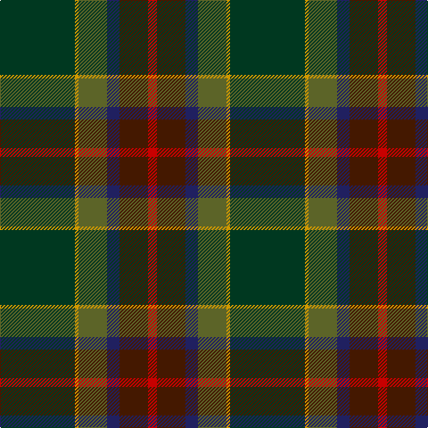

This page is one **sett** — a single exact thread-count. It belongs to the [tartan](/tartans/dg42dy2g16db7dr16r5/)
(the same proportion at any scale), whose colour order is pattern [GYGBBR](/stripes/gygbbr/).

Sourced from register-of-tartans.  It is a [6 stripe tartan](/stripes/stripes6/).

Original link https://www.tartanregister.gov.uk/tartanDetails.aspx?ref=4498

## Register references

External register numbers recorded for this tartan.

- Scottish Register of Tartans: [4498](https://www.tartanregister.gov.uk/tartanDetails.aspx?ref=4498)
- Scottish Tartans Authority (ITI): 2255
- Scottish Tartans World Register: 2255

## Thread count
DG/84 DY4 G32 DB14 DR32 R/10

## Palette
Each colour and the base-6 reference it is a variant of.

| Colour | Shade | Base |
|---|---|---|
| DB | <code style="background-color:#202060;">#202060</code> `oklch(28.9% 0.111 276.9)` <small>#202060</small> | B <code style="background-color:#2A418A;">#2A418A</code> |
| DG | <code style="background-color:#003820;">#003820</code> `oklch(30.0% 0.070 158.3)` <small>#003820</small> | G <code style="background-color:#006100;">#006100</code> |
| DR | <code style="background-color:#441800;">#441800</code> `oklch(27.3% 0.076 46.3)` <small>#441800</small> | B <code style="background-color:#2A418A;">#2A418A</code> |
| DY | <code style="background-color:#D09800;">#D09800</code> `oklch(71.4% 0.147 82.1)` <small>#D09800</small> | Y <code style="background-color:#F2BF00;">#F2BF00</code> |
| G | <code style="background-color:#5C6428;">#5C6428</code> `oklch(48.3% 0.084 116.0)` <small>#5C6428</small> | G <code style="background-color:#006100;">#006100</code> |
| LR | <code style="background-color:#E8CCB8;">#E8CCB8</code> `oklch(86.3% 0.042 57.7)` <small>#E8CCB8</small> | W <code style="background-color:#F7F7F7;">#F7F7F7</code> |
| R | <code style="background-color:#C80000;">#C80000</code> `oklch(52.3% 0.215 29.2)` <small>#C80000</small> | R <code style="background-color:#CC0000;">#CC0000</code> |

# Sample pattern

## Nearest tartans

The nearest existing variants by ΔTartan distance, with this tartan at the top so the swatches line up against it.

ΔTartan

Tartan

Sett

—

<a href="/ttd/edit/#slug=dg42lo2y16db7do16r5~x2">Waterford, County</a> <a class="nn-out" href="/setts/s6/dg42lo2y16db7do16r5~x2/" title="open its dictionary page">↗</a>

0.88

<a href="/ttd/edit/#slug=o3dg13dt13lo2dg34w3~x2">Glencross (Tynron) (Personal)</a> <a class="nn-out" href="/setts/s6/o3dg13dt13lo2dg34w3~x2/" title="open its dictionary page">↗</a>

0.98

<a href="/ttd/edit/#slug=g7lo2g5dg37db6r16db5b2~x2">Telfer Green</a> <a class="nn-out" href="/setts/s8/g7lo2g5dg37db6r16db5b2~x2/" title="open its dictionary page">↗</a>

1.03

<a href="/ttd/edit/#slug=g15lo1do2db5k4dg5~x6">Dobson (Palm Bay) (Personal)</a> <a class="nn-out" href="/setts/s6/g15lo1do2db5k4dg5~x6/" title="open its dictionary page">↗</a>

1.22

<a href="/ttd/edit/#slug=dp10k2dg10dp30dg30dg55k4r8">Batten of Argyll (Baddenach)</a> <a class="nn-out" href="/setts/s8/dp10k2dg10dp30dg30dg55k4r8/" title="open its dictionary page">↗</a>

1.30

<a href="/ttd/edit/#slug=r4n38k4n6k41dg62y4">Bennett, John Paul (Personal)</a> <a class="nn-out" href="/setts/s7/r4n38k4n6k41dg62y4/" title="open its dictionary page">↗</a>

1.40

<a href="/ttd/edit/#slug=dt12k17y4dg51ly3g4~x2">US Army Regimental Tartan Tartan Number: 6307. Earliest known date: 2004 The Army was the only arm of the U.S. Forces not to have its own tartan. The colours were chosen to represent the uniforms - black for the beret, khaki for the summer uniform, light green for the original sniper and now part of the summer uniform, dark blue for the original dress uniform, olive for the combat uniform and gold for the cavalry. See products available Copyright © Blair Urquhart, Comrie, 2015</a> <a class="nn-out" href="/setts/s6/dt12k17y4dg51ly3g4~x2/" title="open its dictionary page">↗</a>

1.41

<a href="/ttd/edit/#slug=m8k2y10dp30y30g55k4o6">Aberuchill District Tartan Tartan Number: 6814. Earliest known date: 2005 Aberuchill lends it name to the area south of Comrie where the river Ruchil meets the river Earn. The two rivers form the boundaries of the Aberuchill Estate for which this tartan was created. See products available Copyright © Blair Urquhart, Comrie, 2015</a> <a class="nn-out" href="/setts/s8/m8k2y10dp30y30g55k4o6/" title="open its dictionary page">↗</a>

1.48

<a href="/ttd/edit/#slug=do31lo6lr3db36do8dg60lo7t7~x2">Little-Dowse Wedding</a> <a class="nn-out" href="/setts/s8/do31lo6lr3db36do8dg60lo7t7~x2/" title="open its dictionary page">↗</a>

1.52

<a href="/ttd/edit/#slug=w2k2r1dt20k15dg30ly1~x2">Muir-Hill (Personal)</a> <a class="nn-out" href="/setts/s7/w2k2r1dt20k15dg30ly1~x2/" title="open its dictionary page">↗</a>

1.53

<a href="/ttd/edit/#slug=k4dg16db11r16dg25lo2t3~x2">Mayo, County (District)</a> <a class="nn-out" href="/setts/s7/k4dg16db11r16dg25lo2t3~x2/" title="open its dictionary page">↗</a>

## Neighbour map

Every grey dot is one of 14299 variants placed by the first two principal components of the ΔTartan feature space (44% of its variance). Red is this tartan; blue dots are its nearest — click one to open its page.

<svg viewBox="0 0 640 380" role="img" style="max-width:100%;height:auto;border:1px solid #e0e0e0;border-radius:4px;display:block" xmlns="http://www.w3.org/2000/svg"><image href="/nn/cloud.v1.png" width="640" height="380"/><a href="/setts/s6/o3dg13dt13lo2dg34w3~x2/"><circle cx="302.3" cy="193.3" r="4" fill="#3465a4"><title>Glencross (Tynron) (Personal)</title></circle></a><a href="/setts/s8/g7lo2g5dg37db6r16db5b2~x2/"><circle cx="285.3" cy="163.1" r="4" fill="#3465a4"><title>Telfer Green</title></circle></a><a href="/setts/s6/g15lo1do2db5k4dg5~x6/"><circle cx="266.3" cy="207.4" r="4" fill="#3465a4"><title>Dobson (Palm Bay) (Personal)</title></circle></a><a href="/setts/s8/dp10k2dg10dp30dg30dg55k4r8/"><circle cx="255.9" cy="168.0" r="4" fill="#3465a4"><title>Batten of Argyll (Baddenach)</title></circle></a><a href="/setts/s7/r4n38k4n6k41dg62y4/"><circle cx="291.5" cy="211.6" r="4" fill="#3465a4"><title>Bennett, John Paul (Personal)</title></circle></a><a href="/setts/s6/dt12k17y4dg51ly3g4~x2/"><circle cx="351.6" cy="191.4" r="4" fill="#3465a4"><title>US Army Regimental Tartan Tartan Number: 6307. Earliest known date: 2004 The Army was the only arm of the U.S. Forces not to have its own tartan. The colours were chosen to represent the uniforms - black for the beret, khaki for the summer uniform, light green for the original sniper and now part of the summer uniform, dark blue for the original dress uniform, olive for the combat uniform and gold for the cavalry. See products available Copyright © Blair Urquhart, Comrie, 2015</title></circle></a><a href="/setts/s8/m8k2y10dp30y30g55k4o6/"><circle cx="243.5" cy="151.0" r="4" fill="#3465a4"><title>Aberuchill District Tartan Tartan Number: 6814. Earliest known date: 2005 Aberuchill lends it name to the area south of Comrie where the river Ruchil meets the river Earn. The two rivers form the boundaries of the Aberuchill Estate for which this tartan was created. See products available Copyright © Blair Urquhart, Comrie, 2015</title></circle></a><a href="/setts/s8/do31lo6lr3db36do8dg60lo7t7~x2/"><circle cx="254.0" cy="176.9" r="4" fill="#3465a4"><title>Little-Dowse Wedding</title></circle></a><a href="/setts/s7/w2k2r1dt20k15dg30ly1~x2/"><circle cx="291.3" cy="161.0" r="4" fill="#3465a4"><title>Muir-Hill (Personal)</title></circle></a><a href="/setts/s7/k4dg16db11r16dg25lo2t3~x2/"><circle cx="285.2" cy="211.5" r="4" fill="#3465a4"><title>Mayo, County (District)</title></circle></a><circle cx="302.4" cy="191.5" r="5" fill="#c00000"/></svg>

ID: /setts/s6/dg42lo2y16db7do16r5~x2/
