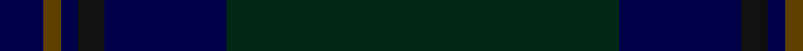

**Bands:** [GBKBGB](/stripes/gbkbgb/) · **Stripes:** [DG DB K DB DY DB](/stripes/stripes6/) DG DB K DB DY DB

This was sourced from register-of-tartans.  It is a [6 band tartan](/bands/bands6/).

Original link https://www.tartanregister.gov.uk/tartanDetails.aspx?ref=3883

## Register references

External register numbers recorded for this tartan.

- Scottish Register of Tartans: [3883](https://www.tartanregister.gov.uk/tartanDetails.aspx?ref=3883)
- Scottish Tartans Authority (ITI): 2332
- Scottish Tartans World Register: 2332

## Thread count
DG/90 DB28 K6 DB4 T4 DB/10

## Palette
Each colour and its ΔE from the base-6 reference it is a variant of.

| Colour | Shade | Base | ΔE (OKLab) |
|---|---|---|---|
| DB | <code style="background-color:#000048;">#000048</code> `#000048` | B <code style="background-color:#2A418A;">#2A418A</code> | 0.22 |
| DG | <code style="background-color:#002814;">#002814</code> `#002814` | G <code style="background-color:#006100;">#006100</code> | 0.20 |
| DGa | <code style="background-color:#003820;">#003820</code> `#003820` | G <code style="background-color:#006100;">#006100</code> | 0.15 |
| K | <code style="background-color:#101010;">#101010</code> `#101010` | K <code style="background-color:#000000;">#000000</code> | 0.17 |
| T | <code style="background-color:#604000;">#604000</code> `#604000` | G <code style="background-color:#006100;">#006100</code> | 0.14 |

# Sample pattern

## Nearest tartans

The nearest existing variants by ΔTartan distance.

1. [Tern House](/setts/s7/dg23db3k8db4dg4db56dy8/) — ΔT 1.39
1. [Little of Morton Rigg Red (Personal)](/setts/s8/k3t1k32db6k4db16k3r2~x2/) — ΔT 1.71
1. [Orman (Personal)](/setts/s9/k10k3k3k32dg1k1dg1k2n2~x2/) — ΔT 1.84
1. [Land's End, Blue (Fashion)](/setts/s8/dg2dt26dg2dt2dg9r2dg9dt2~x2/) — ΔT 1.87
1. [McGovern (2016)](/setts/s5/dt62o4dy10dy3dg21~x2/) — ΔT 1.89
1. [Feddinch Club, St Andrews Limited, The](/setts/s4/dg43k14k14r2~x2/) — ΔT 1.90
1. [Little Hunting](/setts/s8/db5db3db4db3db4k28db8r1~x2/) — ΔT 2.00
1. [Comme Ça Il Principe](/setts/s10/dt3k53dt4k4dt4k4dt24db10dt1r1/) — ΔT 2.02
1. [Heslop Lurdenlaw by Kelso](/setts/s4/dt44dg12g1o6~x2/) — ΔT 2.13
1. [Hector, James (Corporate)](/setts/s5/do2dg11dt27dg8r2~x2/) — ΔT 2.14

## Neighbour map

Every grey dot is one of 14299 variants placed by the first two principal components of the ΔTartan feature space (44% of its variance). Red is this tartan; blue dots are its nearest — click one to open its page.

<svg viewBox="0 0 640 380" role="img" style="max-width:100%;height:auto;border:1px solid #e0e0e0;border-radius:4px;display:block" xmlns="http://www.w3.org/2000/svg"><image href="/nn/cloud.v1.png" width="640" height="380"/><a href="/setts/s7/dg23db3k8db4dg4db56dy8/"><circle cx="527.1" cy="265.1" r="4" fill="#3465a4"><title>Tern House</title></circle></a><a href="/setts/s8/k3t1k32db6k4db16k3r2~x2/"><circle cx="539.4" cy="215.6" r="4" fill="#3465a4"><title>Little of Morton Rigg Red (Personal)</title></circle></a><a href="/setts/s9/k10k3k3k32dg1k1dg1k2n2~x2/"><circle cx="626.0" cy="223.0" r="4" fill="#3465a4"><title>Orman (Personal)</title></circle></a><a href="/setts/s8/dg2dt26dg2dt2dg9r2dg9dt2~x2/"><circle cx="523.0" cy="286.7" r="4" fill="#3465a4"><title>Land's End, Blue (Fashion)</title></circle></a><a href="/setts/s5/dt62o4dy10dy3dg21~x2/"><circle cx="471.9" cy="233.2" r="4" fill="#3465a4"><title>McGovern (2016)</title></circle></a><a href="/setts/s4/dg43k14k14r2~x2/"><circle cx="480.3" cy="288.6" r="4" fill="#3465a4"><title>Feddinch Club, St Andrews Limited, The</title></circle></a><a href="/setts/s8/db5db3db4db3db4k28db8r1~x2/"><circle cx="474.5" cy="230.1" r="4" fill="#3465a4"><title>Little Hunting</title></circle></a><a href="/setts/s10/dt3k53dt4k4dt4k4dt24db10dt1r1/"><circle cx="526.4" cy="181.6" r="4" fill="#3465a4"><title>Comme Ça Il Principe</title></circle></a><a href="/setts/s4/dt44dg12g1o6~x2/"><circle cx="596.1" cy="241.1" r="4" fill="#3465a4"><title>Heslop Lurdenlaw by Kelso</title></circle></a><a href="/setts/s5/do2dg11dt27dg8r2~x2/"><circle cx="491.9" cy="310.5" r="4" fill="#3465a4"><title>Hector, James (Corporate)</title></circle></a><circle cx="561.8" cy="254.2" r="5" fill="#c00000"/></svg>

ID: /setts/s6/dg45db14k3db2dy2db5~x2/
