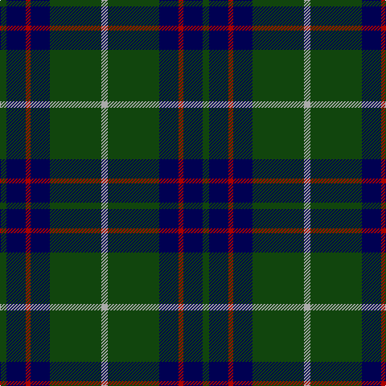

In pattern [GBRBGY](/stripes/gbrbgy/).

This was sourced from weddslist.  It is a [6 stripe tartan](/stripes/stripes6/).

Original link http://www.weddslist.com/cgi-bin/tartans/pg.pl?source=tinsel

## Thread count
DG/8 DB24 DR6 DB24 DG64 N/8

## Palette
Each colour and the base-6 reference it is a variant of.

| Colour | Shade | Base |
|---|---|---|
| DB | <code style="background-color:#000052;">#000052</code> `oklch(19.8% 0.137 264.1)` <small>#000052</small> | B <code style="background-color:#2A418A;">#2A418A</code> |
| DG | <code style="background-color:#11450D;">#11450D</code> `oklch(34.4% 0.101 142.1)` <small>#11450D</small> | G <code style="background-color:#006100;">#006100</code> |
| DR | <code style="background-color:#AA0000;">#AA0000</code> `oklch(46.3% 0.190 29.2)` <small>#AA0000</small> | R <code style="background-color:#CC0000;">#CC0000</code> |
| N | <code style="background-color:#AAAAAA;">#AAAAAA</code> `oklch(73.8% 0.000 89.9)` <small>#AAAAAA</small> | Y <code style="background-color:#F2BF00;">#F2BF00</code> |

# Sample pattern

## Nearest tartans

The nearest existing variants by ΔTartan distance.

1. [MacIntyre LC](/setts/s6/dg4db12r3db12dg32lr4/) — ΔT 0.00
1. [St. Andrews Old Course Hotel (Corp)](/setts/s6/g26db10k3db2dy2db10~x4/) — ΔT 0.65
1. [MacIntyre](/setts/s6/dg4db12r3db12dg32w4~x2/) — ΔT 0.67
1. [MacIntyre L](/setts/s6/dg4db12r3db12dg32lb4/) — ΔT 0.71
1. [Douglas (Clan)](/setts/s5/k6db4dg44k41w4~x2/) — ΔT 0.82
1. [Cameron Hunting](/setts/s7/r3dg10r3dg14db16dg3ly2~x2/) — ΔT 0.90
1. [Heritage Tartan, The](/setts/s6/db8r4db24g35lb4g8/) — ΔT 0.91
1. [Glen Esk](/setts/s8/dg10r1dg1r2dg8db10dg1ly1~x4/) — ΔT 0.99
1. [Rowan (Personal)](/setts/s5/g12lo1db8k1db1~x4/) — ΔT 1.04
1. [Greenways Marketing Intl (Corporate)](/setts/s7/db24g3db3g3lo2g18r2~x2/) — ΔT 1.06

## Neighbour map

Every grey dot is one of 14299 variants placed by the first two principal components of the ΔTartan feature space (44% of its variance). Red is this tartan; blue dots are its nearest — click one to open its page.

<svg viewBox="0 0 640 380" role="img" style="max-width:100%;height:auto;border:1px solid #e0e0e0;border-radius:4px;display:block" xmlns="http://www.w3.org/2000/svg"><image href="/nn/cloud.v1.png" width="640" height="380"/><a href="/setts/s6/dg4db12r3db12dg32lr4/"><circle cx="322.2" cy="228.7" r="4" fill="#3465a4"><title>MacIntyre LC</title></circle></a><a href="/setts/s6/g26db10k3db2dy2db10~x4/"><circle cx="315.7" cy="217.5" r="4" fill="#3465a4"><title>St. Andrews Old Course Hotel (Corp)</title></circle></a><a href="/setts/s6/dg4db12r3db12dg32w4~x2/"><circle cx="323.4" cy="225.9" r="4" fill="#3465a4"><title>MacIntyre</title></circle></a><a href="/setts/s6/dg4db12r3db12dg32lb4/"><circle cx="301.3" cy="218.4" r="4" fill="#3465a4"><title>MacIntyre L</title></circle></a><a href="/setts/s5/k6db4dg44k41w4~x2/"><circle cx="317.9" cy="235.7" r="4" fill="#3465a4"><title>Douglas (Clan)</title></circle></a><a href="/setts/s7/r3dg10r3dg14db16dg3ly2~x2/"><circle cx="285.4" cy="241.4" r="4" fill="#3465a4"><title>Cameron Hunting</title></circle></a><a href="/setts/s6/db8r4db24g35lb4g8/"><circle cx="284.9" cy="228.3" r="4" fill="#3465a4"><title>Heritage Tartan, The</title></circle></a><a href="/setts/s8/dg10r1dg1r2dg8db10dg1ly1~x4/"><circle cx="324.8" cy="207.8" r="4" fill="#3465a4"><title>Glen Esk</title></circle></a><a href="/setts/s5/g12lo1db8k1db1~x4/"><circle cx="340.2" cy="226.0" r="4" fill="#3465a4"><title>Rowan (Personal)</title></circle></a><a href="/setts/s7/db24g3db3g3lo2g18r2~x2/"><circle cx="312.4" cy="196.9" r="4" fill="#3465a4"><title>Greenways Marketing Intl (Corporate)</title></circle></a><circle cx="322.2" cy="228.7" r="5" fill="#c00000"/></svg>

ID: /setts/s6/dg4db12r3db12dg32lr4~x2/
