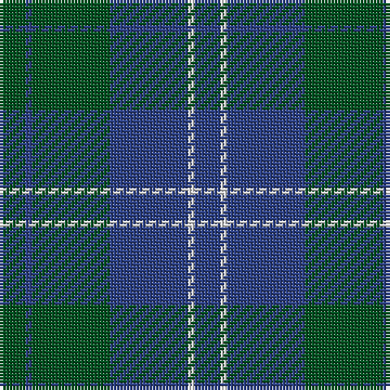

In pattern [BWBGBG](/stripes/bwbgbg/).

This was sourced from register-of-tartans.  It is a [6 stripe tartan](/stripes/stripes6/).

Original link https://www.tartanregister.gov.uk/tartanDetails.aspx?ref=4390

## Also known as

This cloth is also recorded under:

- Unidentified, Tweed

## Register references

External register numbers recorded for this tartan.

- Scottish Register of Tartans: [4390](https://www.tartanregister.gov.uk/tartanDetails.aspx?ref=4390)
- Scottish Tartans World Register: 617

## Thread count
G/8 B2 G24 B24 LN2 B/8

## Palette
Each colour and the base-6 reference it is a variant of.

| Colour | Shade | Base |
|---|---|---|
| B | <code style="background-color:#2C4084;">#2C4084</code> `oklch(39.4% 0.117 268.3)` <small>#2C4084</small> | B <code style="background-color:#2A418A;">#2A418A</code> |
| G | <code style="background-color:#005020;">#005020</code> `oklch(37.7% 0.105 149.6)` <small>#005020</small> | G <code style="background-color:#006100;">#006100</code> |
| LN | <code style="background-color:#E0E0E0;">#E0E0E0</code> `oklch(90.7% 0.000 89.9)` <small>#E0E0E0</small> | W <code style="background-color:#F7F7F7;">#F7F7F7</code> |

# Sample pattern

## Nearest tartans

The nearest existing variants by ΔTartan distance, with this tartan at the top so the swatches line up against it.

ΔTartan

Tartan

Sett

—

<a href="/ttd/edit/#slug=dg4db1dg12db12w1db4~x2">Unidentified Tweed</a> <a class="nn-out" href="/setts/s6/dg4db1dg12db12w1db4~x2/" title="open its dictionary page">↗</a>

0.96

<a href="/ttd/edit/#slug=db11dg2db15dg18w2~x2">Hamilton Hunting</a> <a class="nn-out" href="/setts/s5/db11dg2db15dg18w2~x2/" title="open its dictionary page">↗</a>

1.30

<a href="/ttd/edit/#slug=db7db2db25db10g21db2~x2">Sugiyama</a> <a class="nn-out" href="/setts/s6/db7db2db25db10g21db2~x2/" title="open its dictionary page">↗</a>

1.43

<a href="/ttd/edit/#slug=r1g16db16g1~x2">Barclay</a> <a class="nn-out" href="/setts/s4/r1g16db16g1~x2/" title="open its dictionary page">↗</a>

1.43

<a href="/ttd/edit/#slug=r1g16db16g1~x4">Barclay Htg (Clan)</a> <a class="nn-out" href="/setts/s4/r1g16db16g1~x4/" title="open its dictionary page">↗</a>

1.49

<a href="/ttd/edit/#slug=t9dt3t1dt12ly1~x4">North Sea Commission</a> <a class="nn-out" href="/setts/s5/t9dt3t1dt12ly1~x4/" title="open its dictionary page">↗</a>

1.49

<a href="/ttd/edit/#slug=dg10db2dg2db6t5db1t2~x2">Unidentified No 17</a> <a class="nn-out" href="/setts/s7/dg10db2dg2db6t5db1t2~x2/" title="open its dictionary page">↗</a>

1.51

<a href="/ttd/edit/#slug=db20dy2db2dy2db2dy6g15dy2~x2">Gammell (Brown) (Personal)</a> <a class="nn-out" href="/setts/s8/db20dy2db2dy2db2dy6g15dy2~x2/" title="open its dictionary page">↗</a>

1.53

<a href="/ttd/edit/#slug=dp4dt18r2dt2r2dt9g20dt3g4~x2">St. Andrews New Golf Club</a> <a class="nn-out" href="/setts/s9/dp4dt18r2dt2r2dt9g20dt3g4~x2/" title="open its dictionary page">↗</a>

1.54

<a href="/ttd/edit/#slug=g8w3n6db11n30db5~x2">Devlin, Craig (Personal)</a> <a class="nn-out" href="/setts/s6/g8w3n6db11n30db5~x2/" title="open its dictionary page">↗</a>

1.55

<a href="/ttd/edit/#slug=db2dg15do3db7dg7db2~x4">Green Highland, The (Fashion)</a> <a class="nn-out" href="/setts/s6/db2dg15do3db7dg7db2~x4/" title="open its dictionary page">↗</a>

## Neighbour map

Every grey dot is one of 14299 variants placed by the first two principal components of the ΔTartan feature space (44% of its variance). Red is this tartan; blue dots are its nearest — click one to open its page.

<svg viewBox="0 0 640 380" role="img" style="max-width:100%;height:auto;border:1px solid #e0e0e0;border-radius:4px;display:block" xmlns="http://www.w3.org/2000/svg"><image href="/nn/cloud.v1.png" width="640" height="380"/><a href="/setts/s5/db11dg2db15dg18w2~x2/"><circle cx="365.9" cy="291.4" r="4" fill="#3465a4"><title>Hamilton Hunting</title></circle></a><a href="/setts/s6/db7db2db25db10g21db2~x2/"><circle cx="345.6" cy="267.2" r="4" fill="#3465a4"><title>Sugiyama</title></circle></a><a href="/setts/s4/r1g16db16g1~x2/"><circle cx="385.6" cy="256.1" r="4" fill="#3465a4"><title>Barclay</title></circle></a><a href="/setts/s4/r1g16db16g1~x4/"><circle cx="385.6" cy="256.1" r="4" fill="#3465a4"><title>Barclay Htg (Clan)</title></circle></a><a href="/setts/s5/t9dt3t1dt12ly1~x4/"><circle cx="398.0" cy="251.9" r="4" fill="#3465a4"><title>North Sea Commission</title></circle></a><a href="/setts/s7/dg10db2dg2db6t5db1t2~x2/"><circle cx="309.3" cy="277.2" r="4" fill="#3465a4"><title>Unidentified No 17</title></circle></a><a href="/setts/s8/db20dy2db2dy2db2dy6g15dy2~x2/"><circle cx="340.6" cy="238.9" r="4" fill="#3465a4"><title>Gammell (Brown) (Personal)</title></circle></a><a href="/setts/s9/dp4dt18r2dt2r2dt9g20dt3g4~x2/"><circle cx="341.2" cy="233.2" r="4" fill="#3465a4"><title>St. Andrews New Golf Club</title></circle></a><a href="/setts/s6/g8w3n6db11n30db5~x2/"><circle cx="357.6" cy="242.2" r="4" fill="#3465a4"><title>Devlin, Craig (Personal)</title></circle></a><a href="/setts/s6/db2dg15do3db7dg7db2~x4/"><circle cx="389.2" cy="290.3" r="4" fill="#3465a4"><title>Green Highland, The (Fashion)</title></circle></a><circle cx="385.7" cy="269.5" r="5" fill="#c00000"/></svg>

ID: /setts/s6/dg4db1dg12db12w1db4~x2/
