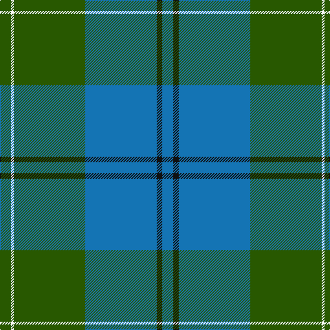

This page is one **sett** — a single exact thread-count. It belongs to the [tartan](/tartans/dg4w1dg26b26k2b4/)
(the same proportion at any scale), whose colour order is pattern [BKBGWG](/stripes/bkbgwg/).

Sourced from register-of-tartans.  It is a [6 stripe tartan](/stripes/stripes6/).

Original link https://www.tartanregister.gov.uk/tartanDetails.aspx?ref=2915

## Register references

External register numbers recorded for this tartan.

- Scottish Register of Tartans: [2915](https://www.tartanregister.gov.uk/tartanDetails.aspx?ref=2915)
- Scottish Tartans Authority (ITI): 1050
- Scottish Tartans World Register: 1050

## Thread count
G/16 W4 G104 B104 K8 B/16

## Palette

Palette: <strong>Tartan Register</strong>
<table><thead><tr><th>Colour</th><th>Threads</th><th>Shade</th><th>Base</th><th>OKLCh</th></tr></thead><tbody><tr><td>G/</td><td style="text-align:right;font-variant-numeric:tabular-nums">16</td><td><code style="background-color:#285800;">#285800</code> <small style="color:#888">#285800</small></td><td>G <code style="background-color:#006100;">#006100</code></td><td><small style="color:#888">oklch(41.0% 0.122 135.8)</small></td></tr><tr><td>W</td><td style="text-align:right;font-variant-numeric:tabular-nums">4</td><td><code style="background-color:#FCFCFC;">#FCFCFC</code> <small style="color:#888">#FCFCFC</small></td><td>W <code style="background-color:#F7F7F7;">#F7F7F7</code></td><td><small style="color:#888">oklch(99.1% 0.000 89.9)</small></td></tr><tr><td>G</td><td style="text-align:right;font-variant-numeric:tabular-nums">104</td><td><code style="background-color:#285800;">#285800</code> <small style="color:#888">#285800</small></td><td>G <code style="background-color:#006100;">#006100</code></td><td><small style="color:#888">oklch(41.0% 0.122 135.8)</small></td></tr><tr><td>B</td><td style="text-align:right;font-variant-numeric:tabular-nums">104</td><td><code style="background-color:#1474B4;">#1474B4</code> <small style="color:#888">#1474B4</small></td><td>B <code style="background-color:#2A418A;">#2A418A</code></td><td><small style="color:#888">oklch(54.0% 0.129 245.1)</small></td></tr><tr><td>K</td><td style="text-align:right;font-variant-numeric:tabular-nums">8</td><td><code style="background-color:#101010;">#101010</code> <small style="color:#888">#101010</small></td><td>K <code style="background-color:#000000;">#000000</code></td><td><small style="color:#888">oklch(17.3% 0.000 89.9)</small></td></tr><tr><td>B/</td><td style="text-align:right;font-variant-numeric:tabular-nums">16</td><td><code style="background-color:#1474B4;">#1474B4</code> <small style="color:#888">#1474B4</small></td><td>B <code style="background-color:#2A418A;">#2A418A</code></td><td><small style="color:#888">oklch(54.0% 0.129 245.1)</small></td></tr></tbody></table>

# Sample pattern

## Nearest tartans

The nearest existing variants by ΔTartan distance, with this tartan at the top so the swatches line up against it.

ΔTartan

Tartan

Sett

—

<a href="/ttd/edit/#slug=dg4w1dg26b26k2b4~x4">Melville (Two black lines)</a> <a class="nn-out" href="/setts/s6/dg4w1dg26b26k2b4~x4/" title="open its dictionary page">↗</a>

0.97

<a href="/ttd/edit/#slug=db4k4db24g32w1g2~x4">Oliphant (Clan)</a> <a class="nn-out" href="/setts/s6/db4k4db24g32w1g2~x4/" title="open its dictionary page">↗</a>

1.16

<a href="/ttd/edit/#slug=b46r2b3r2b14g38k3g4~x2">Greenlaw, American (Name)</a> <a class="nn-out" href="/setts/s8/b46r2b3r2b14g38k3g4~x2/" title="open its dictionary page">↗</a>

1.32

<a href="/ttd/edit/#slug=dg38w2dg6db24o6db2o3db2~x2">MacAuliffe/McAucliffe</a> <a class="nn-out" href="/setts/s8/dg38w2dg6db24o6db2o3db2~x2/" title="open its dictionary page">↗</a>

1.35

<a href="/ttd/edit/#slug=t28dt15r2dt2w1dt6~x2">Corries</a> <a class="nn-out" href="/setts/s6/t28dt15r2dt2w1dt6~x2/" title="open its dictionary page">↗</a>

1.38

<a href="/ttd/edit/#slug=db10k3t65g56ly6">Phoenix Police Honor Guard (Corp.)</a> <a class="nn-out" href="/setts/s5/db10k3t65g56ly6/" title="open its dictionary page">↗</a>

1.39

<a href="/ttd/edit/#slug=t9db2t39dt33lo2dt5~x2">Port Authority of NY &amp; NJ</a> <a class="nn-out" href="/setts/s6/t9db2t39dt33lo2dt5~x2/" title="open its dictionary page">↗</a>

1.41

<a href="/ttd/edit/#slug=db4k4db24g32w1g2~x2">Oliphant</a> <a class="nn-out" href="/setts/s6/db4k4db24g32w1g2~x2/" title="open its dictionary page">↗</a>

1.42

<a href="/ttd/edit/#slug=db4dg3db2dg19t24dg1t2~x2">Unidentified #6</a> <a class="nn-out" href="/setts/s7/db4dg3db2dg19t24dg1t2~x2/" title="open its dictionary page">↗</a>

1.43

<a href="/ttd/edit/#slug=db4g3db2g19t24g1t2~x2">Unidentified 1</a> <a class="nn-out" href="/setts/s7/db4g3db2g19t24g1t2~x2/" title="open its dictionary page">↗</a>

1.44

<a href="/setts/s10/db4k4db24g32w1g2~x4/">Oliphant</a>

## Neighbour map

Every grey dot is one of 14359 variants placed by the first two principal components of the ΔTartan feature space (44% of its variance). Red is this tartan; blue dots are its nearest — click one to open its page.

<svg viewBox="0 0 640 380" role="img" style="max-width:100%;height:auto;border:1px solid #e0e0e0;border-radius:4px;display:block" xmlns="http://www.w3.org/2000/svg"><image href="/nn/cloud.v1.png" width="640" height="380"/><a href="/setts/s6/db4k4db24g32w1g2~x4/"><circle cx="374.4" cy="178.6" r="4" fill="#3465a4"><title>Oliphant (Clan)</title></circle></a><a href="/setts/s8/b46r2b3r2b14g38k3g4~x2/"><circle cx="410.3" cy="183.4" r="4" fill="#3465a4"><title>Greenlaw, American (Name)</title></circle></a><a href="/setts/s8/dg38w2dg6db24o6db2o3db2~x2/"><circle cx="364.2" cy="179.6" r="4" fill="#3465a4"><title>MacAuliffe/McAucliffe</title></circle></a><a href="/setts/s6/t28dt15r2dt2w1dt6~x2/"><circle cx="381.4" cy="178.9" r="4" fill="#3465a4"><title>Corries</title></circle></a><a href="/setts/s5/db10k3t65g56ly6/"><circle cx="294.0" cy="186.3" r="4" fill="#3465a4"><title>Phoenix Police Honor Guard (Corp.)</title></circle></a><a href="/setts/s6/t9db2t39dt33lo2dt5~x2/"><circle cx="381.2" cy="203.3" r="4" fill="#3465a4"><title>Port Authority of NY &amp; NJ</title></circle></a><a href="/setts/s6/db4k4db24g32w1g2~x2/"><circle cx="349.8" cy="166.4" r="4" fill="#3465a4"><title>Oliphant</title></circle></a><a href="/setts/s7/db4dg3db2dg19t24dg1t2~x2/"><circle cx="392.7" cy="212.5" r="4" fill="#3465a4"><title>Unidentified #6</title></circle></a><a href="/setts/s7/db4g3db2g19t24g1t2~x2/"><circle cx="386.4" cy="207.2" r="4" fill="#3465a4"><title>Unidentified 1</title></circle></a><a href="/setts/s10/db4k4db24g32w1g2~x4/"><circle cx="359.0" cy="163.5" r="4" fill="#3465a4"><title>Oliphant</title></circle></a><circle cx="370.1" cy="193.7" r="5" fill="#c00000"/></svg>

ID: /setts/s6/dg4w1dg26b26k2b4~x4/
