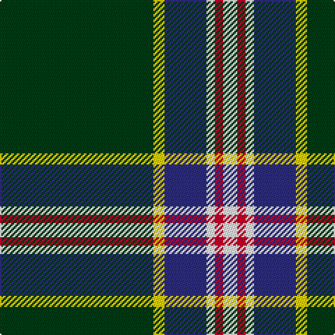

This page is one **sett** — a single exact thread-count. It belongs to the [tartan](/tartans/dg55ly4db15w3r3w5/)
(the same proportion at any scale), whose colour order is pattern [GYBWRW](/stripes/gybwrw/).

Sourced from register-of-tartans.  It is a [6 stripe tartan](/stripes/stripes6/).

Original link https://www.tartanregister.gov.uk/tartanDetails.aspx?ref=10901

## Register references

External register numbers recorded for this tartan.

- Scottish Register of Tartans: [10901](https://www.tartanregister.gov.uk/tartanDetails.aspx?ref=10901)

## Thread count
DG/110 Y8 DB30 W6 R6 W/10

## Palette

Palette: <strong>Tartan Register</strong>
<table><thead><tr><th>Colour</th><th>Threads</th><th>Shade</th><th>Base</th><th>OKLCh</th></tr></thead><tbody><tr><td>DG/</td><td style="text-align:right;font-variant-numeric:tabular-nums">110</td><td><code style="background-color:#003C14;">#003C14</code> <small style="color:#888">#003C14</small></td><td>G <code style="background-color:#006100;">#006100</code></td><td><small style="color:#888">oklch(31.1% 0.089 148.5)</small></td></tr><tr><td>Y</td><td style="text-align:right;font-variant-numeric:tabular-nums">8</td><td><code style="background-color:#FFD700;">#FFD700</code> <small style="color:#888">#FFD700</small></td><td>Y <code style="background-color:#F2BF00;">#F2BF00</code></td><td><small style="color:#888">oklch(88.7% 0.182 95.3)</small></td></tr><tr><td>DB</td><td style="text-align:right;font-variant-numeric:tabular-nums">30</td><td><code style="background-color:#2C2C80;">#2C2C80</code> <small style="color:#888">#2C2C80</small></td><td>B <code style="background-color:#2A418A;">#2A418A</code></td><td><small style="color:#888">oklch(35.0% 0.138 276.6)</small></td></tr><tr><td>W</td><td style="text-align:right;font-variant-numeric:tabular-nums">6</td><td><code style="background-color:#FFFFFF;">#FFFFFF</code> <small style="color:#888">#FFFFFF</small></td><td>W <code style="background-color:#F7F7F7;">#F7F7F7</code></td><td><small style="color:#888">oklch(100.0% 0.000 89.9)</small></td></tr><tr><td>R</td><td style="text-align:right;font-variant-numeric:tabular-nums">6</td><td><code style="background-color:#C8002C;">#C8002C</code> <small style="color:#888">#C8002C</small></td><td>R <code style="background-color:#CC0000;">#CC0000</code></td><td><small style="color:#888">oklch(52.6% 0.212 22.0)</small></td></tr><tr><td>W/</td><td style="text-align:right;font-variant-numeric:tabular-nums">10</td><td><code style="background-color:#FFFFFF;">#FFFFFF</code> <small style="color:#888">#FFFFFF</small></td><td>W <code style="background-color:#F7F7F7;">#F7F7F7</code></td><td><small style="color:#888">oklch(100.0% 0.000 89.9)</small></td></tr></tbody></table>

# Sample pattern

## Nearest tartans

The nearest existing variants by ΔTartan distance, with this tartan at the top so the swatches line up against it.

ΔTartan

Tartan

Sett

—

<a href="/ttd/edit/#slug=dg55ly4db15w3r3w5~x2">Spencer (2013)</a> <a class="nn-out" href="/setts/s6/dg55ly4db15w3r3w5~x2/" title="open its dictionary page">↗</a>

0.90

<a href="/ttd/edit/#slug=r5w4lg6db2dg43db2lg4r3~x2">Mullikin (2013)</a> <a class="nn-out" href="/setts/s8/r5w4lg6db2dg43db2lg4r3~x2/" title="open its dictionary page">↗</a>

1.19

<a href="/ttd/edit/#slug=dg60w3k12o5dg9o6k4w10">New York Jets</a> <a class="nn-out" href="/setts/s8/dg60w3k12o5dg9o6k4w10/" title="open its dictionary page">↗</a>

1.29

<a href="/ttd/edit/#slug=k2r1ly1y8k15y2dp1~x4">Coalfields Regeneration Trust, The</a> <a class="nn-out" href="/setts/s7/k2r1ly1y8k15y2dp1~x4/" title="open its dictionary page">↗</a>

1.29

<a href="/ttd/edit/#slug=r5w4dbi6db2g43db2dbi4r3~x2">Mullikin (2013)</a> <a class="nn-out" href="/setts/s8/r5w4dbi6db2g43db2dbi4r3~x2/" title="open its dictionary page">↗</a>

1.30

<a href="/ttd/edit/#slug=k2r1ly1g8k15g2dp1~x2">Coalfields Regeneration Trust, The</a> <a class="nn-out" href="/setts/s7/k2r1ly1g8k15g2dp1~x2/" title="open its dictionary page">↗</a>

1.34

<a href="/ttd/edit/#slug=r3dt4w10dg2w2dg5dt34ly3~x2">Royal Troon Golf Club, The</a> <a class="nn-out" href="/setts/s8/r3dt4w10dg2w2dg5dt34ly3~x2/" title="open its dictionary page">↗</a>

1.36

<a href="/ttd/edit/#slug=r5g3ly6w3ly5k55w5~x2">Avalon</a> <a class="nn-out" href="/setts/s7/r5g3ly6w3ly5k55w5~x2/" title="open its dictionary page">↗</a>

1.36

<a href="/ttd/edit/#slug=db6w3r3g55k10r3~x4">Military Medical Memorial (USA)</a> <a class="nn-out" href="/setts/s6/db6w3r3g55k10r3~x4/" title="open its dictionary page">↗</a>

1.39

<a href="/ttd/edit/#slug=db17r3dg55db3dg4db3dg4ly3w5~x2">Bundanoon</a> <a class="nn-out" href="/setts/s9/db17r3dg55db3dg4db3dg4ly3w5~x2/" title="open its dictionary page">↗</a>

1.40

<a href="/ttd/edit/#slug=w8r6ly2g34b3~x2">Milling-Christensen</a> <a class="nn-out" href="/setts/s5/w8r6ly2g34b3~x2/" title="open its dictionary page">↗</a>

## Neighbour map

Every grey dot is one of 14359 variants placed by the first two principal components of the ΔTartan feature space (44% of its variance). Red is this tartan; blue dots are its nearest — click one to open its page.

<svg viewBox="0 0 640 380" role="img" style="max-width:100%;height:auto;border:1px solid #e0e0e0;border-radius:4px;display:block" xmlns="http://www.w3.org/2000/svg"><image href="/nn/cloud.v1.png" width="640" height="380"/><a href="/setts/s8/r5w4lg6db2dg43db2lg4r3~x2/"><circle cx="353.7" cy="115.7" r="4" fill="#3465a4"><title>Mullikin (2013)</title></circle></a><a href="/setts/s8/dg60w3k12o5dg9o6k4w10/"><circle cx="359.7" cy="143.3" r="4" fill="#3465a4"><title>New York Jets</title></circle></a><a href="/setts/s7/k2r1ly1y8k15y2dp1~x4/"><circle cx="310.0" cy="150.1" r="4" fill="#3465a4"><title>Coalfields Regeneration Trust, The</title></circle></a><a href="/setts/s8/r5w4dbi6db2g43db2dbi4r3~x2/"><circle cx="366.6" cy="122.0" r="4" fill="#3465a4"><title>Mullikin (2013)</title></circle></a><a href="/setts/s7/k2r1ly1g8k15g2dp1~x2/"><circle cx="319.7" cy="158.1" r="4" fill="#3465a4"><title>Coalfields Regeneration Trust, The</title></circle></a><a href="/setts/s8/r3dt4w10dg2w2dg5dt34ly3~x2/"><circle cx="302.0" cy="119.4" r="4" fill="#3465a4"><title>Royal Troon Golf Club, The</title></circle></a><a href="/setts/s7/r5g3ly6w3ly5k55w5~x2/"><circle cx="369.5" cy="115.5" r="4" fill="#3465a4"><title>Avalon</title></circle></a><a href="/setts/s6/db6w3r3g55k10r3~x4/"><circle cx="410.7" cy="150.4" r="4" fill="#3465a4"><title>Military Medical Memorial (USA)</title></circle></a><a href="/setts/s9/db17r3dg55db3dg4db3dg4ly3w5~x2/"><circle cx="391.6" cy="131.8" r="4" fill="#3465a4"><title>Bundanoon</title></circle></a><a href="/setts/s5/w8r6ly2g34b3~x2/"><circle cx="334.5" cy="153.4" r="4" fill="#3465a4"><title>Milling-Christensen</title></circle></a><circle cx="356.6" cy="141.5" r="5" fill="#c00000"/></svg>

ID: /setts/s6/dg55ly4db15w3r3w5~x2/
