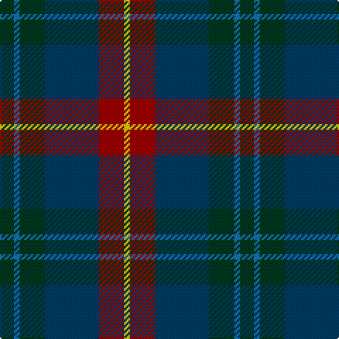

In pattern [GBGBRY](/stripes/gbgbry/).

This was sourced from tartans-authority.  It is a [6 stripe tartan](/stripes/stripes6/).

Original link http://www.tartansauthority.com/tartan-ferret/display/11139/

## Thread count
DG/10 B4 DG18 DB38 DR18 Y/4

## Palette
Each colour and its ΔE from the base-6 reference it is a variant of.

| Colour | Shade | Base | ΔE (OKLab) |
|---|---|---|---|
| B | <code style="background-color:#1474B4;">#1474B4</code> `#1474B4` | B <code style="background-color:#2A418A;">#2A418A</code> | 0.15 |
| DB | <code style="background-color:#003C64;">#003C64</code> `#003C64` | B <code style="background-color:#2A418A;">#2A418A</code> | 0.08 |
| DG | <code style="background-color:#003820;">#003820</code> `#003820` | G <code style="background-color:#006100;">#006100</code> | 0.15 |
| DR | <code style="background-color:#A00000;">#A00000</code> `#A00000` | R <code style="background-color:#CC0000;">#CC0000</code> | 0.09 |
| Y | <code style="background-color:#FCCC00;">#FCCC00</code> `#FCCC00` | Y <code style="background-color:#F2BF00;">#F2BF00</code> | 0.04 |

# Sample pattern

## Nearest tartans

The nearest existing variants by ΔTartan distance.

1. [Douglas, (Brown)](/setts/s5/k7t3dy30db30w3~x2/) — ΔT 0.83
1. [MacPhail Hunting](/setts/s6/r2db23k14dg16k2w2~x2/) — ΔT 0.85
1. [Lisbon](/setts/s6/r2do22g22do3db12y2~x2/) — ΔT 0.89
1. [MacPhedran/MacFadzean](/setts/s7/dg3db12lb1k12dg13r2dg2~x2/) — ΔT 0.90
1. [Newmill](/setts/s7/r1o5dt3dt11dt3o5lo1~x8/) — ΔT 0.91
1. [Bailies of Bennachie (Corporate)](/setts/s7/g27r2g4r15db26k2db6~x2/) — ΔT 0.91
1. [Leslie Hebridean Artifact Tartan Tartan Number: 1111. Earliest known date: 1740 From the Telfer Dunbar collection and said to date to C.1740s. See products available Copyright © Blair Urquhart, Comrie, 2015](/setts/s6/k6dg11w2db22r2k4~x2/) — ΔT 0.93
1. [Skene](/setts/s7/db24k4r3k4dg24k4r4~x2/) — ΔT 0.95
1. [MacDonald (Flora.. )](/setts/s7/dg17ly2k14r2db9r2db10~x2/) — ΔT 0.96
1. [Thompson/Thomson/MacTavish Hunting](/setts/s6/t4dy28dg6t12k12t3~x2/) — ΔT 0.98

## Neighbour map

Every grey dot is one of 14299 variants placed by the first two principal components of the ΔTartan feature space (44% of its variance). Red is this tartan; blue dots are its nearest — click one to open its page.

<svg viewBox="0 0 640 380" role="img" style="max-width:100%;height:auto;border:1px solid #e0e0e0;border-radius:4px;display:block" xmlns="http://www.w3.org/2000/svg"><image href="/nn/cloud.v1.png" width="640" height="380"/><a href="/setts/s5/k7t3dy30db30w3~x2/"><circle cx="259.5" cy="228.9" r="4" fill="#3465a4"><title>Douglas, (Brown)</title></circle></a><a href="/setts/s6/r2db23k14dg16k2w2~x2/"><circle cx="214.9" cy="209.8" r="4" fill="#3465a4"><title>MacPhail Hunting</title></circle></a><a href="/setts/s6/r2do22g22do3db12y2~x2/"><circle cx="241.0" cy="217.9" r="4" fill="#3465a4"><title>Lisbon</title></circle></a><a href="/setts/s7/dg3db12lb1k12dg13r2dg2~x2/"><circle cx="220.5" cy="203.4" r="4" fill="#3465a4"><title>MacPhedran/MacFadzean</title></circle></a><a href="/setts/s7/r1o5dt3dt11dt3o5lo1~x8/"><circle cx="206.0" cy="208.4" r="4" fill="#3465a4"><title>Newmill</title></circle></a><a href="/setts/s7/g27r2g4r15db26k2db6~x2/"><circle cx="240.9" cy="194.9" r="4" fill="#3465a4"><title>Bailies of Bennachie (Corporate)</title></circle></a><a href="/setts/s6/k6dg11w2db22r2k4~x2/"><circle cx="261.6" cy="208.0" r="4" fill="#3465a4"><title>Leslie Hebridean Artifact Tartan Tartan Number: 1111. Earliest known date: 1740 From the Telfer Dunbar collection and said to date to C.1740s. See products available Copyright © Blair Urquhart, Comrie, 2015</title></circle></a><a href="/setts/s7/db24k4r3k4dg24k4r4~x2/"><circle cx="200.9" cy="207.8" r="4" fill="#3465a4"><title>Skene</title></circle></a><a href="/setts/s7/dg17ly2k14r2db9r2db10~x2/"><circle cx="160.9" cy="220.5" r="4" fill="#3465a4"><title>MacDonald (Flora.. )</title></circle></a><a href="/setts/s6/t4dy28dg6t12k12t3~x2/"><circle cx="249.9" cy="241.5" r="4" fill="#3465a4"><title>Thompson/Thomson/MacTavish Hunting</title></circle></a><circle cx="220.4" cy="225.5" r="5" fill="#c00000"/></svg>

ID: /setts/s6/dg5b2dg9dt19r9ly2~x2/
