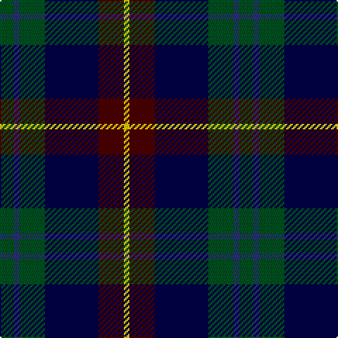

In pattern [GBGBBY](/stripes/gbgbby/).

This was sourced from register-of-tartans.  It is a [6 stripe tartan](/stripes/stripes6/).

Original link https://www.tartanregister.gov.uk/tartanDetails.aspx?ref=11139

## Register references

External register numbers recorded for this tartan.

- Scottish Register of Tartans: [11139](https://www.tartanregister.gov.uk/tartanDetails.aspx?ref=11139)

## Thread count
G/10 DBa4 G18 DB38 DR18 Y/4

## Palette
Each colour and the base-6 reference it is a variant of.

| Colour | Shade | Base |
|---|---|---|
| DB | <code style="background-color:#000048;">#000048</code> `oklch(18.2% 0.126 264.1)` <small>#000048</small> | B <code style="background-color:#2A418A;">#2A418A</code> |
| DBa | <code style="background-color:#2C2C80;">#2C2C80</code> `oklch(35.0% 0.138 276.6)` <small>#2C2C80</small> | B <code style="background-color:#2A418A;">#2A418A</code> |
| DR | <code style="background-color:#4C0000;">#4C0000</code> `oklch(26.2% 0.107 29.2)` <small>#4C0000</small> | B <code style="background-color:#2A418A;">#2A418A</code> |
| G | <code style="background-color:#005020;">#005020</code> `oklch(37.7% 0.105 149.6)` <small>#005020</small> | G <code style="background-color:#006100;">#006100</code> |
| Y | <code style="background-color:#FCCC00;">#FCCC00</code> `oklch(86.2% 0.176 91.5)` <small>#FCCC00</small> | Y <code style="background-color:#F2BF00;">#F2BF00</code> |

# Sample pattern

## Nearest tartans

The nearest existing variants by ΔTartan distance.

1. [New England (Fashion)](/setts/s6/k2w1k12g5db11r1~x2/) — ΔT 0.67
1. [MacPhail Hunting #2](/setts/s6/r4db24k12g14k4lb3~x2/) — ΔT 0.74
1. [Rose Hunting Clan Tartan Tartan Number: 1226. Earliest known date: 1831 First recorded in James Logan's, 'The Scottish Gael' in 1831. See products available Copyright © Blair Urquhart, Comrie, 2015](/setts/s6/k4w1g10k10db10r2~x2/) — ΔT 0.77
1. [MacPhail Hunting](/setts/s6/r2db23k14dg16k2w2~x2/) — ΔT 0.77
1. [Midlothian](/setts/s6/db31b4db5k19g20lo4~x2/) — ΔT 0.79
1. [Paterson Blue (Personal)](/setts/s6/db22w2k10g11r3g4~x2/) — ΔT 0.81
1. [Loudoun's Highlanders - 1747 #1 (Mil](/setts/s6/r4k2db24k20g20lo3~x2/) — ΔT 0.81
1. [Mitchell (Clan)](/setts/s6/k2g17k16r2db17lr2~x2/) — ΔT 0.81
1. [Rose Hunting](/setts/s6/k4w1g10k10db10r2~x4/) — ΔT 0.82
1. [Russell or Mitchell or Hunter or Galbraith](/setts/s6/k2dg12k12r1db12w2~x2/) — ΔT 0.83

## Neighbour map

Every grey dot is one of 14299 variants placed by the first two principal components of the ΔTartan feature space (44% of its variance). Red is this tartan; blue dots are its nearest — click one to open its page.

<svg viewBox="0 0 640 380" role="img" style="max-width:100%;height:auto;border:1px solid #e0e0e0;border-radius:4px;display:block" xmlns="http://www.w3.org/2000/svg"><image href="/nn/cloud.v1.png" width="640" height="380"/><a href="/setts/s6/k2w1k12g5db11r1~x2/"><circle cx="238.4" cy="203.6" r="4" fill="#3465a4"><title>New England (Fashion)</title></circle></a><a href="/setts/s6/r4db24k12g14k4lb3~x2/"><circle cx="172.5" cy="220.7" r="4" fill="#3465a4"><title>MacPhail Hunting #2</title></circle></a><a href="/setts/s6/k4w1g10k10db10r2~x2/"><circle cx="170.6" cy="225.3" r="4" fill="#3465a4"><title>Rose Hunting Clan Tartan Tartan Number: 1226. Earliest known date: 1831 First recorded in James Logan's, 'The Scottish Gael' in 1831. See products available Copyright © Blair Urquhart, Comrie, 2015</title></circle></a><a href="/setts/s6/r2db23k14dg16k2w2~x2/"><circle cx="214.9" cy="209.8" r="4" fill="#3465a4"><title>MacPhail Hunting</title></circle></a><a href="/setts/s6/db31b4db5k19g20lo4~x2/"><circle cx="191.1" cy="226.6" r="4" fill="#3465a4"><title>Midlothian</title></circle></a><a href="/setts/s6/db22w2k10g11r3g4~x2/"><circle cx="204.0" cy="204.8" r="4" fill="#3465a4"><title>Paterson Blue (Personal)</title></circle></a><a href="/setts/s6/r4k2db24k20g20lo3~x2/"><circle cx="173.5" cy="210.6" r="4" fill="#3465a4"><title>Loudoun's Highlanders - 1747 #1 (Mil</title></circle></a><a href="/setts/s6/k2g17k16r2db17lr2~x2/"><circle cx="163.2" cy="221.4" r="4" fill="#3465a4"><title>Mitchell (Clan)</title></circle></a><a href="/setts/s6/k4w1g10k10db10r2~x4/"><circle cx="166.4" cy="223.2" r="4" fill="#3465a4"><title>Rose Hunting</title></circle></a><a href="/setts/s6/k2dg12k12r1db12w2~x2/"><circle cx="180.5" cy="211.1" r="4" fill="#3465a4"><title>Russell or Mitchell or Hunter or Galbraith</title></circle></a><circle cx="202.9" cy="221.7" r="5" fill="#c00000"/></svg>

ID: /setts/s6/dg5db2dg9db19dr9ly2~x2/
