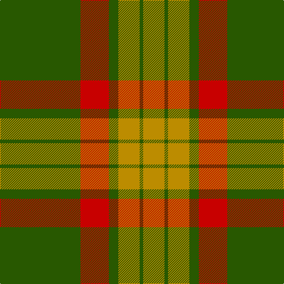

**Bands:** [YGYGRG](/stripes/ygygrg/) · **Stripes:** [LO DG LO DG R DG](/stripes/stripes6/) LO DG LO DG R DG

This was sourced from tartans-authority.  It is a [6 band tartan](/bands/bands6/).

Original link http://www.tartansauthority.com/tartan-ferret/display/6310/

## Thread count
G/136 R48 G16 DY36 G6 DY/36

## Palette
Each colour and its ΔE from the base-6 reference it is a variant of.

| Colour | Shade | Base | ΔE (OKLab) |
|---|---|---|---|
| DY | <code style="background-color:#BC8C00;">#BC8C00</code> `#BC8C00` | Y <code style="background-color:#F2BF00;">#F2BF00</code> | 0.16 |
| G | <code style="background-color:#285800;">#285800</code> `#285800` | G <code style="background-color:#006100;">#006100</code> | 0.03 |
| R | <code style="background-color:#C80000;">#C80000</code> `#C80000` | R <code style="background-color:#CC0000;">#CC0000</code> | 0.01 |

# Sample pattern

## Nearest tartans

The nearest existing variants by ΔTartan distance.

1. [MacMillan/Isetan](/setts/s6/g68r24g8lo18g3lo18~x2/) — ΔT 1.04
1. [Maxwell Htg (Clan)](/setts/s7/g3r16g4k6g28r2g3~x2/) — ΔT 1.47
1. [Forget Family (Personal)](/setts/s6/g8lo1g8lo12r1lo1~x4/) — ΔT 1.54
1. [Spice Apple](/setts/s7/r4g4lo4g12r22lo1g4~x4/) — ΔT 1.59
1. [Princess Margaret Rose Tartan Tartan Number: 986. Earliest known date: 1930 Colours reversed from MacGregor See products available Copyright © Blair Urquhart, Comrie, 2015](/setts/s6/g36r18g4r6k1w2~x2/) — ΔT 1.64
1. [Unidentified Cant #09](/setts/s8/r44db2g26r3db2/) — ΔT 1.64
1. [Gleneil (Spoof)](/setts/s8/k2o2k1o18g24k1g2lo2~x2/) — ΔT 1.66
1. [Skene](/setts/s7/db6r3g1r3g12r3g1~x2/) — ΔT 1.67
1. [Rice (Welsh Name)](/setts/s10/dt4lo21dt1lo21y8db4y5db4y4dt4/) — ΔT 1.71
1. [McNee (Name)](/setts/s7/k9w2r50g42r16g17k4/) — ΔT 1.71

## Neighbour map

Every grey dot is one of 14299 variants placed by the first two principal components of the ΔTartan feature space (44% of its variance). Red is this tartan; blue dots are its nearest — click one to open its page.

<svg viewBox="0 0 640 380" role="img" style="max-width:100%;height:auto;border:1px solid #e0e0e0;border-radius:4px;display:block" xmlns="http://www.w3.org/2000/svg"><image href="/nn/cloud.v1.png" width="640" height="380"/><a href="/setts/s6/g68r24g8lo18g3lo18~x2/"><circle cx="367.9" cy="192.4" r="4" fill="#3465a4"><title>MacMillan/Isetan</title></circle></a><a href="/setts/s7/g3r16g4k6g28r2g3~x2/"><circle cx="420.1" cy="223.3" r="4" fill="#3465a4"><title>Maxwell Htg (Clan)</title></circle></a><a href="/setts/s6/g8lo1g8lo12r1lo1~x4/"><circle cx="375.3" cy="243.5" r="4" fill="#3465a4"><title>Forget Family (Personal)</title></circle></a><a href="/setts/s7/r4g4lo4g12r22lo1g4~x4/"><circle cx="368.7" cy="184.3" r="4" fill="#3465a4"><title>Spice Apple</title></circle></a><a href="/setts/s6/g36r18g4r6k1w2~x2/"><circle cx="422.0" cy="152.1" r="4" fill="#3465a4"><title>Princess Margaret Rose Tartan Tartan Number: 986. Earliest known date: 1930 Colours reversed from MacGregor See products available Copyright © Blair Urquhart, Comrie, 2015</title></circle></a><a href="/setts/s8/r44db2g26r3db2/"><circle cx="376.6" cy="170.3" r="4" fill="#3465a4"><title>Unidentified Cant #09</title></circle></a><a href="/setts/s8/k2o2k1o18g24k1g2lo2~x2/"><circle cx="376.9" cy="158.0" r="4" fill="#3465a4"><title>Gleneil (Spoof)</title></circle></a><a href="/setts/s7/db6r3g1r3g12r3g1~x2/"><circle cx="297.8" cy="216.5" r="4" fill="#3465a4"><title>Skene</title></circle></a><a href="/setts/s10/dt4lo21dt1lo21y8db4y5db4y4dt4/"><circle cx="323.8" cy="160.1" r="4" fill="#3465a4"><title>Rice (Welsh Name)</title></circle></a><a href="/setts/s7/k9w2r50g42r16g17k4/"><circle cx="339.6" cy="185.0" r="4" fill="#3465a4"><title>McNee (Name)</title></circle></a><circle cx="392.6" cy="205.8" r="5" fill="#c00000"/></svg>

ID: /setts/s6/dg68r24dg8lo18dg3lo18~x2/
