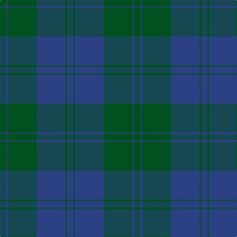

**Bands:** [GBGBGB](/stripes/gbgbgb/) · **Stripes:** [DG DB DG DB DG DB](/stripes/stripes6/) DG DB DG DB DG DB

This was sourced from register-of-tartans.  It is a [6 band tartan](/bands/bands6/).

Original link https://www.tartanregister.gov.uk/tartanDetails.aspx?ref=1605

## Also known as

This cloth is also recorded under:

- Harmony, 12

## Register references

External register numbers recorded for this tartan.

- Scottish Register of Tartans: [1605](https://www.tartanregister.gov.uk/tartanDetails.aspx?ref=1605)
- Scottish Tartans World Register: 113

## Thread count
G/12 B4 G58 B58 G4 B/12

## Palette
Each colour and its ΔE from the base-6 reference it is a variant of.

| Colour | Shade | Base | ΔE (OKLab) |
|---|---|---|---|
| B | <code style="background-color:#2C4084;">#2C4084</code> `#2C4084` | B <code style="background-color:#2A418A;">#2A418A</code> | 0.01 |
| G | <code style="background-color:#005020;">#005020</code> `#005020` | G <code style="background-color:#006100;">#006100</code> | 0.07 |

# Sample pattern

## Nearest tartans

The nearest existing variants by ΔTartan distance.

1. [Williams (New York) (Personal)](/setts/s5/k30dt6k6dt41t2~x2/) — ΔT 1.77
1. [Unidentified Tweed](/setts/s6/dg4db1dg12db12w1db4~x2/) — ΔT 2.00
1. [Land's End Blue](/setts/s8/dg2dt26g2dt2g9r2g9dt2~x2/) — ΔT 2.16
1. [Donachie of Brockloch Htg (Clan)](/setts/s10/y24r2y2dg40y25dg2y2r2y2dg20~x2/) — ΔT 2.19
1. [Breckon Hunting (Name)](/setts/s9/db3r1db14dg14r1dg1r1dg1r2~x4/) — ΔT 2.20
1. [MacCallum, High School](/setts/s5/y9db3y1db11y1~x6/) — ΔT 2.21
1. [Keeper of the Quaich](/setts/s6/dy3db3dy3db27dy40y3/) — ΔT 2.27
1. [Carnet (Fashion)](/setts/s6/k6dg3k3dg11k1dg2~x4/) — ΔT 2.27
1. [Land's End, Blue (Fashion)](/setts/s8/dg2dt26dg2dt2dg9r2dg9dt2~x2/) — ΔT 2.36
1. [Sugiyama](/setts/s6/db7db2db25db10g21db2~x2/) — ΔT 2.36

## Neighbour map

Every grey dot is one of 14299 variants placed by the first two principal components of the ΔTartan feature space (44% of its variance). Red is this tartan; blue dots are its nearest — click one to open its page.

<svg viewBox="0 0 640 380" role="img" style="max-width:100%;height:auto;border:1px solid #e0e0e0;border-radius:4px;display:block" xmlns="http://www.w3.org/2000/svg"><image href="/nn/cloud.v1.png" width="640" height="380"/><a href="/setts/s5/k30dt6k6dt41t2~x2/"><circle cx="474.0" cy="270.6" r="4" fill="#3465a4"><title>Williams (New York) (Personal)</title></circle></a><a href="/setts/s6/dg4db1dg12db12w1db4~x2/"><circle cx="385.7" cy="269.5" r="4" fill="#3465a4"><title>Unidentified Tweed</title></circle></a><a href="/setts/s8/dg2dt26g2dt2g9r2g9dt2~x2/"><circle cx="425.6" cy="230.7" r="4" fill="#3465a4"><title>Land's End Blue</title></circle></a><a href="/setts/s10/y24r2y2dg40y25dg2y2r2y2dg20~x2/"><circle cx="446.0" cy="223.6" r="4" fill="#3465a4"><title>Donachie of Brockloch Htg (Clan)</title></circle></a><a href="/setts/s9/db3r1db14dg14r1dg1r1dg1r2~x4/"><circle cx="419.7" cy="240.6" r="4" fill="#3465a4"><title>Breckon Hunting (Name)</title></circle></a><a href="/setts/s5/y9db3y1db11y1~x6/"><circle cx="449.8" cy="289.3" r="4" fill="#3465a4"><title>MacCallum, High School</title></circle></a><a href="/setts/s6/dy3db3dy3db27dy40y3/"><circle cx="472.2" cy="247.6" r="4" fill="#3465a4"><title>Keeper of the Quaich</title></circle></a><a href="/setts/s6/k6dg3k3dg11k1dg2~x4/"><circle cx="505.0" cy="321.0" r="4" fill="#3465a4"><title>Carnet (Fashion)</title></circle></a><a href="/setts/s8/dg2dt26dg2dt2dg9r2dg9dt2~x2/"><circle cx="523.0" cy="286.7" r="4" fill="#3465a4"><title>Land's End, Blue (Fashion)</title></circle></a><a href="/setts/s6/db7db2db25db10g21db2~x2/"><circle cx="345.6" cy="267.2" r="4" fill="#3465a4"><title>Sugiyama</title></circle></a><circle cx="480.5" cy="294.4" r="5" fill="#c00000"/></svg>

ID: /setts/s6/dg6db2dg29db29dg2db6~x2/
