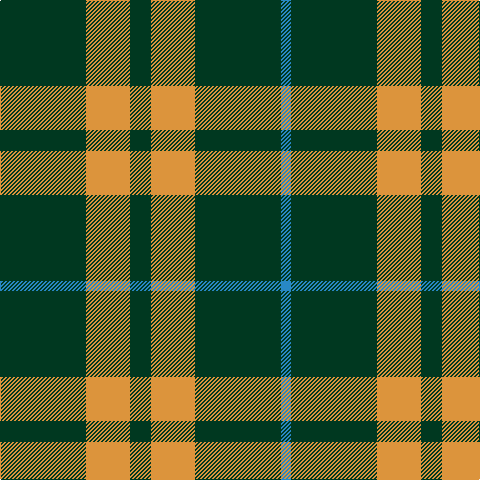

In pattern [BGYGYG](/stripes/bgygyg/).

This was sourced from register-of-tartans.  It is a [6 stripe tartan](/stripes/stripes6/).

Original link https://www.tartanregister.gov.uk/tartanDetails.aspx?ref=3856

## Register references

External register numbers recorded for this tartan.

- Scottish Register of Tartans: [3856](https://www.tartanregister.gov.uk/tartanDetails.aspx?ref=3856)
- Scottish Tartans Authority (ITI): 201
- Scottish Tartans World Register: 201

## Thread count
DG/86 O44 DG21 O44 DG86 B/10

## Palette
Each colour and the base-6 reference it is a variant of.

| Colour | Shade | Base |
|---|---|---|
| B | <code style="background-color:#2888C4;">#2888C4</code> `oklch(60.1% 0.125 241.5)` <small>#2888C4</small> | B <code style="background-color:#2A418A;">#2A418A</code> |
| DG | <code style="background-color:#003820;">#003820</code> `oklch(30.0% 0.070 158.3)` <small>#003820</small> | G <code style="background-color:#006100;">#006100</code> |
| O | <code style="background-color:#DC943C;">#DC943C</code> `oklch(72.3% 0.133 67.9)` <small>#DC943C</small> | Y <code style="background-color:#F2BF00;">#F2BF00</code> |

# Sample pattern

## Nearest tartans

The nearest existing variants by ΔTartan distance.

1. [Special Saffron (Fashion)](/setts/s4/dg21lo44dg86t10/) — ΔT 0.99
1. [Special, Saffron](/setts/s4/dg21lo43dg86b10/) — ΔT 1.09
1. [Special Saffron Tartan Tartan Number: 201. Earliest known date: pre 2003 Y = Saffron See products available Copyright © Blair Urquhart, Comrie, 2015](/setts/s4/dg21ly43dg86t10/) — ΔT 1.18
1. [Heritage #2](/setts/s7/dg20w2dg9w2ly5w7dg10~x2/) — ΔT 1.36
1. [Granger](/setts/s6/dg40k4dg12k21dg17w4~x2/) — ΔT 1.49
1. [Leeds University Corporate Tartan Tartan Number: 980. Earliest known date: pre 2003 Leeds University Scottish Country Dance Club. See products available Copyright © Blair Urquhart, Comrie, 2015](/setts/s8/g9m2g2m2g2m8g11w2~x4/) — ΔT 1.49
1. [Confederate Infantry](/setts/s6/dg2o14dg8o3dg12db2~x2/) — ΔT 1.52
1. [Arkansas](/setts/s7/g3w1g12r6g3k3g2~x4/) — ΔT 1.52
1. [Wilson's, No 211](/setts/s4/g8p4g1p2~x4/) — ΔT 1.59
1. [Hasegawa (Akasaka) (Personal)](/setts/s8/dg3w5dg3t6dg5t1dg12r1~x2/) — ΔT 1.60

## Neighbour map

Every grey dot is one of 14299 variants placed by the first two principal components of the ΔTartan feature space (44% of its variance). Red is this tartan; blue dots are its nearest — click one to open its page.

<svg viewBox="0 0 640 380" role="img" style="max-width:100%;height:auto;border:1px solid #e0e0e0;border-radius:4px;display:block" xmlns="http://www.w3.org/2000/svg"><image href="/nn/cloud.v1.png" width="640" height="380"/><a href="/setts/s4/dg21lo44dg86t10/"><circle cx="372.7" cy="262.0" r="4" fill="#3465a4"><title>Special Saffron (Fashion)</title></circle></a><a href="/setts/s4/dg21lo43dg86b10/"><circle cx="379.1" cy="263.5" r="4" fill="#3465a4"><title>Special, Saffron</title></circle></a><a href="/setts/s4/dg21ly43dg86t10/"><circle cx="357.6" cy="254.7" r="4" fill="#3465a4"><title>Special Saffron Tartan Tartan Number: 201. Earliest known date: pre 2003 Y = Saffron See products available Copyright © Blair Urquhart, Comrie, 2015</title></circle></a><a href="/setts/s7/dg20w2dg9w2ly5w7dg10~x2/"><circle cx="372.6" cy="225.6" r="4" fill="#3465a4"><title>Heritage #2</title></circle></a><a href="/setts/s6/dg40k4dg12k21dg17w4~x2/"><circle cx="391.4" cy="245.5" r="4" fill="#3465a4"><title>Granger</title></circle></a><a href="/setts/s8/g9m2g2m2g2m8g11w2~x4/"><circle cx="350.3" cy="249.9" r="4" fill="#3465a4"><title>Leeds University Corporate Tartan Tartan Number: 980. Earliest known date: pre 2003 Leeds University Scottish Country Dance Club. See products available Copyright © Blair Urquhart, Comrie, 2015</title></circle></a><a href="/setts/s6/dg2o14dg8o3dg12db2~x2/"><circle cx="313.8" cy="262.0" r="4" fill="#3465a4"><title>Confederate Infantry</title></circle></a><a href="/setts/s7/g3w1g12r6g3k3g2~x4/"><circle cx="367.1" cy="208.6" r="4" fill="#3465a4"><title>Arkansas</title></circle></a><a href="/setts/s4/g8p4g1p2~x4/"><circle cx="375.3" cy="281.6" r="4" fill="#3465a4"><title>Wilson's, No 211</title></circle></a><a href="/setts/s8/dg3w5dg3t6dg5t1dg12r1~x2/"><circle cx="312.0" cy="198.9" r="4" fill="#3465a4"><title>Hasegawa (Akasaka) (Personal)</title></circle></a><circle cx="355.1" cy="256.4" r="5" fill="#c00000"/></svg>

ID: /setts/s6/dg86lo44dg21lo44dg86t10/
