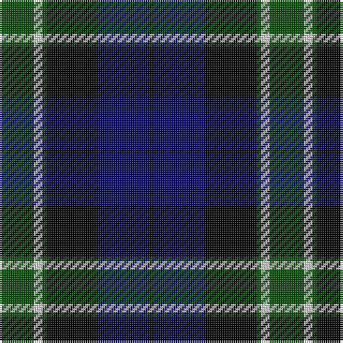

In pattern [GWGKBK](/stripes/gwgkbk/).

This was sourced from weddslist.  It is a [6 stripe tartan](/stripes/stripes6/).

Original link http://www.weddslist.com/cgi-bin/tartans/pg.pl?source=rb

## Thread count
G/16 N4 G2 K24 DB24 K/2

## Palette
Each colour and the base-6 reference it is a variant of.

| Colour | Shade | Base |
|---|---|---|
| DB | <code style="background-color:#000064;">#000064</code> `oklch(22.7% 0.158 264.1)` <small>#000064</small> | B <code style="background-color:#2A418A;">#2A418A</code> |
| G | <code style="background-color:#004C00;">#004C00</code> `oklch(36.1% 0.123 142.5)` <small>#004C00</small> | G <code style="background-color:#006100;">#006100</code> |
| K | <code style="background-color:#000000;">#000000</code> `oklch(0.0% 0.000 0.0)` <small>#000000</small> | K <code style="background-color:#000000;">#000000</code> |
| N | <code style="background-color:#D0D0D0;">#D0D0D0</code> `oklch(85.8% 0.000 89.9)` <small>#D0D0D0</small> | W <code style="background-color:#F7F7F7;">#F7F7F7</code> |

# Sample pattern

## Nearest tartans

The nearest existing variants by ΔTartan distance.

1. [Gunn](/setts/s6/dg2db12dg1k12dg12r2/) — ΔT 0.73
1. [Mitchell](/setts/s6/k2dg12k12r1db12lb2/) — ΔT 0.98
1. [Graham W](/setts/s6/dg21lb2dg4k17dp14k3/) — ΔT 1.02
1. [Melville](/setts/s6/k5lb2dg18k17dp16k3/) — ΔT 1.04
1. [Mitchell](/setts/s6/k2dg12k12r1db12lr2~x2/) — ΔT 1.04
1. [Mitchell](/setts/s6/k2dg12k12r1db12lr2/) — ΔT 1.04
1. [Unnamed, No 59](/setts/s6/t1db11k11g11k2t1~x2/) — ΔT 1.06
1. [Meoni (Personal)](/setts/s7/k1r1k18g12db18g1db1~x2/) — ΔT 1.08
1. [Mowat](/setts/s7/db48k6db10k46ly4k22g43/) — ΔT 1.09
1. [Gunn](/setts/s6/dg2db12dg1k12dg12r2~x2/) — ΔT 1.11

## Neighbour map

Every grey dot is one of 14299 variants placed by the first two principal components of the ΔTartan feature space (44% of its variance). Red is this tartan; blue dots are its nearest — click one to open its page.

<svg viewBox="0 0 640 380" role="img" style="max-width:100%;height:auto;border:1px solid #e0e0e0;border-radius:4px;display:block" xmlns="http://www.w3.org/2000/svg"><image href="/nn/cloud.v1.png" width="640" height="380"/><a href="/setts/s6/dg2db12dg1k12dg12r2/"><circle cx="203.8" cy="228.4" r="4" fill="#3465a4"><title>Gunn</title></circle></a><a href="/setts/s6/k2dg12k12r1db12lb2/"><circle cx="158.7" cy="205.5" r="4" fill="#3465a4"><title>Mitchell</title></circle></a><a href="/setts/s6/dg21lb2dg4k17dp14k3/"><circle cx="200.8" cy="222.2" r="4" fill="#3465a4"><title>Graham W</title></circle></a><a href="/setts/s6/k5lb2dg18k17dp16k3/"><circle cx="187.5" cy="231.6" r="4" fill="#3465a4"><title>Melville</title></circle></a><a href="/setts/s6/k2dg12k12r1db12lr2~x2/"><circle cx="170.4" cy="211.3" r="4" fill="#3465a4"><title>Mitchell</title></circle></a><a href="/setts/s6/k2dg12k12r1db12lr2/"><circle cx="170.4" cy="211.3" r="4" fill="#3465a4"><title>Mitchell</title></circle></a><a href="/setts/s6/t1db11k11g11k2t1~x2/"><circle cx="167.6" cy="212.4" r="4" fill="#3465a4"><title>Unnamed, No 59</title></circle></a><a href="/setts/s7/k1r1k18g12db18g1db1~x2/"><circle cx="232.1" cy="177.8" r="4" fill="#3465a4"><title>Meoni (Personal)</title></circle></a><a href="/setts/s7/db48k6db10k46ly4k22g43/"><circle cx="192.7" cy="210.3" r="4" fill="#3465a4"><title>Mowat</title></circle></a><a href="/setts/s6/dg2db12dg1k12dg12r2~x2/"><circle cx="218.1" cy="235.5" r="4" fill="#3465a4"><title>Gunn</title></circle></a><circle cx="190.6" cy="216.9" r="5" fill="#c00000"/></svg>

ID: /setts/s6/dg8lb2dg1k12db12k1~x2/
