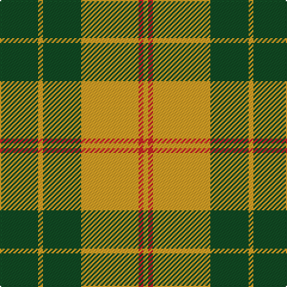

**Bands:** [YRYGYG](/stripes/yrygyg/) · **Stripes:** [LO R LO DG LO DG](/stripes/stripes6/) LO R LO DG LO DG

This was sourced from register-of-tartans.  It is a [6 band tartan](/bands/bands6/).

Original link https://www.tartanregister.gov.uk/tartanDetails.aspx?ref=10694

## Attestations

This cloth appears in 2 source records; the oldest owns this page.

- 14/07/2012 — Forget Family (Yonne) (register-of-tartans, [record](https://www.tartanregister.gov.uk/tartanDetails.aspx?ref=10694))
- undated — Forget Family (Yonne) Name Tartan Tartan Number: 10694. Earliest known date: 11 September 2012 The gold and red colours in the tartan are the Forget family colours, with green to recall the importance of the forest for the family. See products available Copyright © Blair Urquhart, Comrie, 2015 (house-of-tartan, [record](http://www.house-of-tartan.scotland.net/house/TartanViewjs.asp?colr=Def&tnam=10694))

## Register references

External register numbers recorded for this tartan.

- Scottish Register of Tartans: [10694](https://www.tartanregister.gov.uk/tartanDetails.aspx?ref=10694)

## Thread count
G/32 Y4 G32 Y48 R4 Y/4

## Palette
Each colour and its ΔE from the base-6 reference it is a variant of.

| Colour | Shade | Base | ΔE (OKLab) |
|---|---|---|---|
| G | <code style="background-color:#124B24;">#124B24</code> `#124B24` | G <code style="background-color:#006100;">#006100</code> | 0.09 |
| R | <code style="background-color:#CA2625;">#CA2625</code> `#CA2625` | R <code style="background-color:#CC0000;">#CC0000</code> | 0.02 |
| Y | <code style="background-color:#E0A126;">#E0A126</code> `#E0A126` | Y <code style="background-color:#F2BF00;">#F2BF00</code> | 0.08 |

# Sample pattern

## Nearest tartans

The nearest existing variants by ΔTartan distance.

1. [Big Spruce Brewing](/setts/s6/dg11lo1dg1lo6k1lo1~x4/) — ΔT 1.01
1. [MacGregor of Balquidder - 1831 (Clan](/setts/s6/g9r2g9r14k1w2~x4/) — ΔT 1.24
1. [Big Spruce Brewing](/setts/s6/dg11ly1dg1ly6k1ly1~x8/) — ΔT 1.36
1. [O'Neill Pipe Band 1970 (Corporate)](/setts/s8/g1lb4dy12lb3dy6lb12g1lb1~x4/) — ΔT 1.38
1. [MacMillan/Isetan](/setts/s6/g68r24g8lo18g3lo18~x2/) — ΔT 1.42
1. [Unnamed C21st - Fashion](/setts/s6/k4ly32k16r3k16ly4~x2/) — ΔT 1.43
1. [MacDonald of Glenaladale (symmetrical)](/setts/s6/g5w2r27g27r5w2~x2/) — ΔT 1.45
1. [Murray, Lord George (Hose)](/setts/s5/k1r5g10r5g1~x4/) — ΔT 1.45
1. [Unidentified 24](/setts/s7/ly1r3g7r3g7r3ly1~x4/) — ΔT 1.47
1. [Livingston](/setts/s9/g20k2r3k2r6g20r29g3r10~x2/) — ΔT 1.50

## Neighbour map

Every grey dot is one of 14299 variants placed by the first two principal components of the ΔTartan feature space (44% of its variance). Red is this tartan; blue dots are its nearest — click one to open its page.

<svg viewBox="0 0 640 380" role="img" style="max-width:100%;height:auto;border:1px solid #e0e0e0;border-radius:4px;display:block" xmlns="http://www.w3.org/2000/svg"><image href="/nn/cloud.v1.png" width="640" height="380"/><a href="/setts/s6/dg11lo1dg1lo6k1lo1~x4/"><circle cx="351.6" cy="201.1" r="4" fill="#3465a4"><title>Big Spruce Brewing</title></circle></a><a href="/setts/s6/g9r2g9r14k1w2~x4/"><circle cx="289.3" cy="194.3" r="4" fill="#3465a4"><title>MacGregor of Balquidder - 1831 (Clan</title></circle></a><a href="/setts/s6/dg11ly1dg1ly6k1ly1~x8/"><circle cx="330.1" cy="192.0" r="4" fill="#3465a4"><title>Big Spruce Brewing</title></circle></a><a href="/setts/s8/g1lb4dy12lb3dy6lb12g1lb1~x4/"><circle cx="304.2" cy="191.3" r="4" fill="#3465a4"><title>O'Neill Pipe Band 1970 (Corporate)</title></circle></a><a href="/setts/s6/g68r24g8lo18g3lo18~x2/"><circle cx="367.9" cy="192.4" r="4" fill="#3465a4"><title>MacMillan/Isetan</title></circle></a><a href="/setts/s6/k4ly32k16r3k16ly4~x2/"><circle cx="267.6" cy="198.2" r="4" fill="#3465a4"><title>Unnamed C21st - Fashion</title></circle></a><a href="/setts/s6/g5w2r27g27r5w2~x2/"><circle cx="335.2" cy="199.1" r="4" fill="#3465a4"><title>MacDonald of Glenaladale (symmetrical)</title></circle></a><a href="/setts/s5/k1r5g10r5g1~x4/"><circle cx="324.0" cy="239.4" r="4" fill="#3465a4"><title>Murray, Lord George (Hose)</title></circle></a><a href="/setts/s7/ly1r3g7r3g7r3ly1~x4/"><circle cx="308.2" cy="250.2" r="4" fill="#3465a4"><title>Unidentified 24</title></circle></a><a href="/setts/s9/g20k2r3k2r6g20r29g3r10~x2/"><circle cx="335.7" cy="186.2" r="4" fill="#3465a4"><title>Livingston</title></circle></a><circle cx="321.5" cy="211.4" r="5" fill="#c00000"/></svg>

ID: /setts/s6/dg8lo1dg8lo12r1lo1~x4/
