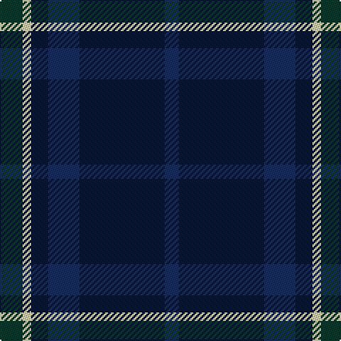

This page is one **sett** — a single exact thread-count. It belongs to the [tartan](/tartans/dg8lr3dba6db11dba30db5/)
(the same proportion at any scale), whose colour order is pattern [BBBBWG](/stripes/bbbbwg/).

Sourced from register-of-tartans.  It is a [6 stripe tartan](/stripes/stripes6/).

Original link https://www.tartanregister.gov.uk/tartanDetails.aspx?ref=10514

## Register references

External register numbers recorded for this tartan.

- Scottish Register of Tartans: [10514](https://www.tartanregister.gov.uk/tartanDetails.aspx?ref=10514)

## Thread count
DG/16 LR6 DBa12 DB22 DBa60 DB/10

## Palette
Each colour and the base-6 reference it is a variant of.

| Colour | Shade | Base |
|---|---|---|
| DB | <code style="background-color:#172D60;">#172D60</code> `oklch(31.1% 0.095 264.1)` <small>#172D60</small> | B <code style="background-color:#2A418A;">#2A418A</code> |
| DBa | <code style="background-color:#081736;">#081736</code> `oklch(21.3% 0.064 262.7)` <small>#081736</small> | B <code style="background-color:#2A418A;">#2A418A</code> |
| DG | <code style="background-color:#06392B;">#06392B</code> `oklch(30.8% 0.057 169.4)` <small>#06392B</small> | G <code style="background-color:#006100;">#006100</code> |
| LR | <code style="background-color:#DDD5AF;">#DDD5AF</code> `oklch(87.0% 0.051 97.4)` <small>#DDD5AF</small> | W <code style="background-color:#F7F7F7;">#F7F7F7</code> |

# Sample pattern

## Nearest tartans

The nearest existing variants by ΔTartan distance, with this tartan at the top so the swatches line up against it.

ΔTartan

Tartan

Sett

—

<a href="/ttd/edit/#slug=dg8w3dt6db11dt30db5~x2">Craig Devlin (Dundee) (Personal)</a> <a class="nn-out" href="/setts/s6/dg8w3dt6db11dt30db5~x2/" title="open its dictionary page">↗</a>

1.27

<a href="/ttd/edit/#slug=r4dt21w2dt20db21dt2db2~x2">St. George's (Birmingham) (School)</a> <a class="nn-out" href="/setts/s7/r4dt21w2dt20db21dt2db2~x2/" title="open its dictionary page">↗</a>

1.33

<a href="/ttd/edit/#slug=dg1db2db5db10ly1~x8">Open Championship (2000)</a> <a class="nn-out" href="/setts/s5/dg1db2db5db10ly1~x8/" title="open its dictionary page">↗</a>

1.44

<a href="/ttd/edit/#slug=dt5db4dr1db14dt14dr1dt5lo3~x2">Edinburgh Monarchs</a> <a class="nn-out" href="/setts/s8/dt5db4dr1db14dt14dr1dt5lo3~x2/" title="open its dictionary page">↗</a>

1.57

<a href="/ttd/edit/#slug=dy5db12db4lo4db22db3db4dy5">Daks Muted blue Trade Tartan Tartan Number: 1725. Earliest known date: 1987 Submitted in 1981 as a potential Currie sett. See products available Copyright © Blair Urquhart, Comrie, 2015</a> <a class="nn-out" href="/setts/s8/dy5db12db4lo4db22db3db4dy5/" title="open its dictionary page">↗</a>

1.59

<a href="/ttd/edit/#slug=b5k22db4k4db26k4~x2">Slanj, The</a> <a class="nn-out" href="/setts/s6/b5k22db4k4db26k4~x2/" title="open its dictionary page">↗</a>

1.59

<a href="/ttd/edit/#slug=db4lo2db20dt2r4dt2db3dt12db2~x2">Stone of Destiny, The (Commemorative</a> <a class="nn-out" href="/setts/s9/db4lo2db20dt2r4dt2db3dt12db2~x2/" title="open its dictionary page">↗</a>

1.68

<a href="/ttd/edit/#slug=db8k1db8k2dg6r1dg6k2db8lb1~x2">Dalmeny - 1965 (Fashion)</a> <a class="nn-out" href="/setts/s10/db8k1db8k2dg6r1dg6k2db8lb1~x2/" title="open its dictionary page">↗</a>

1.69

<a href="/ttd/edit/#slug=dp18dg24k3db6dp2db5dp18~x2">Saorsa</a> <a class="nn-out" href="/setts/s7/dp18dg24k3db6dp2db5dp18~x2/" title="open its dictionary page">↗</a>

1.70

<a href="/ttd/edit/#slug=dg1db2db5db11ly1~x4">Open Championship, The</a> <a class="nn-out" href="/setts/s5/dg1db2db5db11ly1~x4/" title="open its dictionary page">↗</a>

1.70

<a href="/ttd/edit/#slug=dt4r1dt18dt18w1dt4~x4">Ewell Castle School</a> <a class="nn-out" href="/setts/s6/dt4r1dt18dt18w1dt4~x4/" title="open its dictionary page">↗</a>

## Neighbour map

Every grey dot is one of 14299 variants placed by the first two principal components of the ΔTartan feature space (44% of its variance). Red is this tartan; blue dots are its nearest — click one to open its page.

<svg viewBox="0 0 640 380" role="img" style="max-width:100%;height:auto;border:1px solid #e0e0e0;border-radius:4px;display:block" xmlns="http://www.w3.org/2000/svg"><image href="/nn/cloud.v1.png" width="640" height="380"/><a href="/setts/s7/r4dt21w2dt20db21dt2db2~x2/"><circle cx="409.2" cy="257.2" r="4" fill="#3465a4"><title>St. George's (Birmingham) (School)</title></circle></a><a href="/setts/s5/dg1db2db5db10ly1~x8/"><circle cx="422.5" cy="265.0" r="4" fill="#3465a4"><title>Open Championship (2000)</title></circle></a><a href="/setts/s8/dt5db4dr1db14dt14dr1dt5lo3~x2/"><circle cx="386.8" cy="254.0" r="4" fill="#3465a4"><title>Edinburgh Monarchs</title></circle></a><a href="/setts/s8/dy5db12db4lo4db22db3db4dy5/"><circle cx="335.3" cy="266.5" r="4" fill="#3465a4"><title>Daks Muted blue Trade Tartan Tartan Number: 1725. Earliest known date: 1987 Submitted in 1981 as a potential Currie sett. See products available Copyright © Blair Urquhart, Comrie, 2015</title></circle></a><a href="/setts/s6/b5k22db4k4db26k4~x2/"><circle cx="347.2" cy="293.4" r="4" fill="#3465a4"><title>Slanj, The</title></circle></a><a href="/setts/s9/db4lo2db20dt2r4dt2db3dt12db2~x2/"><circle cx="400.6" cy="233.5" r="4" fill="#3465a4"><title>Stone of Destiny, The (Commemorative</title></circle></a><a href="/setts/s10/db8k1db8k2dg6r1dg6k2db8lb1~x2/"><circle cx="330.7" cy="252.1" r="4" fill="#3465a4"><title>Dalmeny - 1965 (Fashion)</title></circle></a><a href="/setts/s7/dp18dg24k3db6dp2db5dp18~x2/"><circle cx="335.2" cy="248.3" r="4" fill="#3465a4"><title>Saorsa</title></circle></a><a href="/setts/s5/dg1db2db5db11ly1~x4/"><circle cx="424.4" cy="248.8" r="4" fill="#3465a4"><title>Open Championship, The</title></circle></a><a href="/setts/s6/dt4r1dt18dt18w1dt4~x4/"><circle cx="414.7" cy="250.4" r="4" fill="#3465a4"><title>Ewell Castle School</title></circle></a><circle cx="372.6" cy="263.9" r="5" fill="#c00000"/></svg>

ID: /setts/s6/dg8w3dt6db11dt30db5~x2/
