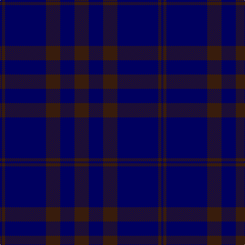

This page is one **sett** — a single exact thread-count. It belongs to the [tartan](/tartans/k14db14k14db40k3db2/)
(the same proportion at any scale), whose colour order is pattern [BBBBBB](/stripes/bbbbbb/).

Sourced from register-of-tartans.  It is a [6 stripe tartan](/stripes/stripes6/).

Original link https://www.tartanregister.gov.uk/tartanDetails.aspx?ref=4962

## Register references

External register numbers recorded for this tartan.

- Scottish Register of Tartans: [4962](https://www.tartanregister.gov.uk/tartanDetails.aspx?ref=4962)
- Scottish Tartans Authority (ITI): 3624

## Thread count
K/28 DB28 K28 DB80 K6 DB/4

## Palette
Each colour and the base-6 reference it is a variant of.

| Colour | Shade | Base |
|---|---|---|
| DB | <code style="background-color:#000060;">#000060</code> `oklch(22.1% 0.153 264.1)` <small>#000060</small> | B <code style="background-color:#2A418A;">#2A418A</code> |
| K | <code style="background-color:#381C0C;">#381C0C</code> `oklch(26.2% 0.051 48.9)` <small>#381C0C</small> | B <code style="background-color:#2A418A;">#2A418A</code> |

# Sample pattern

## Nearest tartans

The nearest existing variants by ΔTartan distance, with this tartan at the top so the swatches line up against it.

ΔTartan

Tartan

Sett

—

<a href="/ttd/edit/#slug=do14db14do14db40do3db2~x2">Atlin</a> <a class="nn-out" href="/setts/s6/do14db14do14db40do3db2~x2/" title="open its dictionary page">↗</a>

1.72

<a href="/ttd/edit/#slug=k30dt6k6dt41t2~x2">Williams (New York) (Personal)</a> <a class="nn-out" href="/setts/s5/k30dt6k6dt41t2~x2/" title="open its dictionary page">↗</a>

1.73

<a href="/ttd/edit/#slug=db9dy12db44dy12db9r3~x2">Elliot</a> <a class="nn-out" href="/setts/s6/db9dy12db44dy12db9r3~x2/" title="open its dictionary page">↗</a>

1.73

<a href="/ttd/edit/#slug=k7r2k33db33k2db7~x2">Casterton (Corporate)</a> <a class="nn-out" href="/setts/s6/k7r2k33db33k2db7~x2/" title="open its dictionary page">↗</a>

2.02

<a href="/ttd/edit/#slug=db3k12db3k17db40k2db2w1~x2">Blue Spirit Fashion Tartan Tartan Number: 7001. Earliest known date: 01/08/2006 Designed by Kirsty Anderson of The House of Edgar for ACS Clothing of Glasgow. See products available Copyright © Blair Urquhart, Comrie, 2015</a> <a class="nn-out" href="/setts/s8/db3k12db3k17db40k2db2w1~x2/" title="open its dictionary page">↗</a>

2.15

<a href="/ttd/edit/#slug=db8k39db8k39db87r6">Largan (?)</a> <a class="nn-out" href="/setts/s6/db8k39db8k39db87r6/" title="open its dictionary page">↗</a>

2.16

<a href="/ttd/edit/#slug=k14db14k14db40k3db2~x2">Atlin (Fashion)</a> <a class="nn-out" href="/setts/s6/k14db14k14db40k3db2~x2/" title="open its dictionary page">↗</a>

2.19

<a href="/ttd/edit/#slug=db3k13db3k22db49k2db2lb1~x2">Blue Spirit</a> <a class="nn-out" href="/setts/s8/db3k13db3k22db49k2db2lb1~x2/" title="open its dictionary page">↗</a>

2.30

<a href="/ttd/edit/#slug=db44dy12db9r3~x2">Elliot (Clan)</a> <a class="nn-out" href="/setts/s4/db44dy12db9r3~x2/" title="open its dictionary page">↗</a>

2.34

<a href="/ttd/edit/#slug=db45b2db4b15db7~x2">Asahi (Corporate)</a> <a class="nn-out" href="/setts/s5/db45b2db4b15db7~x2/" title="open its dictionary page">↗</a>

2.36

<a href="/ttd/edit/#slug=k30db6k6db41lt2~x2">Williams (New York) (Personal)</a> <a class="nn-out" href="/setts/s5/k30db6k6db41lt2~x2/" title="open its dictionary page">↗</a>

## Neighbour map

Every grey dot is one of 14299 variants placed by the first two principal components of the ΔTartan feature space (44% of its variance). Red is this tartan; blue dots are its nearest — click one to open its page.

<svg viewBox="0 0 640 380" role="img" style="max-width:100%;height:auto;border:1px solid #e0e0e0;border-radius:4px;display:block" xmlns="http://www.w3.org/2000/svg"><image href="/nn/cloud.v1.png" width="640" height="380"/><a href="/setts/s5/k30dt6k6dt41t2~x2/"><circle cx="474.0" cy="270.6" r="4" fill="#3465a4"><title>Williams (New York) (Personal)</title></circle></a><a href="/setts/s6/db9dy12db44dy12db9r3~x2/"><circle cx="532.3" cy="267.3" r="4" fill="#3465a4"><title>Elliot</title></circle></a><a href="/setts/s6/k7r2k33db33k2db7~x2/"><circle cx="452.0" cy="266.5" r="4" fill="#3465a4"><title>Casterton (Corporate)</title></circle></a><a href="/setts/s8/db3k12db3k17db40k2db2w1~x2/"><circle cx="537.3" cy="205.6" r="4" fill="#3465a4"><title>Blue Spirit Fashion Tartan Tartan Number: 7001. Earliest known date: 01/08/2006 Designed by Kirsty Anderson of The House of Edgar for ACS Clothing of Glasgow. See products available Copyright © Blair Urquhart, Comrie, 2015</title></circle></a><a href="/setts/s6/db8k39db8k39db87r6/"><circle cx="429.9" cy="254.8" r="4" fill="#3465a4"><title>Largan (?)</title></circle></a><a href="/setts/s6/k14db14k14db40k3db2~x2/"><circle cx="501.0" cy="273.1" r="4" fill="#3465a4"><title>Atlin (Fashion)</title></circle></a><a href="/setts/s8/db3k13db3k22db49k2db2lb1~x2/"><circle cx="557.4" cy="200.6" r="4" fill="#3465a4"><title>Blue Spirit</title></circle></a><a href="/setts/s4/db44dy12db9r3~x2/"><circle cx="612.0" cy="290.5" r="4" fill="#3465a4"><title>Elliot (Clan)</title></circle></a><a href="/setts/s5/db45b2db4b15db7~x2/"><circle cx="626.0" cy="282.8" r="4" fill="#3465a4"><title>Asahi (Corporate)</title></circle></a><a href="/setts/s5/k30db6k6db41lt2~x2/"><circle cx="436.3" cy="253.4" r="4" fill="#3465a4"><title>Williams (New York) (Personal)</title></circle></a><circle cx="552.3" cy="294.4" r="5" fill="#c00000"/></svg>

ID: /setts/s6/do14db14do14db40do3db2~x2/
