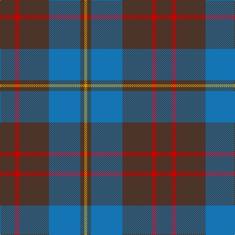

This page is one **sett** — a single exact thread-count. It belongs to the [tartan](/tartans/do15r5do30b32do4lo3/)
(the same proportion at any scale), whose colour order is pattern [BRBBBY](/stripes/brbbby/).

Sourced from register-of-tartans.  It is a [6 stripe tartan](/stripes/stripes6/).

Original link https://www.tartanregister.gov.uk/tartanDetails.aspx?ref=494

2 attestations — the source records this cloth was collapsed from (oldest owns this page)

<ul>
<li>01/01/1914 — Cameron Hunting (register-of-tartans, <a href="https://www.tartanregister.gov.uk/tartanDetails.aspx?ref=494">record</a>)</li>
<li>pre 1914 — Cameron Hunting (Clan) (tartans-authority, <a href="http://www.tartansauthority.com/tartan-ferret/display/1745/">record</a>)</li>
</ul>

## Register references

External register numbers recorded for this tartan.

- Scottish Register of Tartans: [494](https://www.tartanregister.gov.uk/tartanDetails.aspx?ref=494)
- Scottish Tartans Authority (ITI): 1745
- Scottish Tartans World Register: 1745

## Thread count
T/30 R10 T60 B64 T8 DY/6

## Palette

Palette: <strong>Tartan Register</strong> <small style="color:#888">(6 of 7 colours)</small>
<table><thead><tr><th>Colour</th><th>Threads</th><th>Shade</th><th>Base</th><th>OKLCh</th></tr></thead><tbody><tr><td>T/</td><td style="text-align:right;font-variant-numeric:tabular-nums">30</td><td><code style="background-color:#4C3428;">#4C3428</code> <small style="color:#888">#4C3428</small></td><td>B <code style="background-color:#2A418A;">#2A418A</code></td><td><small style="color:#888">oklch(34.9% 0.040 47.5)</small></td></tr><tr><td>R</td><td style="text-align:right;font-variant-numeric:tabular-nums">10</td><td><code style="background-color:#C80000;">#C80000</code> <small style="color:#888">#C80000</small></td><td>R <code style="background-color:#CC0000;">#CC0000</code></td><td><small style="color:#888">oklch(52.3% 0.215 29.2)</small></td></tr><tr><td>T</td><td style="text-align:right;font-variant-numeric:tabular-nums">60</td><td><code style="background-color:#4C3428;">#4C3428</code> <small style="color:#888">#4C3428</small></td><td>B <code style="background-color:#2A418A;">#2A418A</code></td><td><small style="color:#888">oklch(34.9% 0.040 47.5)</small></td></tr><tr><td>B</td><td style="text-align:right;font-variant-numeric:tabular-nums">64</td><td><code style="background-color:#1474B4;">#1474B4</code> <small style="color:#888">#1474B4</small></td><td>B <code style="background-color:#2A418A;">#2A418A</code></td><td><small style="color:#888">oklch(54.0% 0.129 245.1)</small></td></tr><tr><td>T</td><td style="text-align:right;font-variant-numeric:tabular-nums">8</td><td><code style="background-color:#4C3428;">#4C3428</code> <small style="color:#888">#4C3428</small></td><td>B <code style="background-color:#2A418A;">#2A418A</code></td><td><small style="color:#888">oklch(34.9% 0.040 47.5)</small></td></tr><tr><td>DY/</td><td style="text-align:right;font-variant-numeric:tabular-nums">6</td><td><code style="background-color:#D09800;">#D09800</code> <small style="color:#888">#D09800</small></td><td>Y <code style="background-color:#F2BF00;">#F2BF00</code></td><td><small style="color:#888">oklch(71.4% 0.147 82.1)</small></td></tr></tbody></table>

# Sample pattern

## Nearest tartans

The nearest existing variants by ΔTartan distance, with this tartan at the top so the swatches line up against it.

ΔTartan

Tartan

Sett

—

<a href="/ttd/edit/#slug=do15r5do30b32do4lo3~x2">Cameron Hunting</a> <a class="nn-out" href="/setts/s6/do15r5do30b32do4lo3~x2/" title="open its dictionary page">↗</a>

0.72

<a href="/ttd/edit/#slug=dy15r5dy30db32dy4ly3~x2">Cameron Hunting Brown Clan Tartan Tartan Number: 1745. Earliest known date: 1916 Nothing See products available Copyright © Blair Urquhart, Comrie, 2015</a> <a class="nn-out" href="/setts/s6/dy15r5dy30db32dy4ly3~x2/" title="open its dictionary page">↗</a>

0.88

<a href="/ttd/edit/#slug=r1db12y5db2y4lb1~x2">Connaught Green</a> <a class="nn-out" href="/setts/s6/r1db12y5db2y4lb1~x2/" title="open its dictionary page">↗</a>

0.97

<a href="/ttd/edit/#slug=g8w3n6db11n30db5~x2">Devlin, Craig (Personal)</a> <a class="nn-out" href="/setts/s6/g8w3n6db11n30db5~x2/" title="open its dictionary page">↗</a>

1.03

<a href="/ttd/edit/#slug=db18ly2o6ly2o19r3~x2">Balfour blue &amp; brown</a> <a class="nn-out" href="/setts/s6/db18ly2o6ly2o19r3~x2/" title="open its dictionary page">↗</a>

1.07

<a href="/ttd/edit/#slug=dy34db27r3db27dy34w3~x2">London Regiment</a> <a class="nn-out" href="/setts/s6/dy34db27r3db27dy34w3~x2/" title="open its dictionary page">↗</a>

1.14

<a href="/ttd/edit/#slug=dt3t14dt3o16dt34r3~x2">Thorburn (Lochcarron)</a> <a class="nn-out" href="/setts/s6/dt3t14dt3o16dt34r3~x2/" title="open its dictionary page">↗</a>

1.18

<a href="/ttd/edit/#slug=y30ly3y3ly3y12do30k3do5~x2">Dama Classic</a> <a class="nn-out" href="/setts/s8/y30ly3y3ly3y12do30k3do5~x2/" title="open its dictionary page">↗</a>

1.21

<a href="/ttd/edit/#slug=y8do2y13r4y12db22y5o3~x2">Kildare, County (District)</a> <a class="nn-out" href="/setts/s8/y8do2y13r4y12db22y5o3~x2/" title="open its dictionary page">↗</a>

1.22

<a href="/ttd/edit/#slug=db18ly2dy6ly2dy19r3~x2">Balfour #2</a> <a class="nn-out" href="/setts/s6/db18ly2dy6ly2dy19r3~x2/" title="open its dictionary page">↗</a>

1.22

<a href="/ttd/edit/#slug=db18ly2dy6ly2dy19r3~x4">Balfour (Clan)</a> <a class="nn-out" href="/setts/s6/db18ly2dy6ly2dy19r3~x4/" title="open its dictionary page">↗</a>

## Neighbour map

Every grey dot is one of 14359 variants placed by the first two principal components of the ΔTartan feature space (44% of its variance). Red is this tartan; blue dots are its nearest — click one to open its page.

<svg viewBox="0 0 640 380" role="img" style="max-width:100%;height:auto;border:1px solid #e0e0e0;border-radius:4px;display:block" xmlns="http://www.w3.org/2000/svg"><image href="/nn/cloud.v1.png" width="640" height="380"/><a href="/setts/s6/dy15r5dy30db32dy4ly3~x2/"><circle cx="355.4" cy="235.9" r="4" fill="#3465a4"><title>Cameron Hunting Brown Clan Tartan Tartan Number: 1745. Earliest known date: 1916 Nothing See products available Copyright © Blair Urquhart, Comrie, 2015</title></circle></a><a href="/setts/s6/r1db12y5db2y4lb1~x2/"><circle cx="353.3" cy="220.4" r="4" fill="#3465a4"><title>Connaught Green</title></circle></a><a href="/setts/s6/g8w3n6db11n30db5~x2/"><circle cx="357.4" cy="242.9" r="4" fill="#3465a4"><title>Devlin, Craig (Personal)</title></circle></a><a href="/setts/s6/db18ly2o6ly2o19r3~x2/"><circle cx="316.9" cy="227.3" r="4" fill="#3465a4"><title>Balfour blue &amp; brown</title></circle></a><a href="/setts/s6/dy34db27r3db27dy34w3~x2/"><circle cx="343.3" cy="255.3" r="4" fill="#3465a4"><title>London Regiment</title></circle></a><a href="/setts/s6/dt3t14dt3o16dt34r3~x2/"><circle cx="332.7" cy="226.1" r="4" fill="#3465a4"><title>Thorburn (Lochcarron)</title></circle></a><a href="/setts/s8/y30ly3y3ly3y12do30k3do5~x2/"><circle cx="335.5" cy="212.8" r="4" fill="#3465a4"><title>Dama Classic</title></circle></a><a href="/setts/s8/y8do2y13r4y12db22y5o3~x2/"><circle cx="302.3" cy="208.0" r="4" fill="#3465a4"><title>Kildare, County (District)</title></circle></a><a href="/setts/s6/db18ly2dy6ly2dy19r3~x2/"><circle cx="297.0" cy="219.4" r="4" fill="#3465a4"><title>Balfour #2</title></circle></a><a href="/setts/s6/db18ly2dy6ly2dy19r3~x4/"><circle cx="297.0" cy="219.4" r="4" fill="#3465a4"><title>Balfour (Clan)</title></circle></a><circle cx="348.6" cy="235.1" r="5" fill="#c00000"/></svg>

ID: /setts/s6/do15r5do30b32do4lo3~x2/
