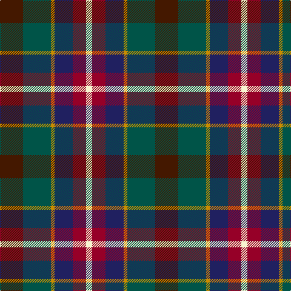

In pattern [BGYBRW](/stripes/bgybrw/).

This was sourced from register-of-tartans.  It is a [6 stripe tartan](/stripes/stripes6/).

Original link https://www.tartanregister.gov.uk/tartanDetails.aspx?ref=11072

## Register references

External register numbers recorded for this tartan.

- Scottish Register of Tartans: [11072](https://www.tartanregister.gov.uk/tartanDetails.aspx?ref=11072)

## Thread count
DR/38 G46 DY6 DB30 DRa22 LY/10

## Palette
Each colour and its ΔE from the base-6 reference it is a variant of.

| Colour | Shade | Base | ΔE (OKLab) |
|---|---|---|---|
| DB | <code style="background-color:#202060;">#202060</code> `#202060` | B <code style="background-color:#2A418A;">#2A418A</code> | 0.11 |
| DR | <code style="background-color:#441800;">#441800</code> `#441800` | B <code style="background-color:#2A418A;">#2A418A</code> | 0.23 |
| DRa | <code style="background-color:#960028;">#960028</code> `#960028` | R <code style="background-color:#CC0000;">#CC0000</code> | 0.12 |
| DY | <code style="background-color:#C88C00;">#C88C00</code> `#C88C00` | Y <code style="background-color:#F2BF00;">#F2BF00</code> | 0.15 |
| G | <code style="background-color:#005448;">#005448</code> `#005448` | G <code style="background-color:#006100;">#006100</code> | 0.10 |
| LY | <code style="background-color:#F8F4D0;">#F8F4D0</code> `#F8F4D0` | W <code style="background-color:#F7F7F7;">#F7F7F7</code> | 0.05 |

# Sample pattern

## Nearest tartans

The nearest existing variants by ΔTartan distance.

1. [Eichelberger Family, Jörg (Personal)](/setts/s7/k10r3lo4dt12dg4r4w2~x4/) — ΔT 0.98
1. [Mekos, The](/setts/s6/dy19g23ly3db15r11w5~x2/) — ΔT 1.07
1. [Bro-Menez Are (Corporate)](/setts/s7/b8k25g13m5lo5r5m8~x2/) — ΔT 1.09
1. [Glen Chalmadale](/setts/s9/g13w2g10k5r13k3r5dt15o5~x2/) — ΔT 1.10
1. [Falardeau-Murphy (Canada) (Personal)](/setts/s7/dg21t21ly3r21dt3dp5dt3~x2/) — ΔT 1.15
1. [Atlantic, Ancient](/setts/s6/w3db17o16db2dg17ly2~x2/) — ΔT 1.19
1. [Atlantic Ancient Trade Tartan Tartan Number: 1781. Earliest known date: 1968 Also known as Murray of Atholl, it has been authorized by Ian Murray, Duke of Atholl. See products available Copyright © Blair Urquhart, Comrie, 2015](/setts/s6/w3db17dy16db2dg17ly2~x2/) — ΔT 1.21
1. [Gracey (2013)](/setts/s7/r3dp8g20k20db17k3lg3~x2/) — ΔT 1.23
1. [Jamestown Parish Church (Corporate)](/setts/s6/r3ly2g12k12db14w3~x2/) — ΔT 1.24
1. [MacLaren #2](/setts/s7/dp9k7dg5r4dg7k1ly1~x2/) — ΔT 1.25

## Neighbour map

Every grey dot is one of 14299 variants placed by the first two principal components of the ΔTartan feature space (44% of its variance). Red is this tartan; blue dots are its nearest — click one to open its page.

<svg viewBox="0 0 640 380" role="img" style="max-width:100%;height:auto;border:1px solid #e0e0e0;border-radius:4px;display:block" xmlns="http://www.w3.org/2000/svg"><image href="/nn/cloud.v1.png" width="640" height="380"/><a href="/setts/s7/k10r3lo4dt12dg4r4w2~x4/"><circle cx="67.0" cy="204.2" r="4" fill="#3465a4"><title>Eichelberger Family, Jörg (Personal)</title></circle></a><a href="/setts/s6/dy19g23ly3db15r11w5~x2/"><circle cx="70.6" cy="205.9" r="4" fill="#3465a4"><title>Mekos, The</title></circle></a><a href="/setts/s7/b8k25g13m5lo5r5m8~x2/"><circle cx="98.3" cy="212.6" r="4" fill="#3465a4"><title>Bro-Menez Are (Corporate)</title></circle></a><a href="/setts/s9/g13w2g10k5r13k3r5dt15o5~x2/"><circle cx="91.3" cy="197.2" r="4" fill="#3465a4"><title>Glen Chalmadale</title></circle></a><a href="/setts/s7/dg21t21ly3r21dt3dp5dt3~x2/"><circle cx="105.0" cy="191.6" r="4" fill="#3465a4"><title>Falardeau-Murphy (Canada) (Personal)</title></circle></a><a href="/setts/s6/w3db17o16db2dg17ly2~x2/"><circle cx="119.6" cy="197.7" r="4" fill="#3465a4"><title>Atlantic, Ancient</title></circle></a><a href="/setts/s6/w3db17dy16db2dg17ly2~x2/"><circle cx="132.5" cy="206.4" r="4" fill="#3465a4"><title>Atlantic Ancient Trade Tartan Tartan Number: 1781. Earliest known date: 1968 Also known as Murray of Atholl, it has been authorized by Ian Murray, Duke of Atholl. See products available Copyright © Blair Urquhart, Comrie, 2015</title></circle></a><a href="/setts/s7/r3dp8g20k20db17k3lg3~x2/"><circle cx="111.3" cy="212.4" r="4" fill="#3465a4"><title>Gracey (2013)</title></circle></a><a href="/setts/s6/r3ly2g12k12db14w3~x2/"><circle cx="75.0" cy="202.7" r="4" fill="#3465a4"><title>Jamestown Parish Church (Corporate)</title></circle></a><a href="/setts/s7/dp9k7dg5r4dg7k1ly1~x2/"><circle cx="143.7" cy="220.9" r="4" fill="#3465a4"><title>MacLaren #2</title></circle></a><circle cx="86.6" cy="217.0" r="5" fill="#c00000"/></svg>

ID: /setts/s6/do19dg23lo3db15r11w5~x2/
