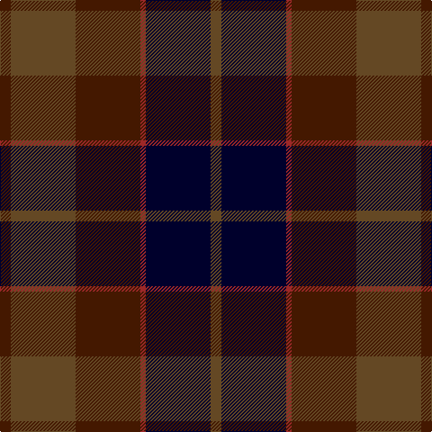

**Bands:** [BGBRKG](/stripes/bgbrkg/) · **Stripes:** [DO DY DO R K DY](/stripes/stripes6/) DO DY DO R K DY

This was sourced from tartans-authority.  It is a [6 band tartan](/bands/bands6/).

Original link http://www.tartansauthority.com/tartan-ferret/display/7632/

## Thread count
DR/12 T72 DR72 DRa6 DB72 T/12

## Palette
Each colour and its ΔE from the base-6 reference it is a variant of.

| Colour | Shade | Base | ΔE (OKLab) |
|---|---|---|---|
| DB | <code style="background-color:#00002C;">#00002C</code> `#00002C` | K <code style="background-color:#000000;">#000000</code> | 0.16 |
| DR | <code style="background-color:#441800;">#441800</code> `#441800` | B <code style="background-color:#2A418A;">#2A418A</code> | 0.23 |
| DRa | <code style="background-color:#9C2828;">#9C2828</code> `#9C2828` | R <code style="background-color:#CC0000;">#CC0000</code> | 0.10 |
| T | <code style="background-color:#644824;">#644824</code> `#644824` | G <code style="background-color:#006100;">#006100</code> | 0.14 |

# Sample pattern

## Nearest tartans

The nearest existing variants by ΔTartan distance.

1. [Edinburgh International Conference Centre, The](/setts/s6/dy4dt20dy3k20o24dt3~x2/) — ΔT 0.83
1. [McCarthy, Old](/setts/s5/db7r26db7dg24ly2~x2/) — ΔT 0.94
1. [Ferguson Britt](/setts/s10/k12r1do12dy12do2dy12do12r1k12dy2~x6/) — ΔT 1.11
1. [Glen Shee #3 (Fashion)](/setts/s5/m4dt29dr30k29m4~x2/) — ΔT 1.21
1. [Andover](/setts/s6/r1n12k6k1do10r1~x4/) — ΔT 1.23
1. [Ferguson of Balquhidder](/setts/s6/dg2db12r1k12dg12k2~x2/) — ΔT 1.31
1. [Mitchell, Cameron (Personal)](/setts/s6/k16dg32k8o4r11o2~x2/) — ΔT 1.31
1. [Eachaidh](/setts/s6/k6y1r18b6dg18k2~x2/) — ΔT 1.36
1. [Bobby Jones (Personal)](/setts/s6/lo1db16dy8k12dy2r1~x2/) — ΔT 1.38
1. [Andover (Fashion)](/setts/s6/r1n12k6ly1do10r1~x4/) — ΔT 1.43

## Neighbour map

Every grey dot is one of 14313 variants placed by the first two principal components of the ΔTartan feature space (44% of its variance). Red is this tartan; blue dots are its nearest — click one to open its page.

<svg viewBox="0 0 640 380" role="img" style="max-width:100%;height:auto;border:1px solid #e0e0e0;border-radius:4px;display:block" xmlns="http://www.w3.org/2000/svg"><image href="/nn/cloud.v1.png" width="640" height="380"/><a href="/setts/s6/dy4dt20dy3k20o24dt3~x2/"><circle cx="217.6" cy="255.6" r="4" fill="#3465a4"><title>Edinburgh International Conference Centre, The</title></circle></a><a href="/setts/s5/db7r26db7dg24ly2~x2/"><circle cx="274.2" cy="240.7" r="4" fill="#3465a4"><title>McCarthy, Old</title></circle></a><a href="/setts/s10/k12r1do12dy12do2dy12do12r1k12dy2~x6/"><circle cx="236.1" cy="233.9" r="4" fill="#3465a4"><title>Ferguson Britt</title></circle></a><a href="/setts/s5/m4dt29dr30k29m4~x2/"><circle cx="222.2" cy="286.8" r="4" fill="#3465a4"><title>Glen Shee #3 (Fashion)</title></circle></a><a href="/setts/s6/r1n12k6k1do10r1~x4/"><circle cx="255.4" cy="216.5" r="4" fill="#3465a4"><title>Andover</title></circle></a><a href="/setts/s6/dg2db12r1k12dg12k2~x2/"><circle cx="249.9" cy="250.8" r="4" fill="#3465a4"><title>Ferguson of Balquhidder</title></circle></a><a href="/setts/s6/k16dg32k8o4r11o2~x2/"><circle cx="297.8" cy="229.7" r="4" fill="#3465a4"><title>Mitchell, Cameron (Personal)</title></circle></a><a href="/setts/s6/k6y1r18b6dg18k2~x2/"><circle cx="251.3" cy="203.9" r="4" fill="#3465a4"><title>Eachaidh</title></circle></a><a href="/setts/s6/lo1db16dy8k12dy2r1~x2/"><circle cx="286.0" cy="218.0" r="4" fill="#3465a4"><title>Bobby Jones (Personal)</title></circle></a><a href="/setts/s6/r1n12k6ly1do10r1~x4/"><circle cx="241.7" cy="207.8" r="4" fill="#3465a4"><title>Andover (Fashion)</title></circle></a><circle cx="260.6" cy="246.5" r="5" fill="#c00000"/></svg>

ID: /setts/s6/do2dy12do12r1k12dy2~x6/
