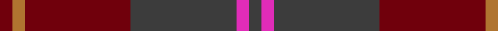

**Bands:** [RRRBRB](/stripes/rrrbrb/) · **Stripes:** [O O O DO M DO](/stripes/stripes6/) O O O DO M DO

This was sourced from register-of-tartans.  It is a [6 band tartan](/bands/bands6/).

Original link https://www.tartanregister.gov.uk/tartanDetails.aspx?ref=861

## Attestations

This cloth appears in 2 source records; the oldest owns this page.

- 01/01/2002 — Cypress (register-of-tartans, [record](https://www.tartanregister.gov.uk/tartanDetails.aspx?ref=861))
- pre 2002 — Cypress (Fashion) (tartans-authority, [record](http://www.tartansauthority.com/tartan-ferret/display/4650/))

## Register references

External register numbers recorded for this tartan.

- Scottish Register of Tartans: [861](https://www.tartanregister.gov.uk/tartanDetails.aspx?ref=861)
- Scottish Tartans Authority (ITI): 4650

## Thread count
DR/8 LT8 DR68 N68 LR8 N/8

## Palette
Each colour and its ΔE from the base-6 reference it is a variant of.

| Colour | Shade | Base | ΔE (OKLab) |
|---|---|---|---|
| DR | <code style="background-color:#70000C;">#70000C</code> `#70000C` | R <code style="background-color:#CC0000;">#CC0000</code> | 0.20 |
| LR | <code style="background-color:#E02CB8;">#E02CB8</code> `#E02CB8` | R <code style="background-color:#CC0000;">#CC0000</code> | 0.22 |
| LT | <code style="background-color:#B07430;">#B07430</code> `#B07430` | R <code style="background-color:#CC0000;">#CC0000</code> | 0.16 |
| N | <code style="background-color:#3C3C3C;">#3C3C3C</code> `#3C3C3C` | B <code style="background-color:#2A418A;">#2A418A</code> | 0.13 |

# Sample pattern

## Nearest tartans

The nearest existing variants by ΔTartan distance.

1. [Cetoloni Family Tartan Tartan Number: 2049. Earliest known date: November 1991 The Cetoloni tartan was designed with the colours of the Border Hills, 'the sky at its best, the rooftop skyline of Siena and the golden sun of Tuscany'. Franco Cetoloni of Liddlevale was born in Badia Roti Bucine in Arezzo, Italy. Jayne was a designer at Pringle's knitwear in Hawick. Red is Sienna red. See products available Copyright © Blair Urquhart, Comrie, 2015](/setts/s6/db2o22dy11ly2dy11db2~x2/) — ΔT 1.32
1. [Wasko (Personal)](/setts/s7/r8lr2o30dg12o3dg12o3~x2/) — ΔT 1.44
1. [Cetoloni](/setts/s6/db2r22dy11y2dy11db2~x2/) — ΔT 1.48
1. [MacArthur-Fox, dress](/setts/s6/r2db13r3db3r16t2~x4/) — ΔT 1.50
1. [Dege of Saville Row](/setts/s6/dy11db1dy3db1db9r1~x4/) — ΔT 1.65
1. [Jardine, of Castlemilk](/setts/s8/dr9o9n9r1db1o9db1r1~x4/) — ΔT 1.80
1. [Pubcrawlers (Corporate)](/setts/s7/g3dy4g2dy22n5r16ly3~x2/) — ΔT 1.81
1. [Lindsay (Chisholm Red)](/setts/s9/dg24db3dg3db3dg3db9m24dg3m4~x2/) — ΔT 1.83
1. [Unamed, Riding cloak 1745](/setts/s5/r1o8r2db8t1~x2/) — ΔT 1.84
1. [Aisteach](/setts/s7/dp32dg16o14k4o6dp7k2~x2/) — ΔT 1.84

## Neighbour map

Every grey dot is one of 14299 variants placed by the first two principal components of the ΔTartan feature space (44% of its variance). Red is this tartan; blue dots are its nearest — click one to open its page.

<svg viewBox="0 0 640 380" role="img" style="max-width:100%;height:auto;border:1px solid #e0e0e0;border-radius:4px;display:block" xmlns="http://www.w3.org/2000/svg"><image href="/nn/cloud.v1.png" width="640" height="380"/><a href="/setts/s6/db2o22dy11ly2dy11db2~x2/"><circle cx="357.6" cy="242.8" r="4" fill="#3465a4"><title>Cetoloni Family Tartan Tartan Number: 2049. Earliest known date: November 1991 The Cetoloni tartan was designed with the colours of the Border Hills, 'the sky at its best, the rooftop skyline of Siena and the golden sun of Tuscany'. Franco Cetoloni of Liddlevale was born in Badia Roti Bucine in Arezzo, Italy. Jayne was a designer at Pringle's knitwear in Hawick. Red is Sienna red. See products available Copyright © Blair Urquhart, Comrie, 2015</title></circle></a><a href="/setts/s7/r8lr2o30dg12o3dg12o3~x2/"><circle cx="385.7" cy="226.2" r="4" fill="#3465a4"><title>Wasko (Personal)</title></circle></a><a href="/setts/s6/db2r22dy11y2dy11db2~x2/"><circle cx="354.2" cy="233.1" r="4" fill="#3465a4"><title>Cetoloni</title></circle></a><a href="/setts/s6/r2db13r3db3r16t2~x4/"><circle cx="348.0" cy="244.8" r="4" fill="#3465a4"><title>MacArthur-Fox, dress</title></circle></a><a href="/setts/s6/dy11db1dy3db1db9r1~x4/"><circle cx="399.7" cy="245.0" r="4" fill="#3465a4"><title>Dege of Saville Row</title></circle></a><a href="/setts/s8/dr9o9n9r1db1o9db1r1~x4/"><circle cx="291.8" cy="233.7" r="4" fill="#3465a4"><title>Jardine, of Castlemilk</title></circle></a><a href="/setts/s7/g3dy4g2dy22n5r16ly3~x2/"><circle cx="317.1" cy="215.4" r="4" fill="#3465a4"><title>Pubcrawlers (Corporate)</title></circle></a><a href="/setts/s9/dg24db3dg3db3dg3db9m24dg3m4~x2/"><circle cx="342.1" cy="251.2" r="4" fill="#3465a4"><title>Lindsay (Chisholm Red)</title></circle></a><a href="/setts/s5/r1o8r2db8t1~x2/"><circle cx="299.5" cy="263.6" r="4" fill="#3465a4"><title>Unamed, Riding cloak 1745</title></circle></a><a href="/setts/s7/dp32dg16o14k4o6dp7k2~x2/"><circle cx="351.8" cy="235.5" r="4" fill="#3465a4"><title>Aisteach</title></circle></a><circle cx="379.1" cy="251.0" r="5" fill="#c00000"/></svg>

ID: /setts/s6/do2m2do17o17o2o2~x4/
