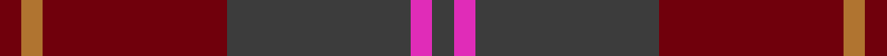

This page is one **sett** — a single exact thread-count. It belongs to the [tartan](/tartans/do2m2do17oi17o2oi2/)
(the same proportion at any scale), whose colour order is pattern [BRBRRR](/stripes/brbrrr/).

Sourced from register-of-tartans.  It is a [6 stripe tartan](/stripes/stripes6/).

Original link https://www.tartanregister.gov.uk/tartanDetails.aspx?ref=861

2 attestations — the source records this cloth was collapsed from (oldest owns this page)

<ul>
<li>01/01/2002 — Cypress (register-of-tartans, <a href="https://www.tartanregister.gov.uk/tartanDetails.aspx?ref=861">record</a>)</li>
<li>pre 2002 — Cypress (Fashion) (tartans-authority, <a href="http://www.tartansauthority.com/tartan-ferret/display/4650/">record</a>)</li>
</ul>

## Register references

External register numbers recorded for this tartan.

- Scottish Register of Tartans: [861](https://www.tartanregister.gov.uk/tartanDetails.aspx?ref=861)
- Scottish Tartans Authority (ITI): 4650

## Thread count
DR/8 LT8 DR68 N68 LR8 N/8

## Palette

Palette: <strong>Tartan Register</strong> <small style="color:#888">(1 of 4 colours)</small>
<table><thead><tr><th>Colour</th><th>Threads</th><th>Shade</th><th>Base</th><th>OKLCh</th></tr></thead><tbody><tr><td>DR/</td><td style="text-align:right;font-variant-numeric:tabular-nums">8</td><td><code style="background-color:#70000C;">#70000C</code> <small style="color:#888">#70000C</small></td><td>R <code style="background-color:#CC0000;">#CC0000</code></td><td><small style="color:#888">oklch(34.3% 0.139 25.3)</small></td></tr><tr><td>LT</td><td style="text-align:right;font-variant-numeric:tabular-nums">8</td><td><code style="background-color:#B07430;">#B07430</code> <small style="color:#888">#B07430</small></td><td>R <code style="background-color:#CC0000;">#CC0000</code></td><td><small style="color:#888">oklch(61.0% 0.112 66.0)</small></td></tr><tr><td>DR</td><td style="text-align:right;font-variant-numeric:tabular-nums">68</td><td><code style="background-color:#70000C;">#70000C</code> <small style="color:#888">#70000C</small></td><td>R <code style="background-color:#CC0000;">#CC0000</code></td><td><small style="color:#888">oklch(34.3% 0.139 25.3)</small></td></tr><tr><td>N</td><td style="text-align:right;font-variant-numeric:tabular-nums">68</td><td><code style="background-color:#3C3C3C;">#3C3C3C</code> <small style="color:#888">#3C3C3C</small></td><td>B <code style="background-color:#2A418A;">#2A418A</code></td><td><small style="color:#888">oklch(35.6% 0.000 89.9)</small></td></tr><tr><td>LR</td><td style="text-align:right;font-variant-numeric:tabular-nums">8</td><td><code style="background-color:#E02CB8;">#E02CB8</code> <small style="color:#888">#E02CB8</small></td><td>R <code style="background-color:#CC0000;">#CC0000</code></td><td><small style="color:#888">oklch(62.9% 0.248 339.3)</small></td></tr><tr><td>N/</td><td style="text-align:right;font-variant-numeric:tabular-nums">8</td><td><code style="background-color:#3C3C3C;">#3C3C3C</code> <small style="color:#888">#3C3C3C</small></td><td>B <code style="background-color:#2A418A;">#2A418A</code></td><td><small style="color:#888">oklch(35.6% 0.000 89.9)</small></td></tr></tbody></table>

# Sample pattern

## Nearest tartans

The nearest existing variants by ΔTartan distance, with this tartan at the top so the swatches line up against it.

ΔTartan

Tartan

Sett

—

<a href="/ttd/edit/#slug=do2m2do17oi17o2oi2~x4">Cypress</a> <a class="nn-out" href="/setts/s6/do2m2do17oi17o2oi2~x4/" title="open its dictionary page">↗</a>

1.32

<a href="/ttd/edit/#slug=db2o22dy11ly2dy11db2~x2">Cetoloni Family Tartan Tartan Number: 2049. Earliest known date: November 1991 The Cetoloni tartan was designed with the colours of the Border Hills, 'the sky at its best, the rooftop skyline of Siena and the golden sun of Tuscany'. Franco Cetoloni of Liddlevale was born in Badia Roti Bucine in Arezzo, Italy. Jayne was a designer at Pringle's knitwear in Hawick. Red is Sienna red. See products available Copyright © Blair Urquhart, Comrie, 2015</a> <a class="nn-out" href="/setts/s6/db2o22dy11ly2dy11db2~x2/" title="open its dictionary page">↗</a>

1.43

<a href="/ttd/edit/#slug=r8lr2o30dg12o3dg12o3~x2">Wasko (Personal)</a> <a class="nn-out" href="/setts/s7/r8lr2o30dg12o3dg12o3~x2/" title="open its dictionary page">↗</a>

1.48

<a href="/ttd/edit/#slug=db2r22dy11y2dy11db2~x2">Cetoloni</a> <a class="nn-out" href="/setts/s6/db2r22dy11y2dy11db2~x2/" title="open its dictionary page">↗</a>

1.49

<a href="/ttd/edit/#slug=r2db13ri3db3ri16t2~x4">MacArthur-Fox, dress</a> <a class="nn-out" href="/setts/s6/r2db13ri3db3ri16t2~x4/" title="open its dictionary page">↗</a>

1.65

<a href="/ttd/edit/#slug=dy11db1dy3dbi1db9r1~x4">Dege of Saville Row</a> <a class="nn-out" href="/setts/s6/dy11db1dy3dbi1db9r1~x4/" title="open its dictionary page">↗</a>

1.80

<a href="/ttd/edit/#slug=dr9o9n9r1db1o9db1r1~x4">Jardine, of Castlemilk</a> <a class="nn-out" href="/setts/s8/dr9o9n9r1db1o9db1r1~x4/" title="open its dictionary page">↗</a>

1.81

<a href="/ttd/edit/#slug=g3dy4g2dy22n5r16ly3~x2">Pubcrawlers (Corporate)</a> <a class="nn-out" href="/setts/s7/g3dy4g2dy22n5r16ly3~x2/" title="open its dictionary page">↗</a>

1.83

<a href="/ttd/edit/#slug=dg24db3dg3db3dg3db9m24dg3m4~x2">Lindsay (Chisholm Red)</a> <a class="nn-out" href="/setts/s9/dg24db3dg3db3dg3db9m24dg3m4~x2/" title="open its dictionary page">↗</a>

1.83

<a href="/ttd/edit/#slug=r1o8r2db8t1~x2">Unamed, Riding cloak 1745</a> <a class="nn-out" href="/setts/s5/r1o8r2db8t1~x2/" title="open its dictionary page">↗</a>

1.84

<a href="/ttd/edit/#slug=dp32dg16o14k4o6dp7k2~x2">Aisteach</a> <a class="nn-out" href="/setts/s7/dp32dg16o14k4o6dp7k2~x2/" title="open its dictionary page">↗</a>

## Neighbour map

Every grey dot is one of 14359 variants placed by the first two principal components of the ΔTartan feature space (44% of its variance). Red is this tartan; blue dots are its nearest — click one to open its page.

<svg viewBox="0 0 640 380" role="img" style="max-width:100%;height:auto;border:1px solid #e0e0e0;border-radius:4px;display:block" xmlns="http://www.w3.org/2000/svg"><image href="/nn/cloud.v1.png" width="640" height="380"/><a href="/setts/s6/db2o22dy11ly2dy11db2~x2/"><circle cx="357.3" cy="243.3" r="4" fill="#3465a4"><title>Cetoloni Family Tartan Tartan Number: 2049. Earliest known date: November 1991 The Cetoloni tartan was designed with the colours of the Border Hills, 'the sky at its best, the rooftop skyline of Siena and the golden sun of Tuscany'. Franco Cetoloni of Liddlevale was born in Badia Roti Bucine in Arezzo, Italy. Jayne was a designer at Pringle's knitwear in Hawick. Red is Sienna red. See products available Copyright © Blair Urquhart, Comrie, 2015</title></circle></a><a href="/setts/s7/r8lr2o30dg12o3dg12o3~x2/"><circle cx="385.4" cy="226.7" r="4" fill="#3465a4"><title>Wasko (Personal)</title></circle></a><a href="/setts/s6/db2r22dy11y2dy11db2~x2/"><circle cx="353.6" cy="233.7" r="4" fill="#3465a4"><title>Cetoloni</title></circle></a><a href="/setts/s6/r2db13ri3db3ri16t2~x4/"><circle cx="347.6" cy="245.7" r="4" fill="#3465a4"><title>MacArthur-Fox, dress</title></circle></a><a href="/setts/s6/dy11db1dy3dbi1db9r1~x4/"><circle cx="399.4" cy="245.6" r="4" fill="#3465a4"><title>Dege of Saville Row</title></circle></a><a href="/setts/s8/dr9o9n9r1db1o9db1r1~x4/"><circle cx="291.7" cy="234.3" r="4" fill="#3465a4"><title>Jardine, of Castlemilk</title></circle></a><a href="/setts/s7/g3dy4g2dy22n5r16ly3~x2/"><circle cx="316.9" cy="215.9" r="4" fill="#3465a4"><title>Pubcrawlers (Corporate)</title></circle></a><a href="/setts/s9/dg24db3dg3db3dg3db9m24dg3m4~x2/"><circle cx="342.1" cy="251.9" r="4" fill="#3465a4"><title>Lindsay (Chisholm Red)</title></circle></a><a href="/setts/s5/r1o8r2db8t1~x2/"><circle cx="299.4" cy="264.5" r="4" fill="#3465a4"><title>Unamed, Riding cloak 1745</title></circle></a><a href="/setts/s7/dp32dg16o14k4o6dp7k2~x2/"><circle cx="351.7" cy="236.1" r="4" fill="#3465a4"><title>Aisteach</title></circle></a><circle cx="378.9" cy="251.6" r="5" fill="#c00000"/></svg>

ID: /setts/s6/do2m2do17oi17o2oi2~x4/
