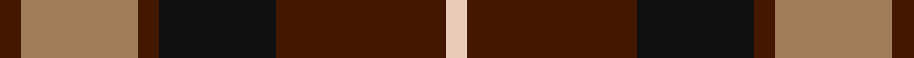
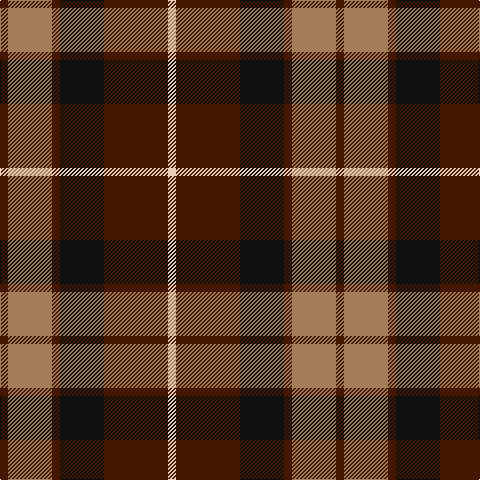

In pattern [BRBKBW](/stripes/brbkbw/).

This was sourced from register-of-tartans.  It is a [6 stripe tartan](/stripes/stripes6/).

Original link https://www.tartanregister.gov.uk/tartanDetails.aspx?ref=3360

## Register references

External register numbers recorded for this tartan.

- Scottish Register of Tartans: [3360](https://www.tartanregister.gov.uk/tartanDetails.aspx?ref=3360)
- Scottish Tartans Authority (ITI): 5490

## Thread count
DR/8 LT44 DR8 K44 DR64 LR/8

## Palette
Each colour and its ΔE from the base-6 reference it is a variant of.

| Colour | Shade | Base | ΔE (OKLab) |
|---|---|---|---|
| DR | <code style="background-color:#441800;">#441800</code> `#441800` | B <code style="background-color:#2A418A;">#2A418A</code> | 0.23 |
| K | <code style="background-color:#101010;">#101010</code> `#101010` | K <code style="background-color:#000000;">#000000</code> | 0.17 |
| LR | <code style="background-color:#E8CCB8;">#E8CCB8</code> `#E8CCB8` | W <code style="background-color:#F7F7F7;">#F7F7F7</code> | 0.12 |
| LT | <code style="background-color:#A07C58;">#A07C58</code> `#A07C58` | R <code style="background-color:#CC0000;">#CC0000</code> | 0.19 |

# Sample pattern

## Nearest tartans

The nearest existing variants by ΔTartan distance.

1. [Thompson Black (Fashion)](/setts/s6/g3k15r8g2o8k2~x4/) — ΔT 0.63
1. [MacMillan - 2002 (Black - Unofficial](/setts/s6/k3lo18dg6r17k31dg3~x2/) — ΔT 0.67
1. [Denny Hunting](/setts/s6/k4dg5k2dg5r17db2~x2/) — ΔT 0.72
1. [Eyre (Personal)](/setts/s6/r3db12r4g18r6k2~x2/) — ΔT 0.88
1. [Canadian Autumn](/setts/s6/g4r28db6g10k10g3~x2/) — ΔT 0.94
1. [British Hills](/setts/s5/r2dg17r8db8ly2~x4/) — ΔT 0.97
1. [Fraser Green](/setts/s6/lb2dr12g6dr1n6dr1~x4/) — ΔT 1.02
1. [Manson Family Tartan Tartan Number: 987. Earliest known date: 1983 The official recording of the sett shows the letter G for the dark green stripe. In heraldic terms this means 'Gules' - red. The designer, Hugh Kirkwood Rankine, clearly intended dark green and this is reproduced here. See products available Copyright © Blair Urquhart, Comrie, 2015](/setts/s8/g1r9g3k3g3r1k9w1~x2/) — ΔT 1.03
1. [O'Neill (District)](/setts/s9/lb2r12k4r2k2r2k6g5lb2~x2/) — ΔT 1.05
1. [Bronte House Check](/setts/s6/m10dy60dt13lo24dt24dy8/) — ΔT 1.06

## Neighbour map

Every grey dot is one of 14299 variants placed by the first two principal components of the ΔTartan feature space (44% of its variance). Red is this tartan; blue dots are its nearest — click one to open its page.

<svg viewBox="0 0 640 380" role="img" style="max-width:100%;height:auto;border:1px solid #e0e0e0;border-radius:4px;display:block" xmlns="http://www.w3.org/2000/svg"><image href="/nn/cloud.v1.png" width="640" height="380"/><a href="/setts/s6/g3k15r8g2o8k2~x4/"><circle cx="201.2" cy="223.0" r="4" fill="#3465a4"><title>Thompson Black (Fashion)</title></circle></a><a href="/setts/s6/k3lo18dg6r17k31dg3~x2/"><circle cx="218.1" cy="210.6" r="4" fill="#3465a4"><title>MacMillan - 2002 (Black - Unofficial</title></circle></a><a href="/setts/s6/k4dg5k2dg5r17db2~x2/"><circle cx="266.6" cy="215.9" r="4" fill="#3465a4"><title>Denny Hunting</title></circle></a><a href="/setts/s6/r3db12r4g18r6k2~x2/"><circle cx="215.7" cy="223.8" r="4" fill="#3465a4"><title>Eyre (Personal)</title></circle></a><a href="/setts/s6/g4r28db6g10k10g3~x2/"><circle cx="267.8" cy="226.5" r="4" fill="#3465a4"><title>Canadian Autumn</title></circle></a><a href="/setts/s5/r2dg17r8db8ly2~x4/"><circle cx="220.6" cy="221.1" r="4" fill="#3465a4"><title>British Hills</title></circle></a><a href="/setts/s6/lb2dr12g6dr1n6dr1~x4/"><circle cx="288.5" cy="212.1" r="4" fill="#3465a4"><title>Fraser Green</title></circle></a><a href="/setts/s8/g1r9g3k3g3r1k9w1~x2/"><circle cx="203.3" cy="192.3" r="4" fill="#3465a4"><title>Manson Family Tartan Tartan Number: 987. Earliest known date: 1983 The official recording of the sett shows the letter G for the dark green stripe. In heraldic terms this means 'Gules' - red. The designer, Hugh Kirkwood Rankine, clearly intended dark green and this is reproduced here. See products available Copyright © Blair Urquhart, Comrie, 2015</title></circle></a><a href="/setts/s9/lb2r12k4r2k2r2k6g5lb2~x2/"><circle cx="197.0" cy="211.5" r="4" fill="#3465a4"><title>O'Neill (District)</title></circle></a><a href="/setts/s6/m10dy60dt13lo24dt24dy8/"><circle cx="248.8" cy="222.4" r="4" fill="#3465a4"><title>Bronte House Check</title></circle></a><circle cx="232.8" cy="225.9" r="5" fill="#c00000"/></svg>

ID: /setts/s6/do2o11do2k11do16lb2~x4/
