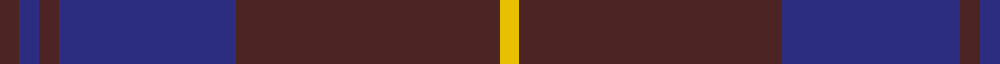
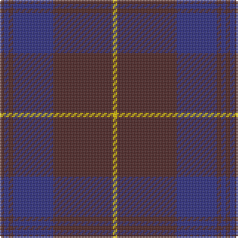

**Bands:** [BBBBBY](/stripes/bbbbby/) · **Stripes:** [DO DB DO DB DO LY](/stripes/stripes6/) DO DB DO DB DO LY

This was sourced from house-of-tartan.  It is a [6 band tartan](/bands/bands6/).

Original link http://www.house-of-tartan.scotland.net/house/TartanViewjs.asp?colr=Def&tnam=1731

## Thread count
T/3 DB3 T3 DB27 T40 Y/3

## Palette
Each colour and its ΔE from the base-6 reference it is a variant of.

| Colour | Shade | Base | ΔE (OKLab) |
|---|---|---|---|
| DB | <code style="background-color:#2C2C80;">#2C2C80</code> `#2C2C80` | B <code style="background-color:#2A418A;">#2A418A</code> | 0.06 |
| T | <code style="background-color:#4C2424;">#4C2424</code> `#4C2424` | B <code style="background-color:#2A418A;">#2A418A</code> | 0.18 |
| Y | <code style="background-color:#E8C000;">#E8C000</code> `#E8C000` | Y <code style="background-color:#F2BF00;">#F2BF00</code> | 0.02 |

# Sample pattern

## Nearest tartans

The nearest existing variants by ΔTartan distance.

1. [Sligo, County](/setts/s6/db50do4db12do23ly4do4~x2/) — ΔT 0.74
1. [Keeper of the Quaich](/setts/s6/dy3db3dy3db27dy40y3/) — ΔT 0.97
1. [Keepers of the Quaich](/setts/s6/lo3dy33db24dy2db2dy2~x2/) — ΔT 1.14
1. [Gavin](/setts/s7/dr26w2dr3dt15dt26dr2dt3~x2/) — ΔT 1.19
1. [Largan (?)](/setts/s6/db8k39db8k39db87r6/) — ΔT 1.38
1. [Harmony 11](/setts/s6/dp6dy2dp29dy29dp2dy6~x2/) — ΔT 1.42
1. [Dege of Saville Row](/setts/s6/dy11db1dy3db1db9r1~x4/) — ΔT 1.44
1. [Hillsdale (Corporate?)](/setts/s5/db13n6r51db51n5~x2/) — ΔT 1.49
1. [Ardee (Corporate)](/setts/s5/db4r1db18n18lr1~x4/) — ΔT 1.55
1. [Feniston (Personal)](/setts/s5/dr30db10dr3db30m3~x2/) — ΔT 1.59

## Neighbour map

Every grey dot is one of 14313 variants placed by the first two principal components of the ΔTartan feature space (44% of its variance). Red is this tartan; blue dots are its nearest — click one to open its page.

<svg viewBox="0 0 640 380" role="img" style="max-width:100%;height:auto;border:1px solid #e0e0e0;border-radius:4px;display:block" xmlns="http://www.w3.org/2000/svg"><image href="/nn/cloud.v1.png" width="640" height="380"/><a href="/setts/s6/db50do4db12do23ly4do4~x2/"><circle cx="472.4" cy="248.0" r="4" fill="#3465a4"><title>Sligo, County</title></circle></a><a href="/setts/s6/dy3db3dy3db27dy40y3/"><circle cx="472.3" cy="247.7" r="4" fill="#3465a4"><title>Keeper of the Quaich</title></circle></a><a href="/setts/s6/lo3dy33db24dy2db2dy2~x2/"><circle cx="441.1" cy="220.8" r="4" fill="#3465a4"><title>Keepers of the Quaich</title></circle></a><a href="/setts/s7/dr26w2dr3dt15dt26dr2dt3~x2/"><circle cx="412.0" cy="228.9" r="4" fill="#3465a4"><title>Gavin</title></circle></a><a href="/setts/s6/db8k39db8k39db87r6/"><circle cx="429.9" cy="254.9" r="4" fill="#3465a4"><title>Largan (?)</title></circle></a><a href="/setts/s6/dp6dy2dp29dy29dp2dy6~x2/"><circle cx="452.5" cy="258.8" r="4" fill="#3465a4"><title>Harmony 11</title></circle></a><a href="/setts/s6/dy11db1dy3db1db9r1~x4/"><circle cx="399.7" cy="245.0" r="4" fill="#3465a4"><title>Dege of Saville Row</title></circle></a><a href="/setts/s5/db13n6r51db51n5~x2/"><circle cx="387.0" cy="267.3" r="4" fill="#3465a4"><title>Hillsdale (Corporate?)</title></circle></a><a href="/setts/s5/db4r1db18n18lr1~x4/"><circle cx="400.1" cy="227.8" r="4" fill="#3465a4"><title>Ardee (Corporate)</title></circle></a><a href="/setts/s5/dr30db10dr3db30m3~x2/"><circle cx="425.1" cy="284.7" r="4" fill="#3465a4"><title>Feniston (Personal)</title></circle></a><circle cx="457.9" cy="238.7" r="5" fill="#c00000"/></svg>

ID: /setts/s6/do3db3do3db27do40ly3/
