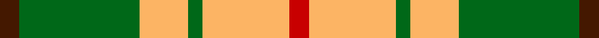
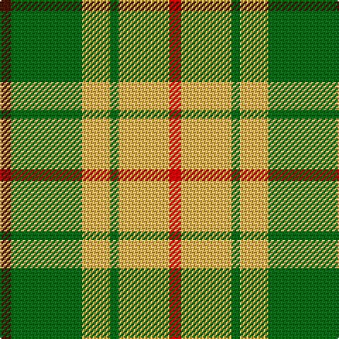

This page is one **sett** — a single exact thread-count. It belongs to the [tartan](/tartans/do4g25lo10g3lo18r4/)
(the same proportion at any scale), whose colour order is pattern [BGYGYR](/stripes/bgygyr/).

Sourced from tartans-authority.  It is a [6 stripe tartan](/stripes/stripes6/).

Original link http://www.tartansauthority.com/tartan-ferret/display/8578/

## Thread count
DR/8 G50 LG20 G6 LG36 R/8

## Palette

Palette: <strong>Tartan Register</strong> <small style="color:#888">(3 of 4 colours)</small>
<table><thead><tr><th>Colour</th><th>Threads</th><th>Shade</th><th>Base</th><th>OKLCh</th></tr></thead><tbody><tr><td>DR/</td><td style="text-align:right;font-variant-numeric:tabular-nums">8</td><td><code style="background-color:#441800;">#441800</code> <small style="color:#888">#441800</small></td><td>B <code style="background-color:#2A418A;">#2A418A</code></td><td><small style="color:#888">oklch(27.3% 0.076 46.3)</small></td></tr><tr><td>G</td><td style="text-align:right;font-variant-numeric:tabular-nums">50</td><td><code style="background-color:#006818;">#006818</code> <small style="color:#888">#006818</small></td><td>G <code style="background-color:#006100;">#006100</code></td><td><small style="color:#888">oklch(45.0% 0.142 145.0)</small></td></tr><tr><td>LG</td><td style="text-align:right;font-variant-numeric:tabular-nums">20</td><td><code style="background-color:#FCB464;">#FCB464</code> <small style="color:#888">#FCB464</small></td><td>Y <code style="background-color:#F2BF00;">#F2BF00</code></td><td><small style="color:#888">oklch(82.2% 0.128 67.3)</small></td></tr><tr><td>G</td><td style="text-align:right;font-variant-numeric:tabular-nums">6</td><td><code style="background-color:#006818;">#006818</code> <small style="color:#888">#006818</small></td><td>G <code style="background-color:#006100;">#006100</code></td><td><small style="color:#888">oklch(45.0% 0.142 145.0)</small></td></tr><tr><td>LG</td><td style="text-align:right;font-variant-numeric:tabular-nums">36</td><td><code style="background-color:#FCB464;">#FCB464</code> <small style="color:#888">#FCB464</small></td><td>Y <code style="background-color:#F2BF00;">#F2BF00</code></td><td><small style="color:#888">oklch(82.2% 0.128 67.3)</small></td></tr><tr><td>R/</td><td style="text-align:right;font-variant-numeric:tabular-nums">8</td><td><code style="background-color:#C80000;">#C80000</code> <small style="color:#888">#C80000</small></td><td>R <code style="background-color:#CC0000;">#CC0000</code></td><td><small style="color:#888">oklch(52.3% 0.215 29.2)</small></td></tr></tbody></table>

# Sample pattern

## Nearest tartans

The nearest existing variants by ΔTartan distance, with this tartan at the top so the swatches line up against it.

ΔTartan

Tartan

Sett

—

<a href="/ttd/edit/#slug=do4g25lo10g3lo18r4~x2">Unidentfied (Ligioner Highland Games</a> <a class="nn-out" href="/setts/s6/do4g25lo10g3lo18r4~x2/" title="open its dictionary page">↗</a>

1.15

<a href="/ttd/edit/#slug=lo5g7k1t1~x4">Wilson's, No 195</a> <a class="nn-out" href="/setts/s4/lo5g7k1t1~x4/" title="open its dictionary page">↗</a>

1.20

<a href="/ttd/edit/#slug=k4r5k2ly21g8k2~x2">MacDuck (Corporate)</a> <a class="nn-out" href="/setts/s6/k4r5k2ly21g8k2~x2/" title="open its dictionary page">↗</a>

1.22

<a href="/ttd/edit/#slug=g9r2g9r14k1w2~x4">MacGregor of Balquidder - 1831 (Clan</a> <a class="nn-out" href="/setts/s6/g9r2g9r14k1w2~x4/" title="open its dictionary page">↗</a>

1.25

<a href="/ttd/edit/#slug=k4r5k2lo21g8k2~x2">MacDuck #2</a> <a class="nn-out" href="/setts/s6/k4r5k2lo21g8k2~x2/" title="open its dictionary page">↗</a>

1.38

<a href="/ttd/edit/#slug=lo12dg4lo24k9lo8dg36r4">Harmer (Corporate)</a> <a class="nn-out" href="/setts/s7/lo12dg4lo24k9lo8dg36r4/" title="open its dictionary page">↗</a>

1.41

<a href="/ttd/edit/#slug=ly9dg4ly22k9ly9dg36r4~x2">Harmer</a> <a class="nn-out" href="/setts/s7/ly9dg4ly22k9ly9dg36r4~x2/" title="open its dictionary page">↗</a>

1.41

<a href="/ttd/edit/#slug=w1ly8dg3ly1db3ly1~x4">Fraser Yellow #2</a> <a class="nn-out" href="/setts/s6/w1ly8dg3ly1db3ly1~x4/" title="open its dictionary page">↗</a>

1.47

<a href="/ttd/edit/#slug=dg27r9n2ly14~x4">Englehart, City of</a> <a class="nn-out" href="/setts/s4/dg27r9n2ly14~x4/" title="open its dictionary page">↗</a>

1.48

<a href="/ttd/edit/#slug=ly9r3ly12y16w5y16ly6r3ly7r2~x2">J &amp; B Whisky (Original) (Corporate)</a> <a class="nn-out" href="/setts/s10/ly9r3ly12y16w5y16ly6r3ly7r2~x2/" title="open its dictionary page">↗</a>

1.48

<a href="/ttd/edit/#slug=g4lb31g7r14g11r3~x2">Gleneagles USA (Dalgleish)</a> <a class="nn-out" href="/setts/s6/g4lb31g7r14g11r3~x2/" title="open its dictionary page">↗</a>

## Neighbour map

Every grey dot is one of 14299 variants placed by the first two principal components of the ΔTartan feature space (44% of its variance). Red is this tartan; blue dots are its nearest — click one to open its page.

<svg viewBox="0 0 640 380" role="img" style="max-width:100%;height:auto;border:1px solid #e0e0e0;border-radius:4px;display:block" xmlns="http://www.w3.org/2000/svg"><image href="/nn/cloud.v1.png" width="640" height="380"/><a href="/setts/s4/lo5g7k1t1~x4/"><circle cx="236.9" cy="234.8" r="4" fill="#3465a4"><title>Wilson's, No 195</title></circle></a><a href="/setts/s6/k4r5k2ly21g8k2~x2/"><circle cx="227.9" cy="171.9" r="4" fill="#3465a4"><title>MacDuck (Corporate)</title></circle></a><a href="/setts/s6/g9r2g9r14k1w2~x4/"><circle cx="289.3" cy="194.3" r="4" fill="#3465a4"><title>MacGregor of Balquidder - 1831 (Clan</title></circle></a><a href="/setts/s6/k4r5k2lo21g8k2~x2/"><circle cx="247.2" cy="181.5" r="4" fill="#3465a4"><title>MacDuck #2</title></circle></a><a href="/setts/s7/lo12dg4lo24k9lo8dg36r4/"><circle cx="238.8" cy="207.3" r="4" fill="#3465a4"><title>Harmer (Corporate)</title></circle></a><a href="/setts/s7/ly9dg4ly22k9ly9dg36r4~x2/"><circle cx="196.4" cy="187.4" r="4" fill="#3465a4"><title>Harmer</title></circle></a><a href="/setts/s6/w1ly8dg3ly1db3ly1~x4/"><circle cx="272.3" cy="191.6" r="4" fill="#3465a4"><title>Fraser Yellow #2</title></circle></a><a href="/setts/s4/dg27r9n2ly14~x4/"><circle cx="265.6" cy="218.1" r="4" fill="#3465a4"><title>Englehart, City of</title></circle></a><a href="/setts/s10/ly9r3ly12y16w5y16ly6r3ly7r2~x2/"><circle cx="186.4" cy="192.7" r="4" fill="#3465a4"><title>J &amp; B Whisky (Original) (Corporate)</title></circle></a><a href="/setts/s6/g4lb31g7r14g11r3~x2/"><circle cx="240.2" cy="210.2" r="4" fill="#3465a4"><title>Gleneagles USA (Dalgleish)</title></circle></a><circle cx="222.4" cy="205.2" r="5" fill="#c00000"/></svg>

ID: /setts/s6/do4g25lo10g3lo18r4~x2/
