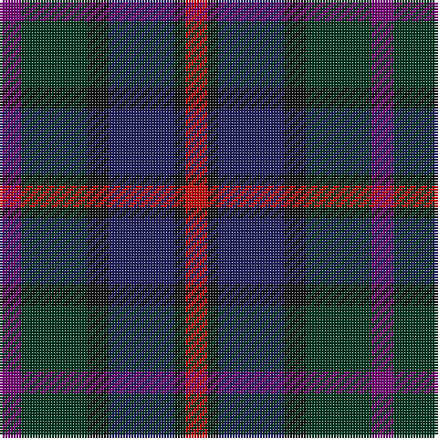

**Bands:** [BGKBKR](/stripes/bgkbkr/) · **Stripes:** [DP DG K DB K R](/stripes/stripes6/) DP DG K DB K R

This was sourced from register-of-tartans.  It is a [6 band tartan](/bands/bands6/).

Original link https://www.tartanregister.gov.uk/tartanDetails.aspx?ref=2312

## Attestations

This cloth appears in 2 source records; the oldest owns this page.

- 01/01/1993 — MacCaughan or MacEachain (Personal) (register-of-tartans, [record](https://www.tartanregister.gov.uk/tartanDetails.aspx?ref=2312))
- 1993 — MacCaughan (Personal) (tartans-authority, [record](http://www.tartansauthority.com/tartan-ferret/display/169/))

## Register references

External register numbers recorded for this tartan.

- Scottish Register of Tartans: [2312](https://www.tartanregister.gov.uk/tartanDetails.aspx?ref=2312)
- Scottish Tartans Authority (ITI): 169
- Scottish Tartans World Register: 169

## Thread count
P/8 DG24 K8 DB24 K4 R/8

## Palette
Each colour and its ΔE from the base-6 reference it is a variant of.

| Colour | Shade | Base | ΔE (OKLab) |
|---|---|---|---|
| DB | <code style="background-color:#202060;">#202060</code> `#202060` | B <code style="background-color:#2A418A;">#2A418A</code> | 0.11 |
| DG | <code style="background-color:#003820;">#003820</code> `#003820` | G <code style="background-color:#006100;">#006100</code> | 0.15 |
| K | <code style="background-color:#101010;">#101010</code> `#101010` | K <code style="background-color:#000000;">#000000</code> | 0.17 |
| P | <code style="background-color:#780078;">#780078</code> `#780078` | B <code style="background-color:#2A418A;">#2A418A</code> | 0.17 |
| R | <code style="background-color:#C80000;">#C80000</code> `#C80000` | R <code style="background-color:#CC0000;">#CC0000</code> | 0.01 |

# Sample pattern

## Nearest tartans

The nearest existing variants by ΔTartan distance.

1. [Heritage (Corporate)](/setts/s7/r5db8k5db24k24y24y5~x2/) — ΔT 1.00
1. [Glen Shee #3 (Fashion)](/setts/s5/m4dt29dr30k29m4~x2/) — ΔT 1.18
1. [Breon (Jersey Shore, Pennsylvania) (Personal)](/setts/s5/t25dg25k6dp10r6~x2/) — ΔT 1.23
1. [Longford, County](/setts/s10/db5k3db18dg6k6dg6dy12r5dy12r3~x2/) — ΔT 1.29
1. [Lennie](/setts/s6/dg2dp8k9y2dg10k2~x2/) — ΔT 1.29
1. [Swankie](/setts/s7/dg3dt22dr10o5dg21r6dt3~x2/) — ΔT 1.37
1. [Holland & Sherry (Corporate)](/setts/s9/dt20b3dt4r3dt3k10g21k4r20~x2/) — ΔT 1.43
1. [Casely](/setts/s6/r4g11k11g2n11y3~x4/) — ΔT 1.44
1. [MacAllum of Berwick (Clan?)](/setts/s9/db10r7db31k25dg23k8db7r8ly5~x2/) — ΔT 1.44
1. [Saorsa (Corporate)](/setts/s6/db11g15k2n5db3n11~x2/) — ΔT 1.44

## Neighbour map

Every grey dot is one of 14313 variants placed by the first two principal components of the ΔTartan feature space (44% of its variance). Red is this tartan; blue dots are its nearest — click one to open its page.

<svg viewBox="0 0 640 380" role="img" style="max-width:100%;height:auto;border:1px solid #e0e0e0;border-radius:4px;display:block" xmlns="http://www.w3.org/2000/svg"><image href="/nn/cloud.v1.png" width="640" height="380"/><a href="/setts/s7/r5db8k5db24k24y24y5~x2/"><circle cx="154.1" cy="254.7" r="4" fill="#3465a4"><title>Heritage (Corporate)</title></circle></a><a href="/setts/s5/m4dt29dr30k29m4~x2/"><circle cx="222.2" cy="286.8" r="4" fill="#3465a4"><title>Glen Shee #3 (Fashion)</title></circle></a><a href="/setts/s5/t25dg25k6dp10r6~x2/"><circle cx="163.6" cy="281.5" r="4" fill="#3465a4"><title>Breon (Jersey Shore, Pennsylvania) (Personal)</title></circle></a><a href="/setts/s10/db5k3db18dg6k6dg6dy12r5dy12r3~x2/"><circle cx="154.6" cy="246.7" r="4" fill="#3465a4"><title>Longford, County</title></circle></a><a href="/setts/s6/dg2dp8k9y2dg10k2~x2/"><circle cx="200.6" cy="280.9" r="4" fill="#3465a4"><title>Lennie</title></circle></a><a href="/setts/s7/dg3dt22dr10o5dg21r6dt3~x2/"><circle cx="217.1" cy="248.2" r="4" fill="#3465a4"><title>Swankie</title></circle></a><a href="/setts/s9/dt20b3dt4r3dt3k10g21k4r20~x2/"><circle cx="157.1" cy="217.6" r="4" fill="#3465a4"><title>Holland &amp; Sherry (Corporate)</title></circle></a><a href="/setts/s6/r4g11k11g2n11y3~x4/"><circle cx="132.8" cy="263.4" r="4" fill="#3465a4"><title>Casely</title></circle></a><a href="/setts/s9/db10r7db31k25dg23k8db7r8ly5~x2/"><circle cx="164.8" cy="229.9" r="4" fill="#3465a4"><title>MacAllum of Berwick (Clan?)</title></circle></a><a href="/setts/s6/db11g15k2n5db3n11~x2/"><circle cx="185.8" cy="261.6" r="4" fill="#3465a4"><title>Saorsa (Corporate)</title></circle></a><circle cx="165.1" cy="263.6" r="5" fill="#c00000"/></svg>

ID: /setts/s6/dp2dg6k2db6k1r2~x4/
