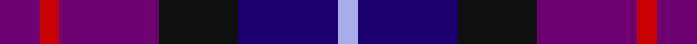
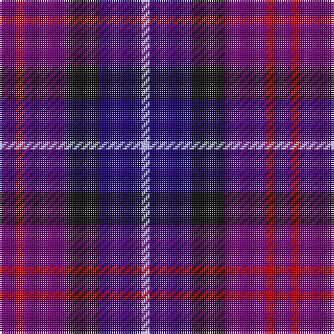

In pattern [BRBKBW](/stripes/brbkbw/).

This was sourced from tartans-authority.  It is a [6 stripe tartan](/stripes/stripes6/).

Original link http://www.tartansauthority.com/tartan-ferret/display/5364/

## Thread count
P/8 R4 P20 K16 DB20 LP/4

## Palette
Each colour and the base-6 reference it is a variant of.

| Colour | Shade | Base |
|---|---|---|
| DB | <code style="background-color:#1C0070;">#1C0070</code> `oklch(26.3% 0.162 277.1)` <small>#1C0070</small> | B <code style="background-color:#2A418A;">#2A418A</code> |
| K | <code style="background-color:#101010;">#101010</code> `oklch(17.3% 0.000 89.9)` <small>#101010</small> | K <code style="background-color:#000000;">#000000</code> |
| LP | <code style="background-color:#A8ACE8;">#A8ACE8</code> `oklch(76.3% 0.086 281.2)` <small>#A8ACE8</small> | W <code style="background-color:#F7F7F7;">#F7F7F7</code> |
| P | <code style="background-color:#6C0070;">#6C0070</code> `oklch(37.6% 0.174 326.5)` <small>#6C0070</small> | B <code style="background-color:#2A418A;">#2A418A</code> |
| R | <code style="background-color:#C80000;">#C80000</code> `oklch(52.3% 0.215 29.2)` <small>#C80000</small> | R <code style="background-color:#CC0000;">#CC0000</code> |

# Sample pattern

## Nearest tartans

The nearest existing variants by ΔTartan distance, with this tartan at the top so the swatches line up against it.

ΔTartan

Tartan

Sett

—

<a href="/ttd/edit/#slug=dp2r1dp5k4db5lb1~x4">Kintore (Fashion)</a> <a class="nn-out" href="/setts/s6/dp2r1dp5k4db5lb1~x4/" title="open its dictionary page">↗</a>

1.11

<a href="/ttd/edit/#slug=dp4r1b5dp4k6lb1~x4">Benreay Medical Centre (Corporate)</a> <a class="nn-out" href="/setts/s6/dp4r1b5dp4k6lb1~x4/" title="open its dictionary page">↗</a>

1.15

<a href="/setts/s10/dp2r1dp5k4db5lb1~x4/">Kintore</a>

1.65

<a href="/ttd/edit/#slug=db6w3db21k16dp6k3dp6~x2">Heritage of Scotland</a> <a class="nn-out" href="/setts/s7/db6w3db21k16dp6k3dp6~x2/" title="open its dictionary page">↗</a>

1.78

<a href="/ttd/edit/#slug=r2db11r3db11t12db10w2~x2">Blue</a> <a class="nn-out" href="/setts/s7/r2db11r3db11t12db10w2~x2/" title="open its dictionary page">↗</a>

1.82

<a href="/ttd/edit/#slug=r2db6dt6db2r2db4dt6r2db2w1~x4">Scottish N. A. Business Council (Co</a> <a class="nn-out" href="/setts/s10/r2db6dt6db2r2db4dt6r2db2w1~x4/" title="open its dictionary page">↗</a>

1.85

<a href="/ttd/edit/#slug=dg3db21r14db5r14db5r14db18dg3db3~x2">Hamilton (Personal)</a> <a class="nn-out" href="/setts/s10/dg3db21r14db5r14db5r14db18dg3db3~x2/" title="open its dictionary page">↗</a>

1.85

<a href="/ttd/edit/#slug=db3k13db13db13w2db13w3~x2">Brodie Countryfare (Corporate)</a> <a class="nn-out" href="/setts/s7/db3k13db13db13w2db13w3~x2/" title="open its dictionary page">↗</a>

1.87

<a href="/ttd/edit/#slug=db16k16db16w3db16k2t3~x2">St. Andrew Society</a> <a class="nn-out" href="/setts/s7/db16k16db16w3db16k2t3~x2/" title="open its dictionary page">↗</a>

1.90

<a href="/ttd/edit/#slug=lb2db20n2dt15r9lb2~x2">Open Championship (1998)</a> <a class="nn-out" href="/setts/s6/lb2db20n2dt15r9lb2~x2/" title="open its dictionary page">↗</a>

1.92

<a href="/ttd/edit/#slug=r1db3dr1g3dr5lb1~x4">Lanark (Fashion #1)</a> <a class="nn-out" href="/setts/s6/r1db3dr1g3dr5lb1~x4/" title="open its dictionary page">↗</a>

## Neighbour map

Every grey dot is one of 14299 variants placed by the first two principal components of the ΔTartan feature space (44% of its variance). Red is this tartan; blue dots are its nearest — click one to open its page.

<svg viewBox="0 0 640 380" role="img" style="max-width:100%;height:auto;border:1px solid #e0e0e0;border-radius:4px;display:block" xmlns="http://www.w3.org/2000/svg"><image href="/nn/cloud.v1.png" width="640" height="380"/><a href="/setts/s6/dp4r1b5dp4k6lb1~x4/"><circle cx="142.6" cy="240.9" r="4" fill="#3465a4"><title>Benreay Medical Centre (Corporate)</title></circle></a><a href="/setts/s10/dp2r1dp5k4db5lb1~x4/"><circle cx="152.5" cy="248.3" r="4" fill="#3465a4"><title>Kintore</title></circle></a><a href="/setts/s7/db6w3db21k16dp6k3dp6~x2/"><circle cx="226.2" cy="236.4" r="4" fill="#3465a4"><title>Heritage of Scotland</title></circle></a><a href="/setts/s7/r2db11r3db11t12db10w2~x2/"><circle cx="163.1" cy="237.8" r="4" fill="#3465a4"><title>Blue</title></circle></a><a href="/setts/s10/r2db6dt6db2r2db4dt6r2db2w1~x4/"><circle cx="199.3" cy="246.8" r="4" fill="#3465a4"><title>Scottish N. A. Business Council (Co</title></circle></a><a href="/setts/s10/dg3db21r14db5r14db5r14db18dg3db3~x2/"><circle cx="229.9" cy="235.8" r="4" fill="#3465a4"><title>Hamilton (Personal)</title></circle></a><a href="/setts/s7/db3k13db13db13w2db13w3~x2/"><circle cx="195.1" cy="259.1" r="4" fill="#3465a4"><title>Brodie Countryfare (Corporate)</title></circle></a><a href="/setts/s7/db16k16db16w3db16k2t3~x2/"><circle cx="215.5" cy="244.8" r="4" fill="#3465a4"><title>St. Andrew Society</title></circle></a><a href="/setts/s6/lb2db20n2dt15r9lb2~x2/"><circle cx="205.3" cy="203.6" r="4" fill="#3465a4"><title>Open Championship (1998)</title></circle></a><a href="/setts/s6/r1db3dr1g3dr5lb1~x4/"><circle cx="181.0" cy="246.1" r="4" fill="#3465a4"><title>Lanark (Fashion #1)</title></circle></a><circle cx="165.1" cy="256.6" r="5" fill="#c00000"/></svg>

ID: /setts/s6/dp2r1dp5k4db5lb1~x4/
