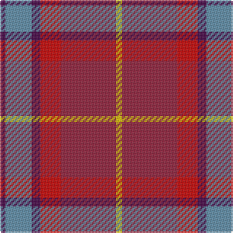

This page is one **sett** — a single exact thread-count. It belongs to the [tartan](/tartans/dp2b9dp3r7dr19y2/)
(the same proportion at any scale), whose colour order is pattern [BBBRRY](/stripes/bbbrry/).

Sourced from register-of-tartans.  It is a [6 stripe tartan](/stripes/stripes6/).

Original link https://www.tartanregister.gov.uk/tartanDetails.aspx?ref=3922

## Register references

External register numbers recorded for this tartan.

- Scottish Register of Tartans: [3922](https://www.tartanregister.gov.uk/tartanDetails.aspx?ref=3922)
- Scottish Tartans Authority (ITI): 7062

## Thread count
DP/4 B18 DP6 R14 DR38 Y/4

## Palette
Each colour and the base-6 reference it is a variant of.

| Colour | Shade | Base |
|---|---|---|
| B | <code style="background-color:#5C8CA8;">#5C8CA8</code> `oklch(61.7% 0.067 235.0)` <small>#5C8CA8</small> | B <code style="background-color:#2A418A;">#2A418A</code> |
| DP | <code style="background-color:#440044;">#440044</code> `oklch(27.1% 0.125 328.4)` <small>#440044</small> | B <code style="background-color:#2A418A;">#2A418A</code> |
| DR | <code style="background-color:#901C38;">#901C38</code> `oklch(43.2% 0.150 13.1)` <small>#901C38</small> | R <code style="background-color:#CC0000;">#CC0000</code> |
| LR | <code style="background-color:#E87878;">#E87878</code> `oklch(70.0% 0.139 21.2)` <small>#E87878</small> | R <code style="background-color:#CC0000;">#CC0000</code> |
| P | <code style="background-color:#B468AC;">#B468AC</code> `oklch(62.5% 0.131 330.9)` <small>#B468AC</small> | R <code style="background-color:#CC0000;">#CC0000</code> |
| R | <code style="background-color:#C80000;">#C80000</code> `oklch(52.3% 0.215 29.2)` <small>#C80000</small> | R <code style="background-color:#CC0000;">#CC0000</code> |
| Y | <code style="background-color:#E8C000;">#E8C000</code> `oklch(81.9% 0.168 93.7)` <small>#E8C000</small> | Y <code style="background-color:#F2BF00;">#F2BF00</code> |

# Sample pattern

## Nearest tartans

The nearest existing variants by ΔTartan distance, with this tartan at the top so the swatches line up against it.

ΔTartan

Tartan

Sett

—

<a href="/ttd/edit/#slug=dp2t9dp3r7r19ly2~x2">Stevens #3</a> <a class="nn-out" href="/setts/s6/dp2t9dp3r7r19ly2~x2/" title="open its dictionary page">↗</a>

1.13

<a href="/ttd/edit/#slug=r15r98dp72t25dp8w15">Afternoon Tea / Assam</a> <a class="nn-out" href="/setts/s6/r15r98dp72t25dp8w15/" title="open its dictionary page">↗</a>

1.29

<a href="/ttd/edit/#slug=r8r1dg4r1db4~x2">Moray of Abercairney #2</a> <a class="nn-out" href="/setts/s5/r8r1dg4r1db4~x2/" title="open its dictionary page">↗</a>

1.30

<a href="/ttd/edit/#slug=db15n20do12r34lb3~x2">McCurdy-Stribbling (Personal)</a> <a class="nn-out" href="/setts/s5/db15n20do12r34lb3~x2/" title="open its dictionary page">↗</a>

1.39

<a href="/ttd/edit/#slug=g12r11p12r3r32p8g8p8~x2">Fiddes</a> <a class="nn-out" href="/setts/s8/g12r11p12r3r32p8g8p8~x2/" title="open its dictionary page">↗</a>

1.41

<a href="/ttd/edit/#slug=m1dp4r10o2w1~x4">Love</a> <a class="nn-out" href="/setts/s5/m1dp4r10o2w1~x4/" title="open its dictionary page">↗</a>

1.44

<a href="/ttd/edit/#slug=w15do8m25do72r98ly15">Afternoon Tea / Apple Tea</a> <a class="nn-out" href="/setts/s6/w15do8m25do72r98ly15/" title="open its dictionary page">↗</a>

1.44

<a href="/ttd/edit/#slug=lr11r4y2k4y2r4y12r20t2~x2">Australia Dress</a> <a class="nn-out" href="/setts/s9/lr11r4y2k4y2r4y12r20t2~x2/" title="open its dictionary page">↗</a>

1.45

<a href="/ttd/edit/#slug=r28ly3r3db3r4dp8g10dp15dp4~x2">Loch Lomond (1999)</a> <a class="nn-out" href="/setts/s9/r28ly3r3db3r4dp8g10dp15dp4~x2/" title="open its dictionary page">↗</a>

1.48

<a href="/ttd/edit/#slug=r8r1g4r1db4~x2">Moray of Abercairney</a> <a class="nn-out" href="/setts/s5/r8r1g4r1db4~x2/" title="open its dictionary page">↗</a>

1.49

<a href="/ttd/edit/#slug=r8r1dg4r1dg1t2~x2">Moray of Abercairney</a> <a class="nn-out" href="/setts/s6/r8r1dg4r1dg1t2~x2/" title="open its dictionary page">↗</a>

## Neighbour map

Every grey dot is one of 14299 variants placed by the first two principal components of the ΔTartan feature space (44% of its variance). Red is this tartan; blue dots are its nearest — click one to open its page.

<svg viewBox="0 0 640 380" role="img" style="max-width:100%;height:auto;border:1px solid #e0e0e0;border-radius:4px;display:block" xmlns="http://www.w3.org/2000/svg"><image href="/nn/cloud.v1.png" width="640" height="380"/><a href="/setts/s6/r15r98dp72t25dp8w15/"><circle cx="237.2" cy="178.4" r="4" fill="#3465a4"><title>Afternoon Tea / Assam</title></circle></a><a href="/setts/s5/r8r1dg4r1db4~x2/"><circle cx="239.8" cy="231.3" r="4" fill="#3465a4"><title>Moray of Abercairney #2</title></circle></a><a href="/setts/s5/db15n20do12r34lb3~x2/"><circle cx="206.5" cy="222.2" r="4" fill="#3465a4"><title>McCurdy-Stribbling (Personal)</title></circle></a><a href="/setts/s8/g12r11p12r3r32p8g8p8~x2/"><circle cx="264.9" cy="205.4" r="4" fill="#3465a4"><title>Fiddes</title></circle></a><a href="/setts/s5/m1dp4r10o2w1~x4/"><circle cx="325.7" cy="195.5" r="4" fill="#3465a4"><title>Love</title></circle></a><a href="/setts/s6/w15do8m25do72r98ly15/"><circle cx="221.2" cy="162.3" r="4" fill="#3465a4"><title>Afternoon Tea / Apple Tea</title></circle></a><a href="/setts/s9/lr11r4y2k4y2r4y12r20t2~x2/"><circle cx="232.7" cy="167.0" r="4" fill="#3465a4"><title>Australia Dress</title></circle></a><a href="/setts/s9/r28ly3r3db3r4dp8g10dp15dp4~x2/"><circle cx="227.7" cy="168.7" r="4" fill="#3465a4"><title>Loch Lomond (1999)</title></circle></a><a href="/setts/s5/r8r1g4r1db4~x2/"><circle cx="242.3" cy="235.1" r="4" fill="#3465a4"><title>Moray of Abercairney</title></circle></a><a href="/setts/s6/r8r1dg4r1dg1t2~x2/"><circle cx="271.5" cy="208.2" r="4" fill="#3465a4"><title>Moray of Abercairney</title></circle></a><circle cx="245.6" cy="194.2" r="5" fill="#c00000"/></svg>

ID: /setts/s6/dp2t9dp3r7r19ly2~x2/
