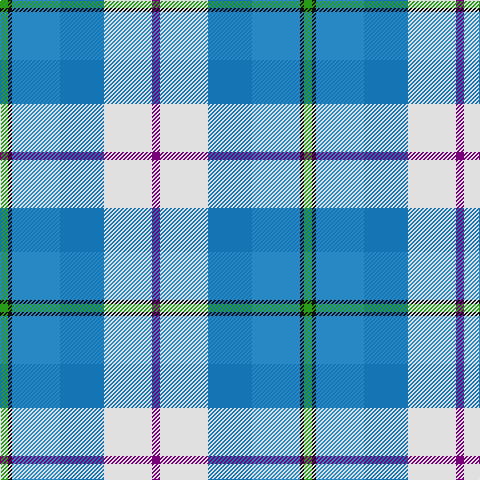

In pattern [BWBBKG](/stripes/bwbbkg/).

This was sourced from tartans-authority.  It is a [6 stripe tartan](/stripes/stripes6/).

Original link http://www.tartansauthority.com/tartan-ferret/display/7623/

## Attestations

This cloth appears in 2 source records; the oldest owns this page.

- pre 2008 — Isle of Barra (District) (tartans-authority, [record](http://www.tartansauthority.com/tartan-ferret/display/7623/))
- undated — Isle of Barra (register-of-tartans, [record](https://www.tartanregister.gov.uk/tartanDetails.aspx?ref=5642))

## Register references

External register numbers recorded for this tartan.

- Scottish Register of Tartans: [5642](https://www.tartanregister.gov.uk/tartanDetails.aspx?ref=5642)
- Scottish Tartans Authority (ITI): 7623

## Thread count
G/8 K4 Ba48 B44 LN48 P/8

## Palette
Each colour and its ΔE from the base-6 reference it is a variant of.

| Colour | Shade | Base | ΔE (OKLab) |
|---|---|---|---|
| B | <code style="background-color:#1474B4;">#1474B4</code> `#1474B4` | B <code style="background-color:#2A418A;">#2A418A</code> | 0.15 |
| Ba | <code style="background-color:#2888C4;">#2888C4</code> `#2888C4` | B <code style="background-color:#2A418A;">#2A418A</code> | 0.21 |
| G | <code style="background-color:#289C18;">#289C18</code> `#289C18` | G <code style="background-color:#006100;">#006100</code> | 0.19 |
| K | <code style="background-color:#101010;">#101010</code> `#101010` | K <code style="background-color:#000000;">#000000</code> | 0.17 |
| LN | <code style="background-color:#E0E0E0;">#E0E0E0</code> `#E0E0E0` | W <code style="background-color:#F7F7F7;">#F7F7F7</code> | 0.07 |
| P | <code style="background-color:#780078;">#780078</code> `#780078` | B <code style="background-color:#2A418A;">#2A418A</code> | 0.17 |

# Sample pattern

## Nearest tartans

The nearest existing variants by ΔTartan distance.

1. [Silversea (Corporate)](/setts/s7/r3db20t20lg2lr4lb17w3~x2/) — ΔT 1.24
1. [Ancient Gathering](/setts/s8/db1lb12p6w1ly3db14b18w1~x2/) — ΔT 1.53
1. [Earl of St. Andrews Dress (Dance)](/setts/s7/w20db14b14w4dt2t2b7~x2/) — ΔT 1.53
1. [Afternoon Tea / Mint Tea](/setts/s6/w15lg98dt72b25dt8ly15/) — ΔT 1.64
1. [Seaside (Fashion)](/setts/s7/w3lb2p4lb14n2t14lo2~x4/) — ΔT 1.66
1. [St Andrews, Earl of, dress](/setts/s7/w28t19db19w4db2lp2db7~x2/) — ΔT 1.67
1. [Alexander of Menstry Hunting](/setts/s8/m5g2m2g26k9lr9lb13w5~x2/) — ΔT 1.68
1. [Elora (District)](/setts/s8/dt2g2dt11o2w8t12ly2t2~x2/) — ΔT 1.70
1. [Allanton Dress (Fashion)](/setts/s6/g4w28db14ly2t17g4~x2/) — ΔT 1.70
1. [Deeside Plaid (Taobh Dhi) (District)](/setts/s7/ly4b22g4o24dp6o4w3~x2/) — ΔT 1.72

## Neighbour map

Every grey dot is one of 14299 variants placed by the first two principal components of the ΔTartan feature space (44% of its variance). Red is this tartan; blue dots are its nearest — click one to open its page.

<svg viewBox="0 0 640 380" role="img" style="max-width:100%;height:auto;border:1px solid #e0e0e0;border-radius:4px;display:block" xmlns="http://www.w3.org/2000/svg"><image href="/nn/cloud.v1.png" width="640" height="380"/><a href="/setts/s7/r3db20t20lg2lr4lb17w3~x2/"><circle cx="72.4" cy="146.3" r="4" fill="#3465a4"><title>Silversea (Corporate)</title></circle></a><a href="/setts/s8/db1lb12p6w1ly3db14b18w1~x2/"><circle cx="125.4" cy="130.4" r="4" fill="#3465a4"><title>Ancient Gathering</title></circle></a><a href="/setts/s7/w20db14b14w4dt2t2b7~x2/"><circle cx="144.0" cy="181.4" r="4" fill="#3465a4"><title>Earl of St. Andrews Dress (Dance)</title></circle></a><a href="/setts/s6/w15lg98dt72b25dt8ly15/"><circle cx="193.2" cy="181.5" r="4" fill="#3465a4"><title>Afternoon Tea / Mint Tea</title></circle></a><a href="/setts/s7/w3lb2p4lb14n2t14lo2~x4/"><circle cx="166.7" cy="181.1" r="4" fill="#3465a4"><title>Seaside (Fashion)</title></circle></a><a href="/setts/s7/w28t19db19w4db2lp2db7~x2/"><circle cx="174.1" cy="158.0" r="4" fill="#3465a4"><title>St Andrews, Earl of, dress</title></circle></a><a href="/setts/s8/m5g2m2g26k9lr9lb13w5~x2/"><circle cx="132.4" cy="145.8" r="4" fill="#3465a4"><title>Alexander of Menstry Hunting</title></circle></a><a href="/setts/s8/dt2g2dt11o2w8t12ly2t2~x2/"><circle cx="82.4" cy="170.1" r="4" fill="#3465a4"><title>Elora (District)</title></circle></a><a href="/setts/s6/g4w28db14ly2t17g4~x2/"><circle cx="162.5" cy="163.9" r="4" fill="#3465a4"><title>Allanton Dress (Fashion)</title></circle></a><a href="/setts/s7/ly4b22g4o24dp6o4w3~x2/"><circle cx="179.4" cy="175.8" r="4" fill="#3465a4"><title>Deeside Plaid (Taobh Dhi) (District)</title></circle></a><circle cx="115.1" cy="174.1" r="5" fill="#c00000"/></svg>

ID: /setts/s6/dp2w12b11t12k1g2~x4/
