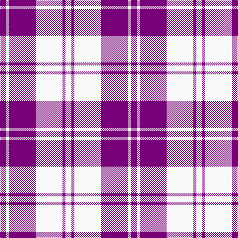

This page is one **sett** — a single exact thread-count. It belongs to the [tartan](/tartans/p2w1p9w9p1w2/)
(the same proportion at any scale), whose colour order is pattern [BWBWBW](/stripes/bwbwbw/).

Sourced from register-of-tartans.  It is a [6 stripe tartan](/stripes/stripes6/).

Original link https://www.tartanregister.gov.uk/tartanDetails.aspx?ref=1128

## Also known as

This cloth is also recorded under:

- Erskine, Purple

2 attestations — the source records this cloth was collapsed from (oldest owns this page)

<ul>
<li>01/01/1980 — Erskine Purple (Dance) (register-of-tartans, <a href="https://www.tartanregister.gov.uk/tartanDetails.aspx?ref=1128">record</a>)</li>
<li>1980 — Erskine, Purple (Dance) (tartans-authority, <a href="http://www.tartansauthority.com/tartan-ferret/display/6534/">record</a>)</li>
</ul>

## Register references

External register numbers recorded for this tartan.

- Scottish Register of Tartans: [1128](https://www.tartanregister.gov.uk/tartanDetails.aspx?ref=1128)
- Scottish Tartans Authority (ITI): 6534

## Thread count
P/12 W6 P54 W54 P6 W/12

## Palette
Each colour and the base-6 reference it is a variant of.

| Colour | Shade | Base |
|---|---|---|
| P | <code style="background-color:#780078;">#780078</code> `oklch(40.2% 0.185 328.4)` <small>#780078</small> | B <code style="background-color:#2A418A;">#2A418A</code> |
| W | <code style="background-color:#F8F8F8;">#F8F8F8</code> `oklch(97.9% 0.000 89.9)` <small>#F8F8F8</small> | W <code style="background-color:#F7F7F7;">#F7F7F7</code> |

# Sample pattern

## Nearest tartans

The nearest existing variants by ΔTartan distance, with this tartan at the top so the swatches line up against it.

ΔTartan

Tartan

Sett

—

<a href="/ttd/edit/#slug=dp2w1dp9w9dp1w2~x6">Erskine Purple (Dance)</a> <a class="nn-out" href="/setts/s6/dp2w1dp9w9dp1w2~x6/" title="open its dictionary page">↗</a>

0.85

<a href="/ttd/edit/#slug=dp6w2dp29w29dp2w6~x2">Erskine Purple (Dance) Fashion Tartan Tartan Number: 6534. Earliest known date: 01/01/1980 A dancers' tartan now woven by D C Dalgliesh of Selkirk. See products available Copyright © Blair Urquhart, Comrie, 2015</a> <a class="nn-out" href="/setts/s6/dp6w2dp29w29dp2w6~x2/" title="open its dictionary page">↗</a>

1.45

<a href="/ttd/edit/#slug=b6ly2b21ly2b6ly24b2ly6~x2">MacLachlan (Chief's Dress) Blue</a> <a class="nn-out" href="/setts/s8/b6ly2b21ly2b6ly24b2ly6~x2/" title="open its dictionary page">↗</a>

1.53

<a href="/ttd/edit/#slug=r5w2r25w25r2w5~x2">Erskine Dress Burgandy Clan Tartan Tartan Number: 1972. Earliest known date: 1971 A popular Dress tartan for Scottish Highland Dancing. See products available Copyright © Blair Urquhart, Comrie, 2015</a> <a class="nn-out" href="/setts/s6/r5w2r25w25r2w5~x2/" title="open its dictionary page">↗</a>

1.59

<a href="/ttd/edit/#slug=r6w2r29w29r2w6~x2">Erskine, Burgundy (Dance)</a> <a class="nn-out" href="/setts/s6/r6w2r29w29r2w6~x2/" title="open its dictionary page">↗</a>

1.77

<a href="/ttd/edit/#slug=db6w2db29w29db2w6~x2">Erskine Blue (Dance)</a> <a class="nn-out" href="/setts/s6/db6w2db29w29db2w6~x2/" title="open its dictionary page">↗</a>

1.82

<a href="/ttd/edit/#slug=w5db16w5db16w33r3~x2">Buchanan Dress Blue (Dance)</a> <a class="nn-out" href="/setts/s6/w5db16w5db16w33r3~x2/" title="open its dictionary page">↗</a>

1.85

<a href="/ttd/edit/#slug=db4w35db31w4~x2">Lewis, Navy (Dance)</a> <a class="nn-out" href="/setts/s4/db4w35db31w4~x2/" title="open its dictionary page">↗</a>

1.85

<a href="/ttd/edit/#slug=w16db3w2db3w2db3r5db6w2~x4">Jeux Canada Games '87 (Corporate)</a> <a class="nn-out" href="/setts/s9/w16db3w2db3w2db3r5db6w2~x4/" title="open its dictionary page">↗</a>

1.90

<a href="/ttd/edit/#slug=k2w28r13w2r13w2~x2">Buchanan #5</a> <a class="nn-out" href="/setts/s6/k2w28r13w2r13w2~x2/" title="open its dictionary page">↗</a>

1.91

<a href="/ttd/edit/#slug=w4m31w35lg4~x2">Lewis, Magenta (Dance)</a> <a class="nn-out" href="/setts/s4/w4m31w35lg4~x2/" title="open its dictionary page">↗</a>

## Neighbour map

Every grey dot is one of 14299 variants placed by the first two principal components of the ΔTartan feature space (44% of its variance). Red is this tartan; blue dots are its nearest — click one to open its page.

<svg viewBox="0 0 640 380" role="img" style="max-width:100%;height:auto;border:1px solid #e0e0e0;border-radius:4px;display:block" xmlns="http://www.w3.org/2000/svg"><image href="/nn/cloud.v1.png" width="640" height="380"/><a href="/setts/s6/dp6w2dp29w29dp2w6~x2/"><circle cx="341.5" cy="186.5" r="4" fill="#3465a4"><title>Erskine Purple (Dance) Fashion Tartan Tartan Number: 6534. Earliest known date: 01/01/1980 A dancers' tartan now woven by D C Dalgliesh of Selkirk. See products available Copyright © Blair Urquhart, Comrie, 2015</title></circle></a><a href="/setts/s8/b6ly2b21ly2b6ly24b2ly6~x2/"><circle cx="326.3" cy="188.7" r="4" fill="#3465a4"><title>MacLachlan (Chief's Dress) Blue</title></circle></a><a href="/setts/s6/r5w2r25w25r2w5~x2/"><circle cx="341.3" cy="192.0" r="4" fill="#3465a4"><title>Erskine Dress Burgandy Clan Tartan Tartan Number: 1972. Earliest known date: 1971 A popular Dress tartan for Scottish Highland Dancing. See products available Copyright © Blair Urquhart, Comrie, 2015</title></circle></a><a href="/setts/s6/r6w2r29w29r2w6~x2/"><circle cx="332.5" cy="178.6" r="4" fill="#3465a4"><title>Erskine, Burgundy (Dance)</title></circle></a><a href="/setts/s6/db6w2db29w29db2w6~x2/"><circle cx="320.1" cy="190.1" r="4" fill="#3465a4"><title>Erskine Blue (Dance)</title></circle></a><a href="/setts/s6/w5db16w5db16w33r3~x2/"><circle cx="283.7" cy="194.6" r="4" fill="#3465a4"><title>Buchanan Dress Blue (Dance)</title></circle></a><a href="/setts/s4/db4w35db31w4~x2/"><circle cx="307.3" cy="241.2" r="4" fill="#3465a4"><title>Lewis, Navy (Dance)</title></circle></a><a href="/setts/s9/w16db3w2db3w2db3r5db6w2~x4/"><circle cx="256.4" cy="180.8" r="4" fill="#3465a4"><title>Jeux Canada Games '87 (Corporate)</title></circle></a><a href="/setts/s6/k2w28r13w2r13w2~x2/"><circle cx="322.9" cy="170.6" r="4" fill="#3465a4"><title>Buchanan #5</title></circle></a><a href="/setts/s4/w4m31w35lg4~x2/"><circle cx="307.0" cy="217.6" r="4" fill="#3465a4"><title>Lewis, Magenta (Dance)</title></circle></a><circle cx="309.8" cy="203.3" r="5" fill="#c00000"/></svg>

ID: /setts/s6/dp2w1dp9w9dp1w2~x6/
