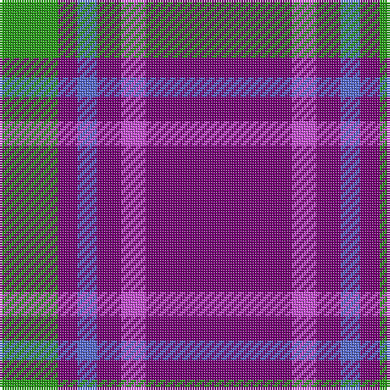

This page is one **sett** — a single exact thread-count. It belongs to the [tartan](/tartans/dp30m5dp5b4dp4g12/)
(the same proportion at any scale), whose colour order is pattern [BRBBBG](/stripes/brbbbg/).

Sourced from tartans-authority.  It is a [6 stripe tartan](/stripes/stripes6/).

Original link http://www.tartansauthority.com/tartan-ferret/display/10057/

## Thread count
Pa/60 P10 Pa10 B8 Pa8 G/24

## Palette

Palette: <strong>Tartan Register</strong> <small style="color:#888">(2 of 4 colours)</small>
<table><thead><tr><th>Colour</th><th>Threads</th><th>Shade</th><th>Base</th><th>OKLCh</th></tr></thead><tbody><tr><td>Pa/</td><td style="text-align:right;font-variant-numeric:tabular-nums">60</td><td><code style="background-color:#780078;">#780078</code> <small style="color:#888">#780078</small></td><td>B <code style="background-color:#2A418A;">#2A418A</code></td><td><small style="color:#888">oklch(40.2% 0.185 328.4)</small></td></tr><tr><td>P</td><td style="text-align:right;font-variant-numeric:tabular-nums">10</td><td><code style="background-color:#C850D8;">#C850D8</code> <small style="color:#888">#C850D8</small></td><td>R <code style="background-color:#CC0000;">#CC0000</code></td><td><small style="color:#888">oklch(64.1% 0.220 322.8)</small></td></tr><tr><td>Pa</td><td style="text-align:right;font-variant-numeric:tabular-nums">10</td><td><code style="background-color:#780078;">#780078</code> <small style="color:#888">#780078</small></td><td>B <code style="background-color:#2A418A;">#2A418A</code></td><td><small style="color:#888">oklch(40.2% 0.185 328.4)</small></td></tr><tr><td>B</td><td style="text-align:right;font-variant-numeric:tabular-nums">8</td><td><code style="background-color:#586CD0;">#586CD0</code> <small style="color:#888">#586CD0</small></td><td>B <code style="background-color:#2A418A;">#2A418A</code></td><td><small style="color:#888">oklch(56.6% 0.155 272.1)</small></td></tr><tr><td>Pa</td><td style="text-align:right;font-variant-numeric:tabular-nums">8</td><td><code style="background-color:#780078;">#780078</code> <small style="color:#888">#780078</small></td><td>B <code style="background-color:#2A418A;">#2A418A</code></td><td><small style="color:#888">oklch(40.2% 0.185 328.4)</small></td></tr><tr><td>G/</td><td style="text-align:right;font-variant-numeric:tabular-nums">24</td><td><code style="background-color:#289C18;">#289C18</code> <small style="color:#888">#289C18</small></td><td>G <code style="background-color:#006100;">#006100</code></td><td><small style="color:#888">oklch(60.6% 0.191 141.6)</small></td></tr></tbody></table>

# Sample pattern

## Nearest tartans

The nearest existing variants by ΔTartan distance, with this tartan at the top so the swatches line up against it.

ΔTartan

Tartan

Sett

—

<a href="/ttd/edit/#slug=dp30m5dp5b4dp4g12~x2">International Festival of Authors (C</a> <a class="nn-out" href="/setts/s6/dp30m5dp5b4dp4g12~x2/" title="open its dictionary page">↗</a>

1.02

<a href="/ttd/edit/#slug=m3dg8m3db8m20w2m2~x4">Unnamed C21st (Lady's Jacket) (Fash)</a> <a class="nn-out" href="/setts/s7/m3dg8m3db8m20w2m2~x4/" title="open its dictionary page">↗</a>

1.06

<a href="/ttd/edit/#slug=dp30m5dp5t4dp4g12~x2">International Festival of Authors</a> <a class="nn-out" href="/setts/s6/dp30m5dp5t4dp4g12~x2/" title="open its dictionary page">↗</a>

1.39

<a href="/ttd/edit/#slug=w1db8r3db2r1db2r3db8lo1~x4">Louisville Fire &amp; Rescue P&amp;D</a> <a class="nn-out" href="/setts/s9/w1db8r3db2r1db2r3db8lo1~x4/" title="open its dictionary page">↗</a>

1.40

<a href="/ttd/edit/#slug=db2r7db2r7db22ly2~x2">MacQueen variant</a> <a class="nn-out" href="/setts/s6/db2r7db2r7db22ly2~x2/" title="open its dictionary page">↗</a>

1.45

<a href="/ttd/edit/#slug=db11w1r12db6r1db6w1~x4">Coronation (1936) #2</a> <a class="nn-out" href="/setts/s7/db11w1r12db6r1db6w1~x4/" title="open its dictionary page">↗</a>

1.51

<a href="/ttd/edit/#slug=db32r3db3r4w3r5db4r7~x2">Edinburgh TIC (Corporate)</a> <a class="nn-out" href="/setts/s8/db32r3db3r4w3r5db4r7~x2/" title="open its dictionary page">↗</a>

1.52

<a href="/ttd/edit/#slug=db11w1r12db6r1db6w1~x2">Coronation</a> <a class="nn-out" href="/setts/s7/db11w1r12db6r1db6w1~x2/" title="open its dictionary page">↗</a>

1.52

<a href="/setts/s6/db60ly6db11r25~x2/">South Australian Pipes &amp; Drums (Corp</a>

1.55

<a href="/ttd/edit/#slug=db8r1w1r1k1~x8">Laing of Archiestown</a> <a class="nn-out" href="/setts/s5/db8r1w1r1k1~x8/" title="open its dictionary page">↗</a>

1.59

<a href="/ttd/edit/#slug=p37w9p3o9w3~x2">Glen App</a> <a class="nn-out" href="/setts/s5/p37w9p3o9w3~x2/" title="open its dictionary page">↗</a>

## Neighbour map

Every grey dot is one of 14299 variants placed by the first two principal components of the ΔTartan feature space (44% of its variance). Red is this tartan; blue dots are its nearest — click one to open its page.

<svg viewBox="0 0 640 380" role="img" style="max-width:100%;height:auto;border:1px solid #e0e0e0;border-radius:4px;display:block" xmlns="http://www.w3.org/2000/svg"><image href="/nn/cloud.v1.png" width="640" height="380"/><a href="/setts/s7/m3dg8m3db8m20w2m2~x4/"><circle cx="334.5" cy="185.1" r="4" fill="#3465a4"><title>Unnamed C21st (Lady's Jacket) (Fash)</title></circle></a><a href="/setts/s6/dp30m5dp5t4dp4g12~x2/"><circle cx="349.1" cy="210.4" r="4" fill="#3465a4"><title>International Festival of Authors</title></circle></a><a href="/setts/s9/w1db8r3db2r1db2r3db8lo1~x4/"><circle cx="382.3" cy="207.3" r="4" fill="#3465a4"><title>Louisville Fire &amp; Rescue P&amp;D</title></circle></a><a href="/setts/s6/db2r7db2r7db22ly2~x2/"><circle cx="394.4" cy="206.7" r="4" fill="#3465a4"><title>MacQueen variant</title></circle></a><a href="/setts/s7/db11w1r12db6r1db6w1~x4/"><circle cx="361.5" cy="208.9" r="4" fill="#3465a4"><title>Coronation (1936) #2</title></circle></a><a href="/setts/s8/db32r3db3r4w3r5db4r7~x2/"><circle cx="412.2" cy="185.6" r="4" fill="#3465a4"><title>Edinburgh TIC (Corporate)</title></circle></a><a href="/setts/s7/db11w1r12db6r1db6w1~x2/"><circle cx="378.4" cy="218.1" r="4" fill="#3465a4"><title>Coronation</title></circle></a><a href="/setts/s6/db60ly6db11r25~x2/"><circle cx="410.4" cy="214.8" r="4" fill="#3465a4"><title>South Australian Pipes &amp; Drums (Corp</title></circle></a><a href="/setts/s5/db8r1w1r1k1~x8/"><circle cx="370.1" cy="198.8" r="4" fill="#3465a4"><title>Laing of Archiestown</title></circle></a><a href="/setts/s5/p37w9p3o9w3~x2/"><circle cx="402.7" cy="192.3" r="4" fill="#3465a4"><title>Glen App</title></circle></a><circle cx="364.8" cy="209.6" r="5" fill="#c00000"/></svg>

ID: /setts/s6/dp30m5dp5b4dp4g12~x2/
