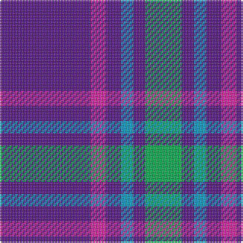

In pattern [BRBBBG](/stripes/brbbbg/).

This was sourced from register-of-tartans.  It is a [6 stripe tartan](/stripes/stripes6/).

Original link https://www.tartanregister.gov.uk/tartanDetails.aspx?ref=10057

## Register references

External register numbers recorded for this tartan.

- Scottish Register of Tartans: [10057](https://www.tartanregister.gov.uk/tartanDetails.aspx?ref=10057)

## Thread count
P/60 LR10 P10 Ba8 P8 B/24

## Palette
Each colour and its ΔE from the base-6 reference it is a variant of.

| Colour | Shade | Base | ΔE (OKLab) |
|---|---|---|---|
| B | <code style="background-color:#00B052;">#00B052</code> `#00B052` | G <code style="background-color:#006100;">#006100</code> | 0.24 |
| Ba | <code style="background-color:#009EC7;">#009EC7</code> `#009EC7` | B <code style="background-color:#2A418A;">#2A418A</code> | 0.27 |
| LR | <code style="background-color:#E026A3;">#E026A3</code> `#E026A3` | R <code style="background-color:#CC0000;">#CC0000</code> | 0.19 |
| P | <code style="background-color:#59178A;">#59178A</code> `#59178A` | B <code style="background-color:#2A418A;">#2A418A</code> | 0.11 |

# Sample pattern

## Nearest tartans

The nearest existing variants by ΔTartan distance.

1. [Laing of Archiestown](/setts/s5/db8r1w1r1k1~x8/) — ΔT 1.02
1. [International Festival of Authors (C](/setts/s6/dp30m5dp5b4dp4g12~x2/) — ΔT 1.06
1. [UEFA (Glasgow)](/setts/s6/b30ly5b4r12~x4/) — ΔT 1.18
1. [Mortell (Personal)](/setts/s10/db20b2w5r2db10b5db20b2w5r5~x2/) — ΔT 1.30
1. [Louisville Fire & Rescue P&D](/setts/s9/w1db8r3db2r1db2r3db8lo1~x4/) — ΔT 1.32
1. [South Australian Pipes & Drums (Corp](/setts/s6/db60ly6db11r25~x2/) — ΔT 1.34
1. [UEFA (Corporate)](/setts/s4/b30ly5b4r12~x4/) — ΔT 1.38
1. [Laing of Archiestown](/setts/s5/db19r2w2r2k2~x4/) — ΔT 1.44
1. [Lothian Buses (Corporate?)](/setts/s6/w2db15r3g3r3db1~x8/) — ΔT 1.54
1. [Woodcock (2014)](/setts/s7/db30dp9g6dp9r4db17w5~x2/) — ΔT 1.56

## Neighbour map

Every grey dot is one of 14299 variants placed by the first two principal components of the ΔTartan feature space (44% of its variance). Red is this tartan; blue dots are its nearest — click one to open its page.

<svg viewBox="0 0 640 380" role="img" style="max-width:100%;height:auto;border:1px solid #e0e0e0;border-radius:4px;display:block" xmlns="http://www.w3.org/2000/svg"><image href="/nn/cloud.v1.png" width="640" height="380"/><a href="/setts/s5/db8r1w1r1k1~x8/"><circle cx="370.1" cy="198.8" r="4" fill="#3465a4"><title>Laing of Archiestown</title></circle></a><a href="/setts/s6/dp30m5dp5b4dp4g12~x2/"><circle cx="364.8" cy="209.6" r="4" fill="#3465a4"><title>International Festival of Authors (C</title></circle></a><a href="/setts/s6/b30ly5b4r12~x4/"><circle cx="346.9" cy="217.8" r="4" fill="#3465a4"><title>UEFA (Glasgow)</title></circle></a><a href="/setts/s10/db20b2w5r2db10b5db20b2w5r5~x2/"><circle cx="337.7" cy="186.6" r="4" fill="#3465a4"><title>Mortell (Personal)</title></circle></a><a href="/setts/s9/w1db8r3db2r1db2r3db8lo1~x4/"><circle cx="382.3" cy="207.3" r="4" fill="#3465a4"><title>Louisville Fire &amp; Rescue P&amp;D</title></circle></a><a href="/setts/s6/db60ly6db11r25~x2/"><circle cx="410.4" cy="214.8" r="4" fill="#3465a4"><title>South Australian Pipes &amp; Drums (Corp</title></circle></a><a href="/setts/s4/b30ly5b4r12~x4/"><circle cx="381.9" cy="250.7" r="4" fill="#3465a4"><title>UEFA (Corporate)</title></circle></a><a href="/setts/s5/db19r2w2r2k2~x4/"><circle cx="414.8" cy="193.5" r="4" fill="#3465a4"><title>Laing of Archiestown</title></circle></a><a href="/setts/s6/w2db15r3g3r3db1~x8/"><circle cx="342.0" cy="176.6" r="4" fill="#3465a4"><title>Lothian Buses (Corporate?)</title></circle></a><a href="/setts/s7/db30dp9g6dp9r4db17w5~x2/"><circle cx="282.2" cy="213.4" r="4" fill="#3465a4"><title>Woodcock (2014)</title></circle></a><circle cx="349.1" cy="210.4" r="5" fill="#c00000"/></svg>

ID: /setts/s6/dp30m5dp5t4dp4g12~x2/
