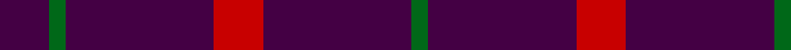

**Bands:** [BGBRBG](/stripes/bgbrbg/) · **Stripes:** [DP G DP R DP G](/stripes/stripes6/) DP G DP R DP G

This was sourced from register-of-tartans.  It is a [6 band tartan](/bands/bands6/).

Original link https://www.tartanregister.gov.uk/tartanDetails.aspx?ref=1720

## Register references

External register numbers recorded for this tartan.

- Scottish Register of Tartans: [1720](https://www.tartanregister.gov.uk/tartanDetails.aspx?ref=1720)
- Scottish Tartans Authority (ITI): 130
- Scottish Tartans World Register: 130

## Thread count
DP/12 G4 DP36 R12 DP36 G/4

## Palette
Each colour and its ΔE from the base-6 reference it is a variant of.

| Colour | Shade | Base | ΔE (OKLab) |
|---|---|---|---|
| DG | <code style="background-color:#003820;">#003820</code> `#003820` | G <code style="background-color:#006100;">#006100</code> | 0.15 |
| DP | <code style="background-color:#440044;">#440044</code> `#440044` | B <code style="background-color:#2A418A;">#2A418A</code> | 0.18 |
| G | <code style="background-color:#006818;">#006818</code> `#006818` | G <code style="background-color:#006100;">#006100</code> | 0.02 |
| R | <code style="background-color:#C80000;">#C80000</code> `#C80000` | R <code style="background-color:#CC0000;">#CC0000</code> | 0.01 |

# Sample pattern

## Nearest tartans

The nearest existing variants by ΔTartan distance.

1. [Highland Spring (1988) (Corporate)](/setts/s4/dp3g1dp9r3~x4/) — ΔT 1.26
1. [Highland Spring Corporate Tartan Tartan Number: 130. Earliest known date: 1987 Highland Spring manufacture bottled drinking water at Blackford in Perthshire, Scotland. See products available Copyright © Blair Urquhart, Comrie, 2015](/setts/s4/dp5g2dp19r5~x2/) — ΔT 1.89
1. [Highland Spring](/setts/s4/p5g3p19r5~x2/) — ΔT 1.97
1. [Brooks Brothers Tattersall Blue](/setts/s5/lo1db9lo2db9r1~x4/) — ΔT 2.08
1. [Leonard Hunting](/setts/s6/k10dp5k30dp5k10dp9~x4/) — ΔT 2.18
1. [Lynch Variant](/setts/s6/r12dp3r7dp52dg4dp4~x2/) — ΔT 2.27
1. [Brooks Brothers Tattersall Red](/setts/s5/db1r9db2r9lo1~x4/) — ΔT 2.32
1. [Leonard Hunting (Name)](/setts/s4/k30dp5k10dp9~x4/) — ΔT 2.32
1. [Hebridean, (Old..)](/setts/s7/db10r1db10r2db10r1g2~x2/) — ΔT 2.34
1. [Buie](/setts/s3/m18k3m2~x4/) — ΔT 2.43

## Neighbour map

Every grey dot is one of 14313 variants placed by the first two principal components of the ΔTartan feature space (44% of its variance). Red is this tartan; blue dots are its nearest — click one to open its page.

<svg viewBox="0 0 640 380" role="img" style="max-width:100%;height:auto;border:1px solid #e0e0e0;border-radius:4px;display:block" xmlns="http://www.w3.org/2000/svg"><image href="/nn/cloud.v1.png" width="640" height="380"/><a href="/setts/s4/dp3g1dp9r3~x4/"><circle cx="502.4" cy="275.6" r="4" fill="#3465a4"><title>Highland Spring (1988) (Corporate)</title></circle></a><a href="/setts/s4/dp5g2dp19r5~x2/"><circle cx="562.0" cy="271.8" r="4" fill="#3465a4"><title>Highland Spring Corporate Tartan Tartan Number: 130. Earliest known date: 1987 Highland Spring manufacture bottled drinking water at Blackford in Perthshire, Scotland. See products available Copyright © Blair Urquhart, Comrie, 2015</title></circle></a><a href="/setts/s4/p5g3p19r5~x2/"><circle cx="501.8" cy="279.2" r="4" fill="#3465a4"><title>Highland Spring</title></circle></a><a href="/setts/s5/lo1db9lo2db9r1~x4/"><circle cx="544.0" cy="269.5" r="4" fill="#3465a4"><title>Brooks Brothers Tattersall Blue</title></circle></a><a href="/setts/s6/k10dp5k30dp5k10dp9~x4/"><circle cx="511.7" cy="319.0" r="4" fill="#3465a4"><title>Leonard Hunting</title></circle></a><a href="/setts/s6/r12dp3r7dp52dg4dp4~x2/"><circle cx="530.4" cy="190.5" r="4" fill="#3465a4"><title>Lynch Variant</title></circle></a><a href="/setts/s5/db1r9db2r9lo1~x4/"><circle cx="607.2" cy="274.0" r="4" fill="#3465a4"><title>Brooks Brothers Tattersall Red</title></circle></a><a href="/setts/s4/k30dp5k10dp9~x4/"><circle cx="530.7" cy="340.1" r="4" fill="#3465a4"><title>Leonard Hunting (Name)</title></circle></a><a href="/setts/s7/db10r1db10r2db10r1g2~x2/"><circle cx="578.9" cy="267.4" r="4" fill="#3465a4"><title>Hebridean, (Old..)</title></circle></a><a href="/setts/s3/m18k3m2~x4/"><circle cx="626.0" cy="281.5" r="4" fill="#3465a4"><title>Buie</title></circle></a><circle cx="552.0" cy="265.4" r="5" fill="#c00000"/></svg>

ID: /setts/s6/dp3g1dp9r3dp9g1~x4/
