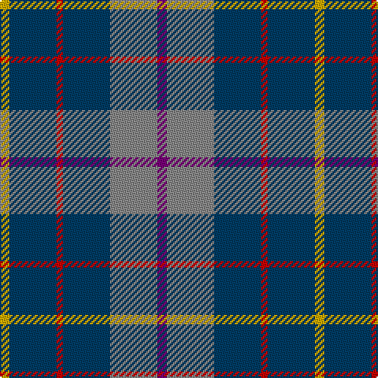

In pattern [BRBRBY](/stripes/brbrby/).

This was sourced from tartans-authority.  It is a [6 stripe tartan](/stripes/stripes6/).

Original link http://www.tartansauthority.com/tartan-ferret/display/10268/

## Also known as

This cloth is also recorded under:

- HMS Duncan Regimental

## Attestations

This cloth appears in 2 source records; the oldest owns this page.

- 19th Aug. 2010 — HMS Duncan (Military) (tartans-authority, [record](http://www.tartansauthority.com/tartan-ferret/display/10268/))
- undated — HMS Duncan Regimental Tartan Tartan Number: 10268. Earliest known date: 2010 Designed and manufactured at Johnstons of Elgin, the tartan was commissioned by the Royal Navy to commemorate the launch of the H.M.S. Duncan, the last type 45 destroyer to be build on the Clyde. The ship has been named after Admiral Duncan who was victorious at the Battle of Camperdown in October 1797. This date is also significant to Johnstons, who were founded in 1797 by Alexander Johnston at Newmill, Elgin. The tartan is based on the Duncan sett and incorporates navy blue, battleship grey, red and gold from the Duncan crest and purple from Scotland's national flower. Only to be worn with authorisation from H.M.S. Duncan. Right to weave reserved to Johnstons of Elgin or by authorisation. See products available Copyright © Blair Urquhart, Comrie, 2015 (house-of-tartan, [record](http://www.house-of-tartan.scotland.net/house/TartanViewjs.asp?colr=Def&tnam=10268))

## Thread count
Y/6 DB30 R4 DB30 N30 P/6

## Palette
Each colour and its ΔE from the base-6 reference it is a variant of.

| Colour | Shade | Base | ΔE (OKLab) |
|---|---|---|---|
| DB | <code style="background-color:#003C64;">#003C64</code> `#003C64` | B <code style="background-color:#2A418A;">#2A418A</code> | 0.08 |
| N | <code style="background-color:#888888;">#888888</code> `#888888` | R <code style="background-color:#CC0000;">#CC0000</code> | 0.24 |
| P | <code style="background-color:#780078;">#780078</code> `#780078` | B <code style="background-color:#2A418A;">#2A418A</code> | 0.17 |
| R | <code style="background-color:#C80000;">#C80000</code> `#C80000` | R <code style="background-color:#CC0000;">#CC0000</code> | 0.01 |
| Y | <code style="background-color:#CCA800;">#CCA800</code> `#CCA800` | Y <code style="background-color:#F2BF00;">#F2BF00</code> | 0.09 |

# Sample pattern

## Nearest tartans

The nearest existing variants by ΔTartan distance.

1. [Dalmeny #2](/setts/s6/db11w2db11k4dg8r1~x2/) — ΔT 0.93
1. [Grainger (Name)](/setts/s7/db36r4db6g18db15k18w4~x2/) — ΔT 1.12
1. [Ancient Atlantic](/setts/s6/w1db6dy5k1db6ly1~x4/) — ΔT 1.14
1. [Kildare, County (District)](/setts/s8/y8do2y13r4y12db22y5o3~x2/) — ΔT 1.15
1. [MacHardy](/setts/s8/dg1r1db6ly1db6dg6r1db1~x2/) — ΔT 1.32
1. [MacHardy, Blue](/setts/s8/db6r3g26db26w4db26r5g5~x2/) — ΔT 1.34
1. [MacIntyre, Inglis](/setts/s6/w4g28db18r4db18ly3~x2/) — ΔT 1.38
1. [American Soc.of Travel Agents (Corp)](/setts/s9/db2o10db1o1db10r1db10g10w2~x2/) — ΔT 1.40
1. [MacHardy](/setts/s8/db1r1g6db6ly1db6r1g1~x2/) — ΔT 1.42
1. [Norris (1957)](/setts/s6/g6b1g7w1b7r1~x4/) — ΔT 1.42

## Neighbour map

Every grey dot is one of 14299 variants placed by the first two principal components of the ΔTartan feature space (44% of its variance). Red is this tartan; blue dots are its nearest — click one to open its page.

<svg viewBox="0 0 640 380" role="img" style="max-width:100%;height:auto;border:1px solid #e0e0e0;border-radius:4px;display:block" xmlns="http://www.w3.org/2000/svg"><image href="/nn/cloud.v1.png" width="640" height="380"/><a href="/setts/s6/db11w2db11k4dg8r1~x2/"><circle cx="302.8" cy="229.6" r="4" fill="#3465a4"><title>Dalmeny #2</title></circle></a><a href="/setts/s7/db36r4db6g18db15k18w4~x2/"><circle cx="264.0" cy="213.6" r="4" fill="#3465a4"><title>Grainger (Name)</title></circle></a><a href="/setts/s6/w1db6dy5k1db6ly1~x4/"><circle cx="271.9" cy="229.3" r="4" fill="#3465a4"><title>Ancient Atlantic</title></circle></a><a href="/setts/s8/y8do2y13r4y12db22y5o3~x2/"><circle cx="302.8" cy="207.2" r="4" fill="#3465a4"><title>Kildare, County (District)</title></circle></a><a href="/setts/s8/dg1r1db6ly1db6dg6r1db1~x2/"><circle cx="310.0" cy="238.9" r="4" fill="#3465a4"><title>MacHardy</title></circle></a><a href="/setts/s8/db6r3g26db26w4db26r5g5~x2/"><circle cx="303.6" cy="215.0" r="4" fill="#3465a4"><title>MacHardy, Blue</title></circle></a><a href="/setts/s6/w4g28db18r4db18ly3~x2/"><circle cx="224.0" cy="206.3" r="4" fill="#3465a4"><title>MacIntyre, Inglis</title></circle></a><a href="/setts/s9/db2o10db1o1db10r1db10g10w2~x2/"><circle cx="232.3" cy="187.8" r="4" fill="#3465a4"><title>American Soc.of Travel Agents (Corp)</title></circle></a><a href="/setts/s8/db1r1g6db6ly1db6r1g1~x2/"><circle cx="291.6" cy="228.7" r="4" fill="#3465a4"><title>MacHardy</title></circle></a><a href="/setts/s6/g6b1g7w1b7r1~x4/"><circle cx="312.2" cy="249.6" r="4" fill="#3465a4"><title>Norris (1957)</title></circle></a><circle cx="279.3" cy="231.6" r="5" fill="#c00000"/></svg>

ID: /setts/s6/dp3o15dt15r2dt15ly3~x2/
