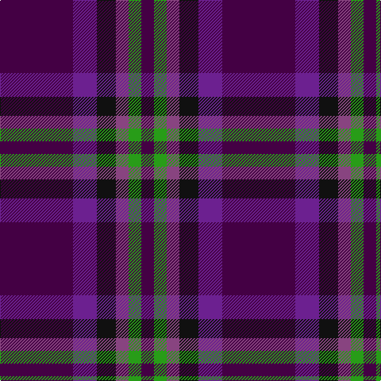

In pattern [BBKBGB](/stripes/bbkbgb/).

This was sourced from house-of-tartan.  It is a [6 stripe tartan](/stripes/stripes6/).

Original link http://www.house-of-tartan.scotland.net/house/TartanViewjs.asp?colr=Def&tnam=10389

## Thread count
DP/92 Pa30 K24 LP16 G16 DP/16

## Palette
Each colour and the base-6 reference it is a variant of.

| Colour | Shade | Base |
|---|---|---|
| DP | <code style="background-color:#440044;">#440044</code> `oklch(27.1% 0.125 328.4)` <small>#440044</small> | B <code style="background-color:#2A418A;">#2A418A</code> |
| G | <code style="background-color:#289C18;">#289C18</code> `oklch(60.6% 0.191 141.6)` <small>#289C18</small> | G <code style="background-color:#006100;">#006100</code> |
| K | <code style="background-color:#101010;">#101010</code> `oklch(17.3% 0.000 89.9)` <small>#101010</small> | K <code style="background-color:#000000;">#000000</code> |
| LP | <code style="background-color:#884480;">#884480</code> `oklch(49.4% 0.122 331.8)` <small>#884480</small> | B <code style="background-color:#2A418A;">#2A418A</code> |
| N | <code style="background-color:#5C5C5C;">#5C5C5C</code> `oklch(47.5% 0.000 89.9)` <small>#5C5C5C</small> | B <code style="background-color:#2A418A;">#2A418A</code> |
| P | <code style="background-color:#780078;">#780078</code> `oklch(40.2% 0.185 328.4)` <small>#780078</small> | B <code style="background-color:#2A418A;">#2A418A</code> |
| Pa | <code style="background-color:#6C2090;">#6C2090</code> `oklch(41.9% 0.176 312.0)` <small>#6C2090</small> | B <code style="background-color:#2A418A;">#2A418A</code> |

# Sample pattern

## Nearest tartans

The nearest existing variants by ΔTartan distance, with this tartan at the top so the swatches line up against it.

ΔTartan

Tartan

Sett

—

<a href="/ttd/edit/#slug=dp46dp15k12p8g8dp8~x2">Haut Name Tartan Tartan Number: 10389. Earliest known date: 1st March 2011 Designed for the Haut family living in Liff by Dundee to celebrate their German and Irish roots and the Scottish identity of their children. See products available Copyright © Blair Urquhart, Comrie, 2015</a> <a class="nn-out" href="/setts/s6/dp46dp15k12p8g8dp8~x2/" title="open its dictionary page">↗</a>

1.34

<a href="/ttd/edit/#slug=dp46p15k12m8g8dp8~x2">Haut (Personal)</a> <a class="nn-out" href="/setts/s6/dp46p15k12m8g8dp8~x2/" title="open its dictionary page">↗</a>

1.46

<a href="/ttd/edit/#slug=dp30db30y4db4y4db5r6~x2">Komissarov, Dmitry (Personal)</a> <a class="nn-out" href="/setts/s7/dp30db30y4db4y4db5r6~x2/" title="open its dictionary page">↗</a>

1.51

<a href="/ttd/edit/#slug=k4r5k4dp28k4g5k4~x2">Montgomrie/Montgomery of Eglinton</a> <a class="nn-out" href="/setts/s7/k4r5k4dp28k4g5k4~x2/" title="open its dictionary page">↗</a>

1.66

<a href="/ttd/edit/#slug=dp22lo10dp6lr18dp50db71k6">Charleston Police Department</a> <a class="nn-out" href="/setts/s7/dp22lo10dp6lr18dp50db71k6/" title="open its dictionary page">↗</a>

1.84

<a href="/ttd/edit/#slug=db30dp9g6dp9r4db17w5~x2">Woodcock (2014)</a> <a class="nn-out" href="/setts/s7/db30dp9g6dp9r4db17w5~x2/" title="open its dictionary page">↗</a>

1.87

<a href="/ttd/edit/#slug=r2db13r3db3r16t2~x4">MacArthur-Fox, dress</a> <a class="nn-out" href="/setts/s6/r2db13r3db3r16t2~x4/" title="open its dictionary page">↗</a>

1.94

<a href="/ttd/edit/#slug=db6w3db21k16dp6k3dp6~x2">Heritage of Scotland</a> <a class="nn-out" href="/setts/s7/db6w3db21k16dp6k3dp6~x2/" title="open its dictionary page">↗</a>

1.95

<a href="/ttd/edit/#slug=dp9db6w1dg4dp2~x4">Cathro</a> <a class="nn-out" href="/setts/s5/dp9db6w1dg4dp2~x4/" title="open its dictionary page">↗</a>

1.95

<a href="/ttd/edit/#slug=r9k4r9k25o3dp18k4~x2">Wounded Warriors Canada</a> <a class="nn-out" href="/setts/s7/r9k4r9k25o3dp18k4~x2/" title="open its dictionary page">↗</a>

1.95

<a href="/ttd/edit/#slug=k1r1k1db7k1g1k1~x8">Eglinton</a> <a class="nn-out" href="/setts/s7/k1r1k1db7k1g1k1~x8/" title="open its dictionary page">↗</a>

## Neighbour map

Every grey dot is one of 14299 variants placed by the first two principal components of the ΔTartan feature space (44% of its variance). Red is this tartan; blue dots are its nearest — click one to open its page.

<svg viewBox="0 0 640 380" role="img" style="max-width:100%;height:auto;border:1px solid #e0e0e0;border-radius:4px;display:block" xmlns="http://www.w3.org/2000/svg"><image href="/nn/cloud.v1.png" width="640" height="380"/><a href="/setts/s6/dp46p15k12m8g8dp8~x2/"><circle cx="258.4" cy="215.2" r="4" fill="#3465a4"><title>Haut (Personal)</title></circle></a><a href="/setts/s7/dp30db30y4db4y4db5r6~x2/"><circle cx="292.3" cy="225.9" r="4" fill="#3465a4"><title>Komissarov, Dmitry (Personal)</title></circle></a><a href="/setts/s7/k4r5k4dp28k4g5k4~x2/"><circle cx="332.7" cy="227.4" r="4" fill="#3465a4"><title>Montgomrie/Montgomery of Eglinton</title></circle></a><a href="/setts/s7/dp22lo10dp6lr18dp50db71k6/"><circle cx="262.2" cy="200.0" r="4" fill="#3465a4"><title>Charleston Police Department</title></circle></a><a href="/setts/s7/db30dp9g6dp9r4db17w5~x2/"><circle cx="282.2" cy="213.4" r="4" fill="#3465a4"><title>Woodcock (2014)</title></circle></a><a href="/setts/s6/r2db13r3db3r16t2~x4/"><circle cx="348.0" cy="244.8" r="4" fill="#3465a4"><title>MacArthur-Fox, dress</title></circle></a><a href="/setts/s7/db6w3db21k16dp6k3dp6~x2/"><circle cx="226.2" cy="236.4" r="4" fill="#3465a4"><title>Heritage of Scotland</title></circle></a><a href="/setts/s5/dp9db6w1dg4dp2~x4/"><circle cx="288.1" cy="263.5" r="4" fill="#3465a4"><title>Cathro</title></circle></a><a href="/setts/s7/r9k4r9k25o3dp18k4~x2/"><circle cx="256.2" cy="226.2" r="4" fill="#3465a4"><title>Wounded Warriors Canada</title></circle></a><a href="/setts/s7/k1r1k1db7k1g1k1~x8/"><circle cx="334.0" cy="227.4" r="4" fill="#3465a4"><title>Eglinton</title></circle></a><circle cx="294.9" cy="236.2" r="5" fill="#c00000"/></svg>

ID: /setts/s6/dp46dp15k12p8g8dp8~x2/
