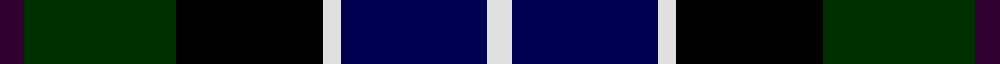

In pattern [BGKWBW](/stripes/bgkwbw/).

This was sourced from weddslist.  It is a [6 stripe tartan](/stripes/stripes6/).

Original link http://www.weddslist.com/cgi-bin/tartans/pg.pl?source=sts

## Thread count
DP/8 DG50 K48 LN6 DB48 LN/8

## Palette
Each colour and the base-6 reference it is a variant of.

| Colour | Shade | Base |
|---|---|---|
| DB | <code style="background-color:#000050;">#000050</code> `oklch(19.5% 0.135 264.1)` <small>#000050</small> | B <code style="background-color:#2A418A;">#2A418A</code> |
| DG | <code style="background-color:#003000;">#003000</code> `oklch(26.8% 0.091 142.5)` <small>#003000</small> | G <code style="background-color:#006100;">#006100</code> |
| DP | <code style="background-color:#300030;">#300030</code> `oklch(21.7% 0.100 328.4)` <small>#300030</small> | B <code style="background-color:#2A418A;">#2A418A</code> |
| K | <code style="background-color:#000000;">#000000</code> `oklch(0.0% 0.000 0.0)` <small>#000000</small> | K <code style="background-color:#000000;">#000000</code> |
| LN | <code style="background-color:#E0E0E0;">#E0E0E0</code> `oklch(90.7% 0.000 89.9)` <small>#E0E0E0</small> | W <code style="background-color:#F7F7F7;">#F7F7F7</code> |

# Sample pattern

## Nearest tartans

The nearest existing variants by ΔTartan distance, with this tartan at the top so the swatches line up against it.

ΔTartan

Tartan

Sett

—

<a href="/ttd/edit/#slug=dp4dg25k24w3db24w4~x2">Herd</a> <a class="nn-out" href="/setts/s6/dp4dg25k24w3db24w4~x2/" title="open its dictionary page">↗</a>

0.39

<a href="/ttd/edit/#slug=r2db8k8lb1dg8k1">Leslie Hunting</a> <a class="nn-out" href="/setts/s6/r2db8k8lb1dg8k1/" title="open its dictionary page">↗</a>

0.54

<a href="/ttd/edit/#slug=lr3db14k12dg12k2ly3~x2">MacNiel of Barra</a> <a class="nn-out" href="/setts/s6/lr3db14k12dg12k2ly3~x2/" title="open its dictionary page">↗</a>

0.54

<a href="/ttd/edit/#slug=lr3db14k12dg12k2ly3">MacNiel of Barra</a> <a class="nn-out" href="/setts/s6/lr3db14k12dg12k2ly3/" title="open its dictionary page">↗</a>

0.59

<a href="/ttd/edit/#slug=r2db8k8lr1dg8k1~x2">Leslie Hunting</a> <a class="nn-out" href="/setts/s6/r2db8k8lr1dg8k1~x2/" title="open its dictionary page">↗</a>

0.59

<a href="/ttd/edit/#slug=r2db8k8lr1dg8k1">Leslie Hunting</a> <a class="nn-out" href="/setts/s6/r2db8k8lr1dg8k1/" title="open its dictionary page">↗</a>

0.64

<a href="/ttd/edit/#slug=r2k1db8k8dg8k1lb2">Campbell Cawdor</a> <a class="nn-out" href="/setts/s7/r2k1db8k8dg8k1lb2/" title="open its dictionary page">↗</a>

0.70

<a href="/ttd/edit/#slug=r2dg8lr1k8db8k1db1~x2">Colquhoun</a> <a class="nn-out" href="/setts/s7/r2dg8lr1k8db8k1db1~x2/" title="open its dictionary page">↗</a>

0.78

<a href="/ttd/edit/#slug=k2dg12k12r1db12lb2">Mitchell</a> <a class="nn-out" href="/setts/s6/k2dg12k12r1db12lb2/" title="open its dictionary page">↗</a>

0.78

<a href="/ttd/edit/#slug=r2k1db8k8dg8k1b2~x2">Campbell of Cawdor</a> <a class="nn-out" href="/setts/s7/r2k1db8k8dg8k1b2~x2/" title="open its dictionary page">↗</a>

0.83

<a href="/ttd/edit/#slug=ly3k2dg12k12db14lb3">MacNeil of Barra</a> <a class="nn-out" href="/setts/s6/ly3k2dg12k12db14lb3/" title="open its dictionary page">↗</a>

## Neighbour map

Every grey dot is one of 14299 variants placed by the first two principal components of the ΔTartan feature space (44% of its variance). Red is this tartan; blue dots are its nearest — click one to open its page.

<svg viewBox="0 0 640 380" role="img" style="max-width:100%;height:auto;border:1px solid #e0e0e0;border-radius:4px;display:block" xmlns="http://www.w3.org/2000/svg"><image href="/nn/cloud.v1.png" width="640" height="380"/><a href="/setts/s6/r2db8k8lb1dg8k1/"><circle cx="124.9" cy="219.0" r="4" fill="#3465a4"><title>Leslie Hunting</title></circle></a><a href="/setts/s6/lr3db14k12dg12k2ly3~x2/"><circle cx="100.4" cy="228.5" r="4" fill="#3465a4"><title>MacNiel of Barra</title></circle></a><a href="/setts/s6/lr3db14k12dg12k2ly3/"><circle cx="100.4" cy="228.5" r="4" fill="#3465a4"><title>MacNiel of Barra</title></circle></a><a href="/setts/s6/r2db8k8lr1dg8k1~x2/"><circle cx="139.2" cy="226.5" r="4" fill="#3465a4"><title>Leslie Hunting</title></circle></a><a href="/setts/s6/r2db8k8lr1dg8k1/"><circle cx="139.2" cy="226.5" r="4" fill="#3465a4"><title>Leslie Hunting</title></circle></a><a href="/setts/s7/r2k1db8k8dg8k1lb2/"><circle cx="118.8" cy="204.8" r="4" fill="#3465a4"><title>Campbell Cawdor</title></circle></a><a href="/setts/s7/r2dg8lr1k8db8k1db1~x2/"><circle cx="142.7" cy="212.7" r="4" fill="#3465a4"><title>Colquhoun</title></circle></a><a href="/setts/s6/k2dg12k12r1db12lb2/"><circle cx="158.7" cy="205.5" r="4" fill="#3465a4"><title>Mitchell</title></circle></a><a href="/setts/s7/r2k1db8k8dg8k1b2~x2/"><circle cx="143.9" cy="219.1" r="4" fill="#3465a4"><title>Campbell of Cawdor</title></circle></a><a href="/setts/s6/ly3k2dg12k12db14lb3/"><circle cx="87.8" cy="222.1" r="4" fill="#3465a4"><title>MacNeil of Barra</title></circle></a><circle cx="115.8" cy="217.3" r="5" fill="#c00000"/></svg>

ID: /setts/s6/dp4dg25k24w3db24w4~x2/
